# HOW TO CREATE A CPN & MORE INFORMATION NEEDED

# NUMBER ALLOCATIONS (THE FIRST FIVE DIGITS)

Before anything you must know how to create the number you will be issuing. Below is a list of the first five prefixes needed to create a legal CPN/SCN number -

The chart below shows the first 3 digits of the social security numbers assigned throughout the United States and its possessions. The same area, when shown more than once, means that certain numbers have been transferred from one State to another, or that an area has been divided for use among certain geographic locations.

# SSN Area Number Location

001-003 New Hampshire

004-007 Maine

008-009 Vermont

010-034 Massachusetts

035-039 Rhode Island

040-049 Connecticut

050-134 New York

135-158 New Jersey

159-211 Pennsylvania

212-220 Maryland

221-222 Delaware

223-231 Virginia

232 North Carolina

232-236 West Virginia

237-246 Not Issued

247-251 South Carolina

252-260 Georgia

261-267 Florida

268-302 Ohio

303-317 Indiana

318-361 Illinois

362-386 Michigan

387-399 Wisconsin

400-407 Kentucky

408-415 Tennessee

416-424 Alabama

425-428 Mississippi

429-432 Arkansas

433-439 Louisiana

440-448 Oklahoma

449-467 Texas

468-477 Minnesota

478-485 Iowa

486-500 Missouri

501-502 North Dakota

503-504 South Dakota

505-508 Nebraska

509-515 Kansas

516-517 Montana

518-519 Idaho

520 Wyoming

521-524 Colorado

525,585 New Mexico

526-527 Arizona

528-529 Utah

530,680 Nevada

531-539 Washington

540-544 Oregon

545-573 California

574 Alaska

575-576 Hawaii

577-579 District of Columbia

580 Virgin Islands

580-584 Puerto Rico

586 Guam

586 American Samoa

586 Philippine Islands

587-665 Not Issued

667-679 Not Issued

681-690 Not Issued

691-699 Not Issued

700-728 Railroad Board\*\*

729-733 Enumeration at Entry

750-772 Not Issued

You can also go to http://www.stevemorse.org/ssn/ssn.html (Decoding Social Security Numbers in One Step) This is a great site to work with and it is 100% FREE of charge !

To find specific years between 2003 through 2011 - You can go to http://www.ssa.gov/employer/ssnvhighgroup.htm - This will help you to choose the 2nd set of numbers in the CPN - Once you have chosen the first five numbers you want to use, you pick the last four !

Now the last four are completely up to you ! You can pick 481-51 (Iowa) and then choose 9873 as the last four - But here is the tricky part - In order to make sure that this number is 100% clean and does not belong to ANY LIVING OR DEAD PERSON - you must first skip trace this number - This involves using a software that allows you to do so !

You cannot go to SSNVALIDATOR.com and do this - This site is strictly for making sure the number you choose is not in the SSN DEATH INDEX - IT IS FOR NOTHING ELSE AT ALL !

You can check numbers by going to the following places :

- 1. SSA Business Services http://www.ssa.gov/bso/bsowelcome.htm (You must register)
- 2. Search Bug http://www.searchbug.com/peoplefinder/verify-ssn-free.aspx?TYPE=ssnv&SSN=539739783 (You must register for a business account)
- 3. Strong Tower https://www.verifico.com/app/strong-tower/cpn-ssn-validation/971?s=direct (THIS IS THE BEST WAY TO CHECK THEM)

Now once you get the report back that the number does not belong to anyone, this includes a child - Then you are good to go and start building on that number . If it comes back as belonging to someone, then you MUST throw it away and try another number ! Now you can still use the first five numbers - But you MUST change the last four !

Once you have succesfully created your new CPN number - Now you can go and register it with IRS (Please see attachment "How to register your CPN with IRS)

Once you have done this step with IRS, now you MUST do the following :

TRIMERGE YOUR NUMBER - (Attach your personal information to the CPN)

https://www.americanexpress.com/us/credit-cards/?intlink=USHP-LFC-PersonalCards-Large

just fill it out, and hit submit - Does not matter what you put as long as the CPN information is in there ! After this is done - you MUST wait 72 hours (3 DAYS) to do anything -

Go to DriveTime.com and fill out the "GET APPROVED" Application.

Go to Etrade and open up an Etrade Personal Checking account - It is VERY SIMPLE TO DO... This gives you a bank account that you can use freely to pay anything you do with your CPN.

I also 100% recommend do these items below, this will make your profile strong ! The first one is a DEFINITE !

Go to https://rentalkharma.com/enroll-discount/?nabe=5527811243638784:1 and fill out the application - There is a \$25.00 fee - this will report up to two years of rental history on your profile which generates a great score ! Make sure you have someone (Family or friend) that can verify the info for you ! Again this is an EXCELLENT EXCELLENT IDEA for those who want a real fast score !

CapitalOne.com and apply for the secured card. It is a small \$49.00 to get it ! This is one of the best ways to get that primary line reporting in the next 7-10 days !!

Myjewelersclub.com - There is a \$99.00 one time fee for a \$5000.00 line of credit that reports to all three credit bureaus.

CrownJewelers.com - Be sure to use an active email as your \$2500.00 approval goes to the email you put in the application - You buy one small thing, less than \$20.00 and you get a \$2500.00 line of credit that reports. !

Again I highly recommend everyone doing at least two of three above !

ONCE you have done all these steps and generated a score for yourself or the CPN - NOW you can add tradelines or start applying for credit cards -

# **CPN INSTRUCTIONS**

**You must take better care of THIS CPN/SCN number than you do your OWN SSN!!!**

**Read this whole instruction manual/agreement completely.**

**If you default on any loan or agreement while using your CPN/SCN number, you will be committing a Federal Crime and could go to Prison!!**

Hello! Purchasing a CPN/SCN number can be one of the most freeing and best decisions of your credit life. Having a CPN is a huge responsibility, but the rewards for developing a strong CPN and taking care of it are worth it! With this number you are not only given a "second chance," but when you have "fixed" your SSN Credit profile, you may continue to use this number. The CPN can add an extra layer of protecting, allowing you to keep your SSN safe from fraud.

# **What is a CPN/SCN???**

You may have made this purchase really not knowing what you were getting into. Or maybe that was just me. The CPN is a nine-digit identification number that looks like a social security number (SSN) and may be used in lieu of an SSN, for such purposes as obtaining credit.

According to the Privacy Act of 1974, one has the legal right to keep his/her SSN private. In certain circumstances, consumers are required by law to disclose their SSN, such as to the Internal Revenue Service, employers, when registering a motor vehicle, buying a firearm, or applying for a federally insured loan. In other circumstances, federal law allows consumers to legally use a separate identification number, hence the opportunity to establish a CPN for a credit file.

CPN's are commonly used by celebrities, members of Congress, and witnesses protected by the federal government to help protect their privacy and security. And, people like you and I.

*IF your number is Randomized or Had shown "Unissued" by SSNValidator.com, these numbers may be good for only 7 to 10 years. Make plans.*

*(Keep reading)*

OK, for the sake of argument, for the rest of the time I am going to assume that you've done some research on this handy little number. That you also know the major in's and out's of it. But just in case, I will use this booklet to go over the most common questions, usability, and LAWS regarding the CPN. This is NOT an all inclusive manual on the CPN/SCN, and you the consumer MUST do your own follow-up research to make sure you are complying with Local and Federal Laws.

First off, this is not an "*ignore all my previous debt's"* card. Or a *get into more credit trouble* card. If you receive ANY credit, loan, cars and such with your CPN/SCN number, and you do NOT pay any of **your** debt back under this number, you will be committing fraud. You can find yourself in a very uncomfortable situation, in jail and/or in a Federal Prison. I know we're coming on strong, but there is a need to. Some think that they can get away with "*burning files*," or "*burning numbers*" and not get caught. That is the wrong way to think. It is that vain of thinking that will wind you up in Prison along with other people we know. Yes, WE know people that are doing hard time for burning numbers. They took out loans, made agreements and did not satisfy the debt. Now, they have lost their freedom. Imagine what that would do to you, your family, your name! Before you make a foolish choice, and think you can out smart our Federal Government, the FBI, and the Financial Institutions, THINK! They have better programs and more man power to find you. And, if you are a file burner, they will find you. Not today, and maybe not tomorrow, but they can and will find you. And if the Law comes to us about you, we will do the right thing.

PS: Fix your SSN Credit to. Do not neglect it.

OK, enough with the heavy. For those of you who's intentions are right, your life is going to get better! My partners and I have spent many years using and researching this amazing little number! With this number you can start a whole new credit life. You can rent in a safe neighborhood. Drive a decent car. You can get the credit you need. You can hold your head high once again!

Let's face it; most of us have dropped the ball credit wise. And now you're in a pickle. So in order to get a car, rent a safe home, get a simple credit card, you need good credit! There is no way around it! And as you know, that short of committing fraud, you are not guaranteed that 100% of the negative items will be removed with ordinary SSN credit repair.

The CPN number will allow you to build a credit profile in a short amount of time. Depending upon your budget, you may have 700 to 800 scores in as little as 30 days!

After you have repaired your SSN and satisfied all that debt, you can use your CPN number as a shield to protect your SSN. This is what many Celeberites do in order to protect their identity. Again, we always insist that you fix and repair your SSN. It is important to do so. The SSN is your way to have a better job, and purchase a home. And if need be, receive government help from time to time. These are things that you cannot use your CPN for. You must use your SSN, and you may be turned down for help because of bad credit. Fix your real credit.

Keep the information for your CPN separate from your SSN and your SSN info separate from your CPN info. If not, you will cause your files to merge, and if your SSN is in rough shape, this will harm your CPN. And did we mention we strongly recommend that you use your CPN to work on your SSN, through Credit Restoration and paying off any outstanding debts?

There is important information in here, and you need to know it. I know that this booklet is lengthy and can come off strong at times. You also need to do more research on your own, as this booklet does not cover everything. This booklet is only a rough out line of the basic do's and dont's. Trust me when I say, we have your best interest at heart. We know what can happen if this number is misused. But we also know what can happen if this number is used and built correctly! FREEDOM!

Thank you for purchasing our product and may God bless you as you honor and keep your commitments!

This list below is the information you will use along with the CPN information. Place it on a card and keep it in your wallet or purse for reference.

- 1. Name
- 2. DOB
- 3. Grandmothers Maiden name. (Different from Mothers)
- 4. Email Address
- 5. Phone Number (for Tri-merge, use a Google Voice Number or similar FREE number)
- 6. Mailing Address. No PO Box, UPS Stores or Mailbox etc., or anyone you've used as a reference under your SSN, or have used YOU.

Do not use the same information from your SSN (other than your name and DOB) on your CPN information. Ever.

#### *(Keep reading)*

# **STEPS:**

- 1) Tri-merge (Skip this step if your CPN/SCN has already been tri-merged)
- 2) "Unghost"/Indexing
- 3) Add AU's/Primary's
- 4) Apply for Credit
- 5) USE WISELY. Enjoy life and your new credit profile!!!

# **Before you Tri-merge, this is some of the info you will use:**

# **CPN Employment:**

Your employment will always be *Management If you do not have an valid employer to use*, and your income will always be between **\$55,000 and \$85,000 per year for Tri-Merging. This is done in order to test and establish the number**.

# DO NOT use current employer.

For length of time at employment, put 5 years, 5 months (unless you are not old enough to, then please use 3 years, 3 months) Same goes for length of time at your residence.

# **Tri-merge Housing:**

You can rent or own and your payments or rent will always be \$500 per month and you will have lived there for at least 5 years 5 months. You can slightly change the amount of your housing payments if you like, but I wouldn't go too far over \$600 or go under \$450.

\*\*\**We are not asking you to commit fraud by having a different address and such. Or that you state a certain amount for income. These are steps in to keep your CPN separate from your SSN and what works best to "activate" your CPN.\*\*\**

*(Keep reading)*

These are the steps to take to make a strong CPN:

*Tri-Merge Instructions:* (Skip this step if your file is Tri-merged)

1) Go to roadloans.com Fill out the application that you are Purchasing a auto. Either use the CPN address or choose that you have not chosen a house. WAIT AT LEAST 24 HOURS.

# 2) https://services.quickenloans.com/clientinfo/ql?cid=332593049413104&ql

This takes about 3 days to complete. Fill out the whole application with the information given. If you choose Quicken Loans, fill in that you need a refi. Take the time to "Chat" with them and ask if you are approved. Wait for about 3 days before you apply for credit or apply AU's.

# 3) OR

https://www.bankofamerica.com/home-loans/mortgage/applying-for-mortgage-loan.go

*These initial three steps will assign the CPN under your name and CPN address.*

Wait 72 hours.

*\*\*\*NEXT, go to CreditKarma.com and set up an account. If it comes up that you cannot be given a score because of a "thin file," your number is good. Make sure your number has been tri-merged. It's easy and the steps are listed below. If it still does not work, contact your broker. We will fix it or generate a new number for your.\*\*\*\**

*\*\*\*\*From this point you can add an Authorized User (AU) and/or a Primary Tradeline. If you are adding an AU or Primary and are over the age of 25, WAIT until you sign up for Creditchecktotal.com until AFTER your AU/Primary provider says that the line(s) are added. The reason being, most adults over the age of 25 do not have a blank credit profile and there could be difficulty making your CCT credit update. Also, if you are trying to get funding, you will want to purchase 2 to 3 AU's, as you will need THREE lines for any REAL funding.\*\*\*\**

# **READ FURTHER ON HOW TO UNGHOST OR INDEX YOUR NUMBER**

# **IF YOU PLAN TO TAKE YOUR CPN TO LENDING OR WANT TO MAKE IT** *STRONGER***, DO THESE NEXT STEPS BEFORE YOU APPLY FOR ANYTHING.**

With all of the fraud that has been committed using CPN's, Banks have developed systems on how to "sniff" out a CPN. We have some of the best methods on making your number look like a real person is behind the number. And that is what you are. These steps will *index* your CPN number and/or CPN address so you're not a "ghost." You do not have to do these steps. But in our experience, if you want a solid CPN that you can use for many many years, this is the route to go. If not, there is not even a gurantee that you'll be able to get a credit card, or credit monitoring site.

AND these additional steps could make the difference between you receiving your loan or not. Is this a guarantee? No. There are NO guarantee when it comes to lending and CPN's. But your chances are greater for success if you follow these simple steps.

- 1) Get a prepaid phone through either **Verizon** or **ATT**. CALL them to register it.
- 2) Go to http://www.listyourself.net/ and register your CPN Address, your Prepaid phone number and email
- 3) Go to your local grocery store and sign up for their club card.
- 4) Sign up for these magazines: Time, National Enquirer, Esquire and such
- 5) Get a hunting and/or fishing license.

# Now your CPN is ready to:

- 1) Add an AU (Authorized User) and/or a Primary Tradeline (*You can do this while or before you index your number*)
- 2) Go to Kohls online, and apply for the card that has the high interested. Your initial credit should be \$300. If you add an AU first, chance are your credit line will be higher. Still no guarantee. Please ask your broker which one if you're not sure. (See instructions below)
- 3) After you have name your FIRST payment on your Kohls card, and/or your primary trade lines have posted, carefully apply for Fingerhut, Capital One, Credit One, Discover. Space it out. Don't do it all in one day. Every few weeks or once a month. Don't rush it.
- 4) Do not over apply.
- 5) KNOW the law. We are not responsible for ANY mis-use of your CPN/SCN number.

*(Keep reading)*

# **This is what you may use your CPN for:**

- 1) Credit Cards
- 2) Automobile Loans
- 3) Rentals
- 4) Loans
- 5) Checking Accounts. Non interest bearing

# **What the CPN is not to be used for:**

- 1) Mortgages, unless it is a private mortgage
- 2) Employment
- 3) Anything interest bearing
- 4) Government programs such as Food Stamps, Section 8 Housing, and such like.

# **You also cannot use this for:**

- 1) Tax purposes, to include employment
- 2) Any Government programs such as food stamps and such
- 3) Any type of mortgages other than PRIVATE mortgages
- 4) Any interest bearing accounts that you would pay taxes on.

In a nutshell, pay your bills, stay within the law, know the law, and you'll be fine. And while you're at it, talk to your agent about credit repair. It would be wise to have your SSN Credit tip-top also.

And most of all, HAVE FUN!! ENJOY YOUR NEW FOUND FREEDOM!!!

Thank you for your business!!

*(Keep reading)*

Hints, Q&A's and Laws on the following

# pages

# **PLEASE READ THE FOLLOW PAGES FOR MORE INSTRUCTIONS, LAWS AND POINTERS.**

This program is not intended to be used as a method of defrauding banks, creditors, or any other Organization that requires your social security number as identification. This program is not a method to avoid paying your existing or future debts. If you created the debt, you are responsible to repay that debt. However, we will not support, facilitate, nor condone any fraudulent activity. The information here is informational purposes only and for you to use at your own risk. We are not lawyers or any legal services. Nor are we licensed financial advisers; and any information given is purely what we've seen work, and is our opinion on how to properly use your CPN/SCN Profile. Please consult your local and national laws for more information. Please do your own research.

We have a non refund policy because of the work needed to give you the info IF your number is not "working," contact us, we will validate your claim, and we will generate a new number at no cost for the first one.

# *FURTHER INSTRUCTIONS AND GUIDELINES*

*This is some of the SAME information as above.*

*This chance continually. We cannot always keep up. What worked yesterday may not work today. We cannot do ANYTHING about this.*

- 1. If your birthday was changed because you previously had the credit cards that were specified on the application, you will change it back to your real birthday after doing the cap one application. This means that for step #2 you will use your real birthday. This will then update your credit file to reflect your birthday after the second application.
- 2. **INSTUCTIONS FOR CAPITAL ONE** Apply online. When you receive your Cap One card, go online to www.capitalone.com/activate and enroll online. *Do NOT call to activate the card.*

Once you do activate please follow these steps (*THESE STEPS ARE GOOD TO*

# *FOLLOW WITH ANY CARD)*:

- 1. DO NOT go and pull money off the ATM for your first transaction. (*they will freeze your card*)
- 2. DO NOT spend your entire limit in one day. (*they will freeze your card*)
- 3. Spend a small amount and make a small payment! To make a payment, I HIGHLY suggest using Moneygram to do so. You will use the code 1013 + your 16-digit card number. Do NOT go online and pay using a credit/debit card that it attached to your SSN- they will freeze your account and your CPN and SSN will LINK. I also suggest applying for a prepaid card with Rushcard.com using your CPN information, so that you may use this to pay for anything CPN-related.

*\*\*\*The method I've personally have used, is to set up a bank account online, make with the initial deposit with the above methods, and then pay all my CPN debts through that bank account. Do not go to a bank that you are currently with or currently owe money to.*

*Wells Fargo, US Bank and Bank of America are great institutions to do business with. Do right by them and they will take care of you. \*\*\*\**

- 4.Wait a full billing cycle and go online to check to make sure that Khols or Cap One or your other cards have posted. Use Credit Check Total to see whether it has posted. You will have to pay. Deal with it.
- 5.Once you are approved by Kohls, wait until you use the the card/account and make a payment before you can apply for Capital One, Credit One or the Discover IT card. You will want to either call or go online to apply. If you are younger than 24, you will want to apply for the Discover IT for Students credit card.

*\*\*\*\*American Express is the most difficult card to get. If you do not have supporting documentation that they will want, don't apply. They will ask for ID, SSN card and such. You've been warned. Do any of the above steps wrong, and the other banks will ask also. \*\*\*\**

6. Just remember that your CPN is NOT just for credit cards! Once your credit file is where you would like it to be, you can obtain an apartment, cell phone, utilities, personal loans, payday loans, bank account, auto loans, business loans..... It is up to YOU what you do with your new file! Do NOT apply for more than ONE credit line per week.

(*Keep reading)*

\*\* I cannot stress this enough: Your credit file is BRAND NEW. Do NOT apply for one card after the next. I only recommend one application per week, and you MUST wait for things to post to your credit file before moving on to the next step. You will want to have 3 credit lines on your file before you move onto other lines.

You may also try these services to build credit on your new CPN:

Fingerhut may give you a line of credit of \$180 or more. You may be required to put down \$30. Make sure you don't use any cards that have your SSN attached to it.

www.huttonchase.com

They will give you a \$1800-\$2000 limit

www.crownjewelers.com

They will give you a \$2500 limit

www.myjewelersclub.com. they will give you a \$5000 limit

www.oxpublishing.com, they will give you a \$3500 limit

www.masoneasypay.com , not sure of the limit with these people but it's a free Tradeline http://www.leaseville.com they have computers , cameras lots of electronics and will approve anyone

# **Straight from the FBI website:**

Remember the SCN/CPN is solely for credit purposes only. Currently, federal law allows individuals to legally use CPNs for financial reporting and protects those individuals who do not wish to disclose their SSAN. Individuals who acquire CPNs are completely responsible for any debt they incur using this number.(http://www.fbi.gov/stats-services/publications/)

Legality of CPN:

Presently, federal law allows the ability for someone to legally use a private ID # for financial reporting purposes instead of a Social Security Number.

Title 5, Section 7 of Publication Law 93-579 of Government Organization and Employees Act:

*(a) (1) It shall be unlawful for any Federal, State or Local Government Agency to deny any individual any right, benefit, or privilege provided by law because of such individual's refusal to disclose his or hers Social Security Account Number.*

What this means is Federal Law protects those who do not wish to disclose their personal information (SS#) except where required to do so. Disclosure of your social security number is only required when dealing with the IRS, your employer, or when applying for a federally insured mortgage.

Instead of a Social Security Number, you now have the opportunity to establish a Credit Privacy Number (CPN).

A Credit Privacy Number is a new 9 digit number established for financial reporting purposes. This number is NOT a new social. It is simply an available file number at the credit bureaus that can have financial information reported. You have the right to establish this number only once, so do not abuse it.

The bureaus or the IRS can take part in this process to establish your CPN. YOU ARE LIABLE FOR PAYING BACK ANYTHING THAT IS BORROWED with this new CPN.

Further, in example, congress holds special privileges to the law; therefore, their privacy needs to be protected. In another example, witnesses under protection can be located if they use their true social security number for transaction. This is the reason why there is the existence of a Credit Privacy Number program. Reasons are not limited to the previous, so why shouldn't you have a CPN?

Members of Congress plan to reintroduce a bill to restrict the availability and use of Social Security numbers, hoping the effort will reduce identity theft. A Social Security Subcommittee Chairman by the name of E. Clay Shaw, announced at a July 11 hearing that he and subcommittee ranking member Robert Matsui, plan to unveil legislation to restrict the sale and public display of Social Security numbers, establish penalties for violations, limit dissemination of numbers by credit reporting agencies, make it more difficult for businesses to deny services if a customer refuses to provide their social security number. The goal is to improve the integrity of the Social Security number assignment process.

| "Congress must act this session to protect the very number it requires each of |  |
|--------------------------------------------------------------------------------|--|
| us to obtain and use throughout our lifetime," said Shaw.                      |  |
|                                                                                |  |
|                                                                                |  |
|                                                                                |  |
|                                                                                |  |

*(keep reading)*

Q: Why do these organizations insist on requiring your social security number to identify you?

A: Because we allow them to! The sole purpose of your social security number is for tax and social security use ONLY!

The law states that No federal, state, or local government agency may deny you any right, privilege or benefit due to your refusal to provide your SS # for any other reason than producing money for retirement account with the Social Security Administration, the IRS and your employer today.

Credit Bureaus are not legally allowed to "require" your Social Security Number. In our country's present credit reporting system a person may be assumed guilty and then must expend a great deal of time and resources to prove his or her innocence. Additionally, once a negative item is in a credit file it may remain long past the 7 year time period most people believe is used. Additionally, a misreported item can show up in a credit report multiple times.

Q: What Will My New Credit Score Be?

A: Your new credit file will be completely blank, and it will take the acquiring of credit accounts and credit history to attain a new credit score.

Q: Am I still responsible for all my old debts?

A: Yes. You are still completely responsible to handle all of your prior debts.

Q: Is this a second social security number?

A: No. Your new nine digit credit profile number will not be used for any government interactions.

Employment, Drivers License's, Welfare, and any other social welfare was meant to utilize your Social

Security Number to gain benefits.

Q: Can I use this number just like a Social Security Number?

A: No. This number is for credit purposes only and is not to be used for the following: Military, Child support, DSS income, SSI, taxes, FHA, VA, or any government programs or funding.

Q: What Can I Use With My New Credit Profile?

A: This new credit profile can be used for credit purposes only. It can be used

for attaining credit cards, car loans, mortgages (private party only), personal unsecured loans and more.

# **Q: What can I use my new CPN OR SCN Number for?**

A: You can use your new CPN Number / SCN Number for any credit reporting purposes. Use it to opening a bank accounts, credit cards, personal loans, auto loans, apartments, utilities, cable, cell phones, etc.

# **Q: Am I responsible for the debts on my old report?**

A: Yes! You are responsible for all debts on your old report and debts incurred with your CPN Number / SCN Number. You must remember that while you are rebuilding your credit, you must use your new number wisely.

Due to certain rights guaranteed by the 1974 US Privacy Act Title V (View The 1974

# **Q: Is CPN Number / SCN Number Number are legal?**

A. Yes. Go to "Is This Legal" page on our website for more info.

Privacy Act), federal law allows the ability for someone to legally use a private ID # for financial reporting purposes instead of a Social Security Number. Title 5, Section 7 of Publication Law 93-579 of Government Organization and Employees Act: …(a) (1) It shall be unlawful for any Federal, State or Local Government Agency to deny any individual any right, benefit, or privilege provided by law because of such individual's refusal to disclose his or her's Social Security Account Number. The law states that No federal, state, or local government agency may deny you any right, privilege or benefit due to your refusal to provide your SSN for any other reason than producing money for retirement account with the Social Security Administration, the IRS and your employer today. Credit Bureaus are not legally allowed to "require" your Social Security Number. In our country's present credit reporting system a person may be assumed guilty and then must expend a great deal of time and resources to prove his or her innocence. Additionally, once a negative item is in a credit file it may remain long past the 7 year time period most people believe is used. Additionally, a misreported item can show up in a credit report multiple times. Credit bureaus are private companies and

# **Q: What will my new FICO be?**

bureaus would like you to think otherwise.

A: Any new credit file which is automatically crated by the credit bureaus computer will be blank. You will need to reestablish your credit, by applying for credit cards and other lines.

are not affiliated with the government in any way, whatsoever. Although, the credit

# **Q: What does the law say about credit and financial matters?**

A: Title 5 of the United States Code Annotated 552(a) known as the Privacy Act, ruled in part: "Right to privacy is a personal right designated to protect persons from the unwanted disclosure of personal information." - CAN Financial Corp vs. Local 743, D.D., I11, 1981 15F. Sup. 943, I11.

(A)(1) "It shall be unlawful to deny any individual any right, benefit, or privilege provided by law because of such individuals refusal to disclose his or her social security account number".

Pub. L 93-579: (B) "Any Federal, State, or Local Government Agency which requests an individual to disclose their Social Security Account Number shall inform that individual whether the disclosure is mandatory or voluntary, by what statutory or other authority such number is solicited, and what uses will be made of it."

The Equal Credit Opportunity Act (ECOA) prohibits creditors from denying you a loan based on reasons that have nothing to do with your credit-worthiness.

# **Q: How does this program work?**

A: By understanding the law and applying credit re-establishment techniques, our proven techniques specializes in the establishment of credit through a completely separate and legal entity. With your new completely and separate legal entity, you will be able to build a new credit-worthy profile.

# **Q: How fast can I get credit through my new legal entity?**

A: As soon as your new CPN Number / SCN Number has been assigned to you, your new credit profile is created and you can start applying for credit. .

# **Q: Can I use the CPN Number / SCN Number to open Bank Accounts and apply for personal loans?**

A: YES

# **Q: Can I use the CPN / SCN on credit card applications?**

A: YES; You can use your new credit profile obtain major credit cards, department store cards, gas cards, auto loans, bank loans, real estate, and any other type of financing you desire.

**Q: Can you use the CPN Number / SCN Number for mortgage?**

**A: NO**

**Q: Can I use CPN Number / SCN Number for employment?**

**A: NO**

# **Q: Will my current credit profile get mixed in with my new credit profile?**

A: The only way your new credit profile can get mixed in with your old in our program is by willingly disclosing your old credit profile information with your new one

So again: Pay every debt you incur, be upfront, do not commit fraud, do not use your number for any government loans or programs and you'll be fine!

And have FUN!! Enjoy your new freedom and life!!!

If you have any questions pertaining to the use of a CPN/SCN, please do not

|  |  | hesitate to ask me. If we can answer your question and help you, we will! |  |  |  |
|--|--|---------------------------------------------------------------------------|--|--|--|
|--|--|---------------------------------------------------------------------------|--|--|--|

Thank you for your business!

*If your questions have not been answered above, we recommend you do your own research. Please use your CPN/SCN wisely and responsibly. We assume no liability for use or misuse of YOUR CPN/SCN. You have been give the basic guidelines and instructions and have been given further advice to bring yourself up on the current laws concerning CPN/SCN numbers.*

This program is not intended to be used as a method of defrauding banks, creditors, or any other organization that requires your social security number as identification. This program is not a method to avoid paying your existing or future debts. If you created the debt, you are responsible to repay that debt. However, we will not support, facilitate, nor condone any fraudulent activity. The information here is informational purposes only and for you to use at your own risk. We are not lawyers, legal Services or Licensed Consultant. We have a strict no refund policy because of the work needed to give you the info.

# HOW TO REGISTER YOUR SCN/CPN

As you may have learned already, there are many benefits in having a CPN. You are able to build a whole new credit profile, and protect your SSN. With this new credit profile you've been able to apply for and receive credit cards, vehicle loans, and maybe even consolidated some debt.

But what if I told you, you can take this to the next level? What if I told you, you could purchase property with your CPN? I know, we told you you cannot do this. And that is true. Not with the CPN itself. But like anything, there is a way.

If you've been taking care of your CPN and building it properly. And by taking care of it I mean, paying your bills on time, not over spending, keeping your DTI (Debt to Income) ratios in check, you're living within your means. And you've also have either added Primary Trade-lines, or you've made your own. Either way, your file is now strong. With a strong CPN File, you can use it as a PG (Personal Guarantor). As a PG you can back a new business, old business, OR back a mortgage loan. But first, you must register your name and new CPN with the IRS.

# STEP 1:

Go to the IRS website: https://sa2.www4.irs.gov/modiein/individual/index.jsp and click "Begin Application."

Make sure you have all of your information present with you. You have a limited amount of time to complete this.

# SELECT YOUR BUSINESS TYPE:

Corporate Users select your business type and proceed by clicking continue

Personal Use CPN's selecting Sole Proprietor or Partnerships are preferred. Be aware that one one (1) sole EIN can be issued; so if you previously had a sole proprietorship EIN please proceed the Partnership Classifications.

Again, click Continue

You will select Partnership or Joint Venture. Choose what applies to you then click Continue.

\*\*\*I'm not going to go through each screen as it will be very simple to understand.\*\*\*

On or around Page 5, you will be asked:

Why is the Partnership requesting an EIN?

In most cases, "Started a new business" is the typical answer. Starting a Partnership with Yourself or Others where you are changing or creating a new business name will constitute reason for generating a new EIN for your CPN.

Click to proceed.

Next you'll be asked "Who is the Responsible Party?

If you're attaching this EIN to an Existing Business you will need to know the Business Name and EIN in the following screen; and your CPN will be attached to your existing business. Typically CPN's will be attached to an individual; so in the next screen you will need to enter your SSN to proceed.

Do not fret! You will not merge your SSN profile with your CPN profile. The IRS does not share this information with the Credit Bureaus or Creditors.

Click to continue. Follow the instructions by adding either your business name and EIN if you have one already. If not, add your name and SSN. Click to continue. Enter your business address or other address. Click to continue. OK, pay close attention!!! In the section: Tell us about the Partnership you will: Legal name of Partnership: Enter the name you used for your CPN (fictitious or otherwise) Trade name Doing business as: Enter your CPN Number here. The rest is self explanatory. \*\*\*Do not over think it. It's very simple.\*\*\*\* Click to continue. The following questions are usually NO. Click to continue. Enter what you do or plan to do. (Just choose one.) Click to continue. Choose whether you'd like to receive your information by Email or Mail. Most people choose to receive your information by mail. Click to continue. Save, print, print screen the information that will be given. You have Incorporated your NAME and CPN. Your EIN allows you the ability to pay taxes on any interest or earning that you've made under your CPN. Keep things legal and legit. STEP 2:

Now that you have properly registered your CPN with the IRS you've opened up a new door. This is NOT an exhaustive way to use your CPN and EIN number. YOU are responsible to learn all you need to know to stay within the limits of the law. This is only to "jump start" you and get you going in the right direction.

If you plan on purchasing property with you CPN this is how:

You would fill out the Application like normal; as a business. Only in the SSN section you would use your EIN. The name or name of the business would be "John Smith Inc."

You may be wondering, where does the CPN play. Very simple. When asked to fill in the section on who is backing the loan (Your PG), you fill in your CPN information. Too easy.

Don't over complicate this. It's very simple. Stay within the limits of the law and you'll be fine. And please, pay your bills.

If you have any further questions, please do not hesitate to ask.

This program is not intended to be used as a method of defrauding banks, creditors, or any other organization that requires your social security number as identification. This program is not a method to avoid paying your existing or future debts. If you created the debt, you are responsible to repay that debt. However, we will not support, facilitate, nor condone any fraudulent activity. The information here is informational purposes only and for you to use at your own risk. We are not lawyers, legal Services or Licensed Consultant. We have a strict no refund policy because of the work needed to give you the info.

# General Instructions for Registering in DUNS / SAM

If you have not previously registered in **DUNS or SAM**, read all instructions below before you register in these systems.

# IMPORTANT FACTS

- 1. All organization/entity information **MUST BE IDENTICAL IN BOTH DUNS and SAM**.
  - You cannot enter one address for DUNS and then a different address for SAM. This will cause a system error and result in significant delays.
  - You cannot have unequal spacing between words in the primary contact information fields. Be very precise when entering all data.
- 2. Certain internet browsers work better than others for navigating the SAM system. If you have technical difficulties, read "Browser Settings for Optimal Use of SAM": https://inside.fws.gov/media/FinancialAssistance/Documents/Browser%20Use%20of%20SAM.pdf
- 3. Obtaining a CAGE or NCAGE code is an important first step in this process. Please scroll to the "Definitions" section below for further information.
- 4. For SAM Customer Service, contact:
  - Federal Service Desk: www.fsd.gov
  - US Calls: 1-866-606-8220
  - International Calls: 334-206-7828
  - You may also contact your DIC point of contact
- 5. There is no registration fee for DUNS or SAM for any organization that is a (or is applying for) financial assistance recipient of the US government, including contracts, grants, and cooperative agreements. There are businesses that will assist in registration for a fee, but you are not required to make payment to any DUNS representatives for purposes of contracts, grants, or cooperative agreements.

# SAM INSTRUCTIONS TO READ PRIOR TO REGISTRATION

- 1. Go to www.sam.gov
- 2. Click on the "Help" Tab.
- 3. Click on the "FAQs" Tab, read the "SAM User Help" information.
- 4. Click on the "User Guides" tab, then the "Quick User Guides" tab below.
- 5. Read the "Quick Start Guide for Entities Interested in Being Eligible for Grants." https://www.sam.gov/sam/transcript/Quick\_Guide\_for\_Grants\_Registrations.pdf
- 6. Click on "Full User Guide" and download full instructions for completing SAM registration. This guide contains step-by-step screen shots to assist in the registration process.
- 7. Also under the "User Guides" tab are "Demonstration Videos:"
  - SAM Overview Video
  - Register a New Entity in SAM to be Eligible for Grants and Other Federal Assistance
  - Migrating Your Legacy System Roles
- 8. For SAM frequently asked questions (FAQs), go to: https://www.sam.gov/portal/public/SAM/
- 9. Once you have read through the formal instructions on the SAM website, you can use the instructions below for basic reference when entering SAM organizational information.
- 10. If you are awaiting an assistance award from DIC, please email your Grant Specialist once you have completed SAM registration.

# BASIC INSTRUCTIONS FOR COMPLETING SAM ENTITY REGISTRATION

1. First, complete DUNS registration for your organization. See below for DUNS information.

- 2. Create a Personal Account and Login
- 3. Click "Register New Entity" under "Manage Entity" on your "My SAM" page
- 4. Select your Entity type
- 5. Select "NO" to "Do you wish to bid on contracts?"
- 6. Select "YES" to "Do you want to be eligible for grants and other federal assistance?"
- 7. Complete "Core Data"
  - Validate your DUNS
  - Enter Business Information
  - Enter CAGE code if you have one. If not, one will be assigned to you after you have completed your registration. Non-domestic registrants must enter NCAGE code.
  - Enter General Information (business type, etc.)
  - Financial Info (EFT)
  - Proceedings detail
- 8. Complete "Point of Contact"
- 9. The entity's registration should be active in 3-5 business days (10 business days for manual validations.)

# DEFINITIONS

# **DUNS Number**

Dun & Bradstreet (D&B) provides a DUNS Number (a unique nine-digit identification number) for each physical location of your business. DUNS Number assignment is FREE for all businesses required to register with the US Federal government for contracts or grants.

If your organization does not have a valid DUNS number, you must request one using one of the methods below. Regardless of the method used, requesting the DUNS number for the first time is free of charge. Please be aware that requesting and renewing a DUNS number may take up to 30 business days.

- Via the DUNS website at http://fedgov.dnb.com/webform
  - o The DUNS website has information available in English only. Requesting a DUNS number is free of charge.
- Via an international DUNS office:

http://www.dandb.com/international/ http://www.dnblatam.com/DUNSRequest/ESP\_Contacts.asp

If your organization already has a DUNS number, please verify that it is valid. The DUNS number must be renewed on an annual basis by either of the two methods below:

- Directly through the DUNS website. No fee is charged.
- Contacting the international DUNS office in your country. A fee is charged depending on locality and urgency of request. Contact information can be found here: http://www.dandb.com/international/ http://www.dnblatam.com/DUNSRequest/ESP\_Contacts.asp

# **CAGE and NCAGE Code in SAM**

The Commercial And Government Entity (CAGE) Code is a five-character ID number used extensively within the U.S. federal government, assigned by the Department of Defense's Defense Logistics Agency (DLA). The CAGE code provides a standardized method of identifying a given facility at a specific location. CAGE codes for entities located outside the United States are called NATO Commercial and Government Entity (NCAGE) codes. NCAGE codes are assigned internationally as part of the NATO Codification System (NCS), and are required for all foreign entities or the registration will be considered incomplete.

A CAGE code or NCAGE code will be automatically assigned to you as a part of your entity's registration in SAM. NCAGE is required for all foreign entities or the registration will be considered incomplete. Information on how to obtain NCAGE codes may be found at http://www.dlis.dla.mil/Forms/Form\_AC135.asp.

The DLA is the government agency responsible for administering CAGE codes. You should email or call the DLA Customer Interaction Center to clarify the error. Agents are available 24 hours a day, 7 days a week, including holidays. Once the error is cleared then you can go back in SAM and resubmit your registration.

 Toll Free: 1-877-352-2255 Commercial: 1-269-961-7766 Email: dlacontactcenter@dla.mil

To research or cross reference what is registered on a recipient's CAGE or NCAGE code account you can visit the DLA's website (http://www.logisticsinformationservice.dla.mil/BINCS/begin\_search.aspx) and search by "DUNS" or the "Name" of the entity to see CAGE or NCAGE code registration information.

# **SWIFT Code**

SWIFT code is a standard format of Bank Identifier Codes (BIC) and it is a unique identification code for a particular bank. These codes are used when transferring money between banks, particularly for international wire transfers. Banks also used the codes for exchanging other messages between them. The SWIFT code consists of 8 or 11 characters. When 8-digits code is given, it refers to the primary office.

- First 4 characters bank code (only letters)
- Next 2 characters ISO 3166-1 alpha-2 country code (only letters)
- Next 2 characters location code (letters and digits) (passive participant will have "1" in the second character)
- Last 3 characters branch code, optional ('XXX' for primary office) (letters and digits)

Currently, there are over 7,500 "live" SWIFT codes. The "live" codes are for the partners who are actively connected to the SWIFT network. On top of that, there are more than 10,000 additional codes, which are used for manual transactions. These additional codes are for the passive participants. The registrations of SWIFT Codes are handled by Society for Worldwide Interbank Financial Telecommunication ("SWIFT") and their headquarters is located in La Hulpe, Belgium.

# **NAICS**

The North American Industry Classification System (NAICS) is the standard used by Federal statistical agencies in classifying business establishments for the purpose of collecting, analyzing, and publishing statistical data related to the U.S. business economy. **You DO NOT need a NAICS code if you are a nongovernmental organization applying for a grant.** 

Steps to establishing your business credit

Incorporate your business. Even though you may be incorporated when you're reading this, it deserves a mention. With sole proprietorships and general partnerships, the business is legally the same as the owner; therefore, there can be no separation of business credit history from personal. Incorporating a business or forming an LLC creates a business that is legally separate from the owner(s).

Obtain a federal tax identification number (EIN). The EIN is basically a social security number for a business. It is required on federal tax filings, and is also required to open a business bank account in the name of the corporation or LLC. In order to comply with IRS requirements, many larger businesses also require an EIN from their vendors in order to pay them for services provided.

Open a business bank account. Open a business checking account in the legal business name. Once open, be sure to pay the financial transactions of the business from that account. If you use a business credit card (see below) for many financial transactions, be sure to pay the credit card bill from your business checking account.

Get a DUNS Number: Issued by the main adjudicator of business credit, Dun & Bradstreet, a DUNS number is your business' credit profile number.

Establish a business phone number. Whether you use a landline, cell phone or you use VoIP, have a separate number for your business and in your business's legal name. List that number in the directory so it can be found.

Open a business credit file. Open a business credit file with all three business reporting agencies: Experian, Equifax and TransUnion.

Obtain business credit card(s). Obtain at least one business credit card that is not linked to you or any other owners personally. Pick a business credit card from a company that reports to the credit reporting agencies.

Establish a line of credit with vendors or suppliers. Work with at least five vendors and/or suppliers to create credit for your company to use when purchasing with them. Ask them to report your payment history to the credit reporting agencies.

Pay your bills on time. Perhaps it should go unsaid, but be sure to pay your bills on time. Like with your personal credit, late payments will negatively impact your business credit.

# A GUIDE TO BUILDING SMART BUSINESS CREDIT

Establishing business credit can be the key to growing your company

# **DID YOU KNOW?**

- Business Credit can help grow your business
- Sound payment practices are key to a solid business credit profile
- Separating Business Credit and Personal Credit can greatly mitigate your risk
- There are 4 keys to building business credit
- Credit applications can be made easier by following a few simple steps

# **INTRODUCTION**

You may think that business credit has limited application for your business—that it matters only when you're trying to secure financing. In reality, business credit is a powerful tool that can help you save money, establish valuable commercial relationships, and, ultimately, *grow* your business.

That said, business credit may not be easy to understand, and establishing it can be difficult. The goal of this guide is to demystify the topic and provide clear, concise advice on how to develop business credit that works harder for your business over the long haul.

# **BUSINESS CREDIT BASICS**

# Let's start with the way you pay.

Do you run your company using a combination of supplier financing and personal credit—maybe adding an equipment lease or commercial loan into the mix? Do you have a few suppliers that extend payment terms, but you buy office supplies on a personal credit card, and have the telephone account listed in your own name?

Having a robust history of steady payments to a variety of creditors boosts the borrowing power of your business and puts other companies at ease about extending credit to your firm.

Being inconsistent in maintaining sound payment practices may result in missing important opportunities to build a solid business credit profile. Whereas having a robust history of steady payments to a variety of creditors boosts the borrowing power of your business and puts other companies at ease about extending credit to your firm, says small business legal and financial expert Barbara Weltman, author of *The Rational Guide to Building Small Business Credit*.

# **SEPARATING BUSINESS AND PERSONAL CREDIT**

# It's important to maintain a business credit profile that is distinctly separate from your personal credit profile.

Building separation between the two can help your business develop the credibility that matters to banks, suppliers, and other creditors, according to Weltman. A business credit profile that includes multiple, positive reports from financial institutions, vendors, utilities, telephone accounts, lessors, and other operational credit accounts in your company's name shows that your business pays its creditors in a timely manner. Maintianing separation can also protect your personal credit profile should a financial mishap occur in the company, and, conversely, can help insulate your business from anything that might have an adverse affect on your personal credit.

# **UNDERSTANDING CREDIT REPORTING BUREAUS**

# Your credit bureau report is at the heart of building business credit.

Credit reporting agencies collect credit data from a wide range of sources. This information is used to create a profile that illustrates how your business has historically met its financial obligations, which helps prospective creditors decide whether to take a chance on extending credit to your company.

Most bureaus make it easy to report this data, and standards vary by bureau. In some cases, businesses are able to report information about themselves. But in an effort to maintain data integrity, some bureaus use only information that has been verified by a third party, a practice that ensures unbiased reports and helps level the playing field for all businesses.

The majority of banks, credit card companies, and other financial institutions report payment patterns to credit bureaus on a regular basis. However, to make sure you're fully covered, it's a good idea to ask suppliers and business partners to do the same, advises Lita Epstein, author of *The Complete Idiot's Guide to Credit Scores.*

# Why a business credit profile matters

A good business credit profile serves two primary functions: it helps your company more easily gain access to the credit it needs at better terms, and it can help you understand more about the companies with which you do business.

Lenders, suppliers, and partners often review business credit profiles to help them determine the risk involved with extending credit to your company. This helps them gauge how likely your company will payin a timely manner. In short, it helps them decide whether or not to do business with you. By the same token, you should examine the credit profiles of other companies in order to evaluate the financial stability of a prospective customer, supplier, manufacturing facility, or other business partner.

A good business credit profile helps your company more easily gain access to the credit it needs at better terms, and it can help you understand more about the companies with which you do business.

Although it's often overlooked, notes Weltman, evaluating a prospective client's commitment and ability to make payments is a critical step to take prior to extending credit.

"Many small business owners are so excited to make a sale that they don't do their homework," she adds. "Remember, it's not a sale until you get paid. Unless you like to work for free, you need to make sure you get the necessary profile information up front."

# **ESTABLISHING BUSINESS CREDIT**

# So what does it take to build your business credit profile?

The following best practice guidelines offer a perspective on the fastest, most efficient way to get it done:

• Borrow and pay. Some businesses think that the only way to establish business credit is to open a business credit card. While that makes sense for some companies, securing credit terms from suppliers or taking out a commercial loan can offer similar benefits with fewer downsides. Paying according to agreed-upon terms is the first step in establishing good business credit.

It is just as important to consistently monitor your company's credit profile as it is to monitor your personal credit profile.

- Be visible, (i.e., ensure that your good behavior is reported). Unfortunately, unless your creditors are reporting timely payments to credit bureaus, a good track record won't help your business credit profile. Ask suppliers and other businesses that extend credit or payment terms to your company to consistently report your payment history. Many bureaus have an option to do so through their websites, or the company can contact the bureau's customer service department for assistance. The more positive reports there are in your company's profile, the more comfortable other companies or creditors will be doing business with you.
- Monitor your company's profile. It is just as important to consistently monitor your company's credit profile as it is to monitor your personal credit profile, says Weltman. You can order your business credit report from each bureau for a fee, which varies by bureau. It's a modest investment that will help you spot any issues in the file and address or correct them. In addition, active business credit monitoring can alert you to any fraud being perpetrated in the name of your business. Be sure to check your credit profiles well in advance of applying for new credit so that you have time to address any inaccuracies or problems prior to submitting your loan or other credit application.

• Act like a business. Even the smallest operation can benefit from a positive business credit profile. Again, your business accounts (telephone, utilities, leases, loans) should be established in your business' name. In the early stages of a business, you may need to personally guarantee payment, but the more established your business credit history is, the more likely it is you'll be able to negotiate and secure good credit terms without those guarantees.

# **KEYS TO CREDIT APPLICATIONS**

As your business grows, you'll probably need to complete credit applications for your suppliers, vendors, and other creditors.

These applications can be key to securing lower interest rates, higher credit lines, and gaining the financing flexibility you need to grow your business (and continue to build a strong payment history). Consider the following guidelines before you complete a credit application:

Credit applications can be key to securing lower interest rates, higher credit lines, and gaining the financing flexibility you need to grow your business.

- Evaluate your own business credit. It's always a good idea to review your business credit profile before applying for new lines of credit. As discussed above, your business credit profile includes a wealth of information that prospective creditors will use to make decisions about the amount and terms of your credit line. Such information may include payment history, tax liens, judgments, collection activity, and inquiries from other prospective creditors. Try looking at your profile through the lens of a creditor, reviewing such information as:
  - n Trade payment history. Does your company have a history of paying its bills on time, or are you routinely late? Late payments in the past may simply be the result of a temporary cash flow crunch, but if your company regularly lags in paying bills, creditors may not see your business as a good credit risk.

- n Credit balances. Is your company using a high percentage of its overall available credit? This may be a reason to seek additional credit, but it may also be a warning sign that your firm is overextended. On the other hand, are balances relatively low compared to credit limits? This may indicate good financial management.
- n Track record. How long has your company been in business? Startups may be riskier debtors than companies with long histories of paying bills on time.
- n Red flags. Review your firm's credit report for liens or judgments. One or two such reports may not be deal-breakers, but they may require you to explain what happened. If there are items that need explaining, be up front. Perhaps your business had a short-term, cash-flow crunch; or you lost a key employee, which led to some black marks on the report. It's better to address them than to ignore or hide them.
- Get good references. Your business will often be asked for credit references. Be sure to contact your references ahead of time to ask for their permission to be included on credit applications. Failing to do so could make the contact less inclined to give you a positive reference. There may also be an issue that you aren't aware of—such as an overlooked invoice or other problem—that, if reported, could reflect poorly on your business. Try to provide three to four references. It's likely that prospective creditors will ask them:
  - n How long they have done business with your company?
  - n What is the maximum credit line they've extended to your business?
  - n How long does your company typically take to pay an invoice?
  - n Have there been times when your company hasn't been able to pay on time?
- Fill out the form completely. When completing the application, be sure to provide all of the information requested. Skipping sections could lead to delays or even result in your credit line being denied. If you have questions, contact the creditor to get them answered.

# **CONCLUSION: GROWING YOUR BUSINESS WITH GOOD CREDIT PRACTICES**

As you've read, good business credit has an impact on more than just a loan application; it can be at the core of fueling the growth of your business.

It provides access to the funding and payment terms you need to expand and, perhaps most important, build trust in any business relationship.

Employing good business credit practices doesn't have to be confusing or challenging. Maintaining a distinctly separate business credit profile, staying current on payments to creditors, ensuring that your good payment history is reported to the credit bureaus, and monitoring your business credit profile to detect issues or fraud can help your business grow. Additionally, when you find yourself in a position to extend credit to your customers, you have the same opportunity to use the commercial credit tools outlined above to limit your risk.

Good business credit has an impact on more than just a loan application; it can be at the core of fueling the growth of your business. It provides access to the funding and payment terms you need to expand and, perhaps most important, build trust in any business relationship.

# **THINK LIKE A BANKER: THE 4 CS OF BUSINESS CREDIT**

To make the most of business credit, it helps to think like a loan officer.

Banks have four key criteria that they typically use when evaluating a business's creditworthiness—the Four Cs of Business Credit (Character, Collateral, Condition, and Capacity). Different banks will weight these factors according to their own

practices, but it helps to put your best foot forward in each of these areas when presenting your business as a potential borrower.

- 1. Character. Lenders and creditors want to be sure that they're doing business with reputable companies and not putting themselves at risk of fraud or other negative activity. If your business or personal credit profiles show spotty payment history, liens, judgments, or other red flags you will need to be prepared to explain those factors or accumulate a longer period of steady payments before seeking new credit.
- 2. Collateral. A financial institution may need to secure a loan based on something of value to your business. It may take the form of business equipment, inventory, or other assets the business owns. Some lenders will seek personal guarantees and may look for personal assets, such as real estate, to secure the loan. The more collateral your business has, the easier it generally is to get the money or terms you need.
- 3. Condition. A solid business credit profile indicates a strong financial history, (i.e., a business in good condition). To show your business in the best possible light, work with your vendors, suppliers, and other creditors to ensure that they are reporting your timely payments to business credit bureaus. This will help tell the story of your business' robust health. Lenders and other creditors may look at the personal credit scores of owners or partners in the business, so be mindful of those profiles as well.
- 4. Capacity. Before extending credit, lenders want to know that your business generates enough revenue to meet the payment obligations. This will be easier for established businesses with a history of sales than it will be for startups. If your business is new, provide information about projected sales and expenses, along with an explanation of how you arrived at those numbers. Be realistic; lenders may compare your projections to industry standards. If you overestimate your expected sales and underestimate expenses, that can be an indication that you may not have done your financial homework well.

Give yourself time to prepare in advance of meeting your lender, and be ready to answer questions about each of these four categories. Look at your business with a critical eye, so that you can anticipate potential stumbling blocks, and be prepared to answer tough questions from your lender. Being prepared can mean the difference between approval and rejection.

# **BUSINESS CREDIT RESOURCES**

As creditors increasingly rely on business credit profiles to make real-time decisions about credit terms, it is more important than ever for your business to build a solid credit profile with a robust history of timely payments. By integrating state-of-the-art technology and superior data, Experian's Business Information Services is an important resource in helping you build your business credit.

Experian is a leader in providing data and predictive insights for businesses, helping them mitigate risk and improve profitability. The company's business database provides comprehensive, third-party-verified information on 99.9 percent of all U.S. companies, with the industry's most extensive data on the broad spectrum of small and mid-sized businesses, including yours.

Learn more about your current profile and how to make it a forceful tool in building your business by visiting us at **[experian.com/mybusinesscredit](http://sbcr.experian.com/?link=5590)**.

Steps to establishing your business credit

Incorporate your business. Even though you may be incorporated when you're reading this, it deserves a mention. With sole proprietorships and general partnerships, the business is legally the same as the owner; therefore, there can be no separation of business credit history from personal. Incorporating a business or forming an LLC creates a business that is legally separate from the owner(s).

Obtain a federal tax identification number (EIN). The EIN is basically a social security number for a business. It is required on federal tax filings, and is also required to open a business bank account in the name of the corporation or LLC. In order to comply with IRS requirements, many larger businesses also require an EIN from their vendors in order to pay them for services provided.

Open a business bank account. Open a business checking account in the legal business name. Once open, be sure to pay the financial transactions of the business from that account. If you use a business credit card (see below) for many financial transactions, be sure to pay the credit card bill from your business checking account.

Get a DUNS Number: Issued by the main adjudicator of business credit, Dun & Bradstreet, a DUNS number is your business' credit profile number.

Establish a business phone number. Whether you use a landline, cell phone or you use VoIP, have a separate number for your business and in your business's legal name. List that number in the directory so it can be found.

Open a business credit file. Open a business credit file with all three business reporting agencies: Experian, Equifax and TransUnion.

Obtain business credit card(s). Obtain at least one business credit card that is not linked to you or any other owners personally. Pick a business credit card from a company that reports to the credit reporting agencies.

Establish a line of credit with vendors or suppliers. Work with at least five vendors and/or suppliers to create credit for your company to use when purchasing with them. Ask them to report your payment history to the credit reporting agencies.

Pay your bills on time. Perhaps it should go unsaid, but be sure to pay your bills on time. Like with your personal credit, late payments will negatively impact your business credit.

# General Instructions for Registering in DUNS / SAM

If you have not previously registered in **DUNS or SAM**, read all instructions below before you register in these systems.

# IMPORTANT FACTS

- 1. All organization/entity information **MUST BE IDENTICAL IN BOTH DUNS and SAM**.
  - You cannot enter one address for DUNS and then a different address for SAM. This will cause a system error and result in significant delays.
  - You cannot have unequal spacing between words in the primary contact information fields. Be very precise when entering all data.
- 2. Certain internet browsers work better than others for navigating the SAM system. If you have technical difficulties, read "Browser Settings for Optimal Use of SAM": https://inside.fws.gov/media/FinancialAssistance/Documents/Browser%20Use%20of%20SAM.pdf
- 3. Obtaining a CAGE or NCAGE code is an important first step in this process. Please scroll to the "Definitions" section below for further information.
- 4. For SAM Customer Service, contact:
  - Federal Service Desk: www.fsd.gov
  - US Calls: 1-866-606-8220
  - International Calls: 334-206-7828
  - You may also contact your DIC point of contact
- 5. There is no registration fee for DUNS or SAM for any organization that is a (or is applying for) financial assistance recipient of the US government, including contracts, grants, and cooperative agreements. There are businesses that will assist in registration for a fee, but you are not required to make payment to any DUNS representatives for purposes of contracts, grants, or cooperative agreements.

# SAM INSTRUCTIONS TO READ PRIOR TO REGISTRATION

- 1. Go to www.sam.gov
- 2. Click on the "Help" Tab.
- 3. Click on the "FAQs" Tab, read the "SAM User Help" information.
- 4. Click on the "User Guides" tab, then the "Quick User Guides" tab below.
- 5. Read the "Quick Start Guide for Entities Interested in Being Eligible for Grants." https://www.sam.gov/sam/transcript/Quick\_Guide\_for\_Grants\_Registrations.pdf
- 6. Click on "Full User Guide" and download full instructions for completing SAM registration. This guide contains step-by-step screen shots to assist in the registration process.
  - 7. Also under the "User Guides" tab are "Demonstration Videos:"
    - SAM Overview Video
    - Register a New Entity in SAM to be Eligible for Grants and Other Federal Assistance
    - Migrating Your Legacy System Roles
  - 8. For SAM frequently asked questions (FAQs), go to: https://www.sam.gov/portal/public/SAM/
  - 9. Once you have read through the formal instructions on the SAM website, you can use the instructions below for basic reference when entering SAM organizational information.
  - 10. If you are awaiting an assistance award from DIC, please email your Grant Specialist once you have completed SAM registration.

# BASIC INSTRUCTIONS FOR COMPLETING SAM ENTITY REGISTRATION

1. First, complete DUNS registration for your organization. See below for DUNS information.

- 2. Create a Personal Account and Login
- 3. Click "Register New Entity" under "Manage Entity" on your "My SAM" page
- 4. Select your Entity type
- 5. Select "NO" to "Do you wish to bid on contracts?"
- 6. Select "YES" to "Do you want to be eligible for grants and other federal assistance?"
- 7. Complete "Core Data"
  - Validate your DUNS
  - Enter Business Information
  - Enter CAGE code if you have one. If not, one will be assigned to you after you have completed your registration. Non-domestic registrants must enter NCAGE code.
  - Enter General Information (business type, etc.)
  - Financial Info (EFT)
  - Proceedings detail
- 8. Complete "Point of Contact"
- 9. The entity's registration should be active in 3-5 business days (10 business days for manual validations.)

# DEFINITIONS

# **DUNS Number**

Dun & Bradstreet (D&B) provides a DUNS Number (a unique nine-digit identification number) for each physical location of your business. DUNS Number assignment is FREE for all businesses required to register with the US Federal government for contracts or grants.

If your organization does not have a valid DUNS number, you must request one using one of the methods below. Regardless of the method used, requesting the DUNS number for the first time is free of charge. Please be aware that requesting and renewing a DUNS number may take up to 30 business days.

- Via the DUNS website at http://fedgov.dnb.com/webform
  - o The DUNS website has information available in English only. Requesting a DUNS number is free of charge.
- Via an international DUNS office:

http://www.dandb.com/international/ http://www.dnblatam.com/DUNSRequest/ESP\_Contacts.asp

If your organization already has a DUNS number, please verify that it is valid. The DUNS number must be renewed on an annual basis by either of the two methods below:

- Directly through the DUNS website. No fee is charged.
- Contacting the international DUNS office in your country. A fee is charged depending on locality and urgency of request. Contact information can be found here: http://www.dandb.com/international/ http://www.dnblatam.com/DUNSRequest/ESP\_Contacts.asp

# **CAGE and NCAGE Code in SAM**

The Commercial And Government Entity (CAGE) Code is a five-character ID number used extensively within the U.S. federal government, assigned by the Department of Defense's Defense Logistics Agency (DLA). The CAGE code provides a standardized method of identifying a given facility at a specific location. CAGE codes for entities located outside the United States are called NATO Commercial and Government Entity (NCAGE) codes. NCAGE codes are assigned internationally as part of the NATO Codification System (NCS), and are required for all foreign entities or the registration will be considered incomplete.

A CAGE code or NCAGE code will be automatically assigned to you as a part of your entity's registration in SAM. NCAGE is required for all foreign entities or the registration will be considered incomplete. Information on how to obtain NCAGE codes may be found at http://www.dlis.dla.mil/Forms/Form\_AC135.asp.

The DLA is the government agency responsible for administering CAGE codes. You should email or call the DLA Customer Interaction Center to clarify the error. Agents are available 24 hours a day, 7 days a week, including holidays. Once the error is cleared then you can go back in SAM and resubmit your registration.

 Toll Free: 1-877-352-2255 Commercial: 1-269-961-7766 Email: dlacontactcenter@dla.mil

To research or cross reference what is registered on a recipient's CAGE or NCAGE code account you can visit the DLA's website (http://www.logisticsinformationservice.dla.mil/BINCS/begin\_search.aspx) and search by "DUNS" or the "Name" of the entity to see CAGE or NCAGE code registration information.

# **SWIFT Code**

SWIFT code is a standard format of Bank Identifier Codes (BIC) and it is a unique identification code for a particular bank. These codes are used when transferring money between banks, particularly for international wire transfers. Banks also used the codes for exchanging other messages between them. The SWIFT code consists of 8 or 11 characters. When 8-digits code is given, it refers to the primary office.

- First 4 characters bank code (only letters)
- Next 2 characters ISO 3166-1 alpha-2 country code (only letters)
- Next 2 characters location code (letters and digits) (passive participant will have "1" in the second character)
- Last 3 characters branch code, optional ('XXX' for primary office) (letters and digits)

Currently, there are over 7,500 "live" SWIFT codes. The "live" codes are for the partners who are actively connected to the SWIFT network. On top of that, there are more than 10,000 additional codes, which are used for manual transactions. These additional codes are for the passive participants. The registrations of SWIFT Codes are handled by Society for Worldwide Interbank Financial Telecommunication ("SWIFT") and their headquarters is located in La Hulpe, Belgium.

# **NAICS**

The North American Industry Classification System (NAICS) is the standard used by Federal statistical agencies in classifying business establishments for the purpose of collecting, analyzing, and publishing statistical data related to the U.S. business economy. **You DO NOT need a NAICS code if you are a nongovernmental organization applying for a grant.** 

Credit Companies that only pull Trans Union

Affinity Plus FCU (Join Foundation)

Allegacy Federal CU (Join Assoc during app process)

Applied Bank

Barclays

BBVA Compass Bank

CFNA

Discover (Equifax 50% of the time)

Eaton Family CU (Ohio Only)

Fifth Third Bank

First Premier Bank

GECRB

John Deere Financial

KEMBA Financial CU (Angie's List Eligible, used to pull Equifax)

Lake Michigan CU (ALS Assoc Eligible)

Lending Club

Mazuma CU (Join Harry S. Truman Library & Museum)

Mercedes Benz Credit Corp

Merrick Bank

Michigan First CU

PNC (TU 50% of the time)

RBFCU

Smart Financial CU (\$60 to join Houston Museum) Affordable Financials Services

State Farm

UMB

VW Credit

# Brands:

Amazon Store (GECRB)

American Eagle (GECRB)

Ameriprise (Barclays)

Apple (Barclays)

Ashley Furniture (GECRB)

Banana Republic (GECRB)

Belks (GECRB)

Babies R Us (GECRB)

Barclaycard Arrival

BJ's (Barclays)

Bridgestone (CFNA)

Care Credit (GECRB)

Chevron (GECRB)

Dillard's (GECRB)

eBay (GECRB)

Firestone (CFNA)

Gap (GECRB)

Golfsmith (GECRB)

Guide Dogs (UMB)

h.h.gregg (GECRB)

Hooters (Merrick Bank)

JCPenney (GECRB)

Linux (UMB)

LLBean (Barclays)

Lowe's (GECRB)

NFL Visa (Barclays)

Old Navy (GECRB)

PayPal (GECRB)

Priceline (Barclays)

QVC (GECRB)

Rooms To Go (GECRB)

Sallie Mae (Barclays)

Sam's Club (GECRB)

Texaco (GECRB)

TJX (GECRB)

Toys R Us (GECRB)

Travelocity (Barclays)

UPromise (Barclays)

US Air (Barclays)

Walmart (GECRB)

Williams Sonoma (Barclays)

Affordable Financials Services

# Commenity Bank Credit Cards

Abercrombie&Fitch Credit Card

AdWords Business Credit Card

ALON Credit Card

American Laser Skincare

American Commercial Credit Card

American Home Credit Card

American Signature Credit Card

American Credit Card

American Home Furnishings Credit Card

Annie Sez Credit Card

Ann Taylor MasterCard Credit Card

Ann Taylor Credit Card

Arizona Mail Order Credit Card

Arhaus Credit Card

Ashley Stewart Credit Card

Avenue Credit Card

Bedford Fair Credit Card

Bealls Florida Credit Card

Bealls Credit Card

Bealls Outlet Credit Card

Bergner's Credit Card

Blair Credit Card

Blue Nile Credit Card

Bon Ton Credit Card

Boston Store Credit Card

Brylane Home Credit Card

Brownstone Studio Credit Card

Brylane Home Visa Card

Buckle Credit Card

Burke's Outlet Credit Card

Carter Lumber Pro Credit Card

Carson's Credit Card

Carter Lumber Credit Card

Catherines Credit Card

Chadwick's Credit Card

Chadwick's Visa Card

Christopher and Banks Credit Card

The Company Store Credit Card

CosmeticCredit Card

Crate and Barrel Credit Card

Crescent Jewelers Credit Card

Cruise One Mastercard Credit Card

David's Bridal Credit Card

Dental First Financing Credit Card

Design Within Reach Credit Card

Domestications Credit Card

Dots Credit Card

dressbarn Credit Card

DUTYFREECOM Credit Card

Dunlaps Credit Card

Eddie Bauer Credit Card

Elder-BeermanCredit Card

El Dorado Furniture Credit Card

Express Credit Card

Fashion Bug Credit Card

FastLine

Fortunoff Credit Card

Fortunoff VISA Credit Card

Friedman's Credit Card

GameStop

Gander Mountain MasterCard

Gander Mountain Credit Card

Garden Ridge Credit Card

Gardner-White Credit Card

Giant Eagle fuelperks! credit card

Goody's Credit Card

Gordmans Credit Card

Goody's Stage Store Credit Card

Gold Violin Credit Card

Grand Rental Station Credit Card

Haband Credit Card

Henri Bendel Credit Card

HealthiPlan

HealthiPlan Medical Credit Card

Herberger's Credit Card

Home&Garden Showplace Credit Card

Ideal Image Credit Card

Home Shopping Network (HSN)

Home Shopping Network (HSN) Mastercard

Jessica London Credit Card

J. Jill Credit Card

Justice Credit Card

Kane Furniture Credit Card

Lane Bryant Credit Card

La Redoute Credit Card

Lew Magram Credit Card

Levin Furniture Credit Card

Little Switzerland Credit Card

The Limited Credit Card

Linensource Credit Card

Lifestyle Lift Credit Card

LOFT MasterCard Credit Card

LOFT Credit Card

Mandee Credit Card

maurices Credit Card

Marathon Credit Card

Marathon VISA Card

metrostyle Credit Card

MedChoice Financial Credit Card

MedChoice Premium Credit Card

Monterey Bay Credit Card

MyPoints VISA Credit Card

My World Credit Card

New York&Company MasterCard

Newport News MasterCard

New York&Company Rewards Credit Card

Newport News Credit Card

Norm Thomson Credit Card

Ohio University Alumni MasterCard

OneStopPlus.com Credit Card

OneStopPlus.com Visa

OSH Credit Card

OSH Commercial Credit Card

Overtons Credit Card

Palais Royal Credit Card

PacSun Credit Card

Parisian Credit Card

Peebles Credit Card

Petite Sophisticate Credit Card

Petland Credit Card

Pier 1 Credit Card

Pottery Barn Kids Credit Card

Pottery Barn Credit Card

Priscilla of Boston Credit Card

Premier Designs Credit Card

Rainsoft Credit Card

Reeds Credit Card

Restoration Hardware Credit Card

The RoomPlace Credit Card

Roaman's Credit Card

Samuels Jewelers Credit Card

Sahalie Credit Card

Silhouettes Credit Card

Smile Generation Financial Credit Card

Solutions Credit Card

Spiegel Credit Card

Sports Authority Credit Card

The Sportsman's Guide Visa

Springstone Credit Card

Stage Credit Card

Steeles Credit Card

Taylor Rental Credit Card

Talbots Credit Card

The Tog Shop Credit Card

TigerDirect Credit Card

Torrid Credit Card

Total Rewards Visa Credit Card

Trek Credit Card

True Value Credit Card

UnderGear Credit Card

uTango VISA Credit Card

Value City Furniture Credit Card

Venue Credit Card

Venus Credit Card

Victoria's Secret Credit Card

Virgin America Visa

Vitacost Rewards Mastercard

West elm Credit Card

Westgate Credit Card

WinterSilks Credit Card Woman Within Credit Card Younkers Credit Card Your Tuition Solution Credit Car

# **CREDIT CARD LENDER LIST**

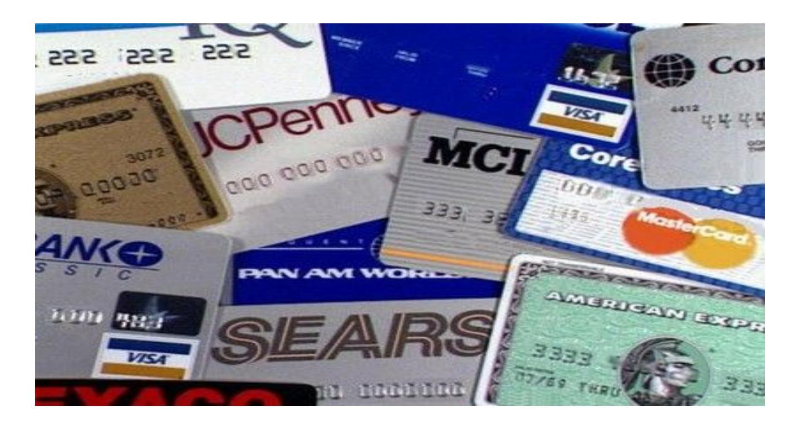

You can start by browsing our cards for banks and card issuers below. You can also use our credit card list to compare credit cards or to find the card with the right features and benefits for you. Our credit card list has been designed is an easy-to-use tool which enables you to compare rates, type of rewards, types of cards and annual fees. Once you make your choice, the credit card application is only a click away and many cards will give you a decision in less than 60 seconds.

To further educate and inform our customers about choosing the right credit card offer and how to spot the best credit card deal, we provide an extensive credit card selection and different card types. Here with our list you can learn more on how to take advantage of the various card benefits, as well as better understand their features and their importance to you building a legitimate credit score.

Another feature of our list is devoted to students, no credit and low credit persons who may be applying for a credit card for the first time. The college student credit cards offer value and benefits that can lead to greater financial flexibility and freedom, and help you build credit.

**SPECIAL CREDIT CARD DEALS:** Our credit card list offers a wide range of promotions which may offer bonuses that can be awarded after your first purchase. These awards may come in the form of cash back, air miles, merchandise or other rewards from the issuer that are in addition to the standard benefits that may be stated on your credit card application. You can also browse our credit cards section to get the lowest interest rate or our business and retail credit cards section to see the best offers for small businesses.

**APPLYING FOR A CREDIT CARD:** Filling out a credit card application is faster than ever before. To apply for a credit card online, simply provide the information requested, and click on the submit button. You may get an online decision in as little as a minute, in other cases you will be notified by mail within a couple of weeks. Use our list to browse and compare credit card offers available to you, all includes a online application. As a disclaimer we must inform you to read any contract fully before completing and submitting your application.

# **SPECIAL NOTE FOR OPENING APPLICATION LINKS:**

- SOME LINKS WHICH APPEAR WITHIN THIS LIST MAY NEED TO BE COPIED AND PASTED DIRECTLY INTO YOUR ADDRESS BAR.
- We have found some application links which are smaller than 1 line will directly link you to the given application.
- We have also found:
- LINKS WHICH ARE LONGER THAN 1 LINE:
- WILL NEED TO BE COPIED AND PASTED INTO YOUR WEB ADDRESS BAR;
- To direct you to the correct application address.
- This is due to the length of the website address which in some case will need to be copied and pasted into your address bar to make it work properly.
- Sorry for any inconvenience this may cause.

# **RETAIL CREDIT CARDS**

- **1. Abercrombie & Fitch Credit Card** <https://onlineaccess.mycreditcard.cc/abercrombie>
- **2. American Dream Card Master Card** <http://www.america>ndreamcard.com/
- **3. American Eagle Visa** [http://www.ae.com/web/getcarded/ae\\_creditcards\\_info.jsp?\\_requestid=181942](http://www.ae.com/web/getcarded/ae_creditcards_info.jsp?_requestid=181942)
- **4. Amazon.com Platinum Visa Credit Card** <http://www.amazon.com/gp/cobrandcard/marketing.html>
- **5. Amway Global Visa Credit Card** <https://www5.bankofamerica.com/credit>cards/marketingdetail.action?context\_id=marketing\_detail&offer\_id=ECOMM090BASG004 00800153140EN000&requestTimeout=120&router\_flag=y

**Provided By; www.oxfunding.com www.legalcpn.com**

- **6. America's Christian Credit Union Credit Cards** <http://www.americaschristiancu.com/home/vis>
- **7. Amtrak Guest Rewards MasterCard** <http://www.firstusa.com/cgi>bin/webcgi/webserve.cgi?partner\_dir\_name=amtrak&page=cont&mkid=6G8N
- **8. Ann Taylor Credit Card** <http://www.anntaylor.com/custs>erv/custserv.jsp?pageName=ATCard
- **9. Ann Taylor MasterCard** <http://www.anntaylor.com/custserv/custserv.jsp?pageName=ATCard>
- **10. Audi Visa Signature Credit Card** <http://www.audiusa.com/us/brand/en/financial.html>
- **11. Avon Old Farms School Visa** <http://www.cardpartner.com/app/avon>-old-farms-school
- **12. Banana Republic Credit Card** <https://secure>bananarepublic.gap.com/profile/PLCCHome.do?redirect=true
- **13. Barnes & Noble Credit Card** <http://www.barnesandnoble.com/membership/mc.asp?jp=3&z=y&cds2Pid=9481>
- **14. Bass Pro Shops Outdoor Rewards Visa** <https://www5.bankofamerica.com/credit>cards/marketingdetail.action?context\_id=marketing\_detail&offer\_id=ECOMM090DBDV004 00800150720EN000&requestTimeout=120&router\_flag=y

**Provided By; www.oxfunding.com www.legalcpn.com**

# **15. Belk Credit Card**

<https://www.onlinecreditcenter2.com/eapplygen2/load.do?cHash=1315641838&subActionId> =1000&langId=en

# **16. Bergdorf Goodman Credit Card**

<http://www.bergdorfgoodman.com/store/service/ccapplication/agreement.jhtml>

# **17. Best Buy Credit Card**

<http://www.bestbuy.com/site/null/null/pcmcat97200050032.c?id=pcmcat97200050032>

# **18. Best Buy Reward Zone MasterCard**

[http://www.bes](http://www.be)tbuy.com/site/null/null/pcmcat101600050004.c?id=pcmcat101600050004

# **19. Black Belt Rewards Visa**

<https://www.partnersfirstcc.com/landing.aspx?code=WBB&cid=99&jid=>4185212&ch=BAN

# **20. Bloomingdale's Credit Card**

<https://www.bloomingdales.com/service/credit/applynow/creditapp.ognc>

# **21. BMW Platinum Visa Credit Card**

<http://www.bmwusa.com/Standard/Content/FinancialServices/CreditCard.aspx>

# **22. Boat U.S. Platinum Plus Visa** <https://www5.bankofamerica.com/credit>cards/marketingdetail.action?context\_id=marketing\_detail&prod\_group\_cd=1ABC&request Timeout=120

**23. Boyds Bears Visa Platinum** <http://www.boydsstuff.com/newz/CreditCard.html>

**Provided By; www.oxfunding.com www.legalcpn.com**

**24. Brighter Planet Visa Credit Card** [http://brighterplanet.com/products/credit\\_card](http://brighterplanet.com/products/credit_card)

# **25. Brooks Brothers Credit Card**

<https://www.onlinecreditcenter2.com/eapplygen2/load.do?cHash=766574706&subActionId> =1000&langId=en

# **26. Brooks Brothers Platinum MasterCard**

[http://www.brooksbrothers.com/brookscard/landing\\_brookscard.tem](http://www.brooksbrothers.com/brookscard/landing_brookscard.tem)

# **27. Budweiser Credit Card**

[http://www.usbank.com/cgi\\_w/cfm/creditcards/Anheuser\\_Busch/bud\\_rewardsPlat.cfm?ics\\_](http://www.usbank.com/cgi_w/cfm/creditcards/Anheuser_Busch/bud_rewardsPlat.cfm?ics_) src=58000&redirect=AB58000

# **28. Buy.com Platinum Visa Card**

<https://ssl.buy.com/AC/loginAccount.aspx?ReturnUrl=%2fAC%2fAccount%2fBuyVisaRewar> ds.aspx%3fwhat%3dbuyvisa%26dir\_name%3dbuydotcom\_ic\_30\_30\_coup\_no\_int%26mkid %3d664Q&what=buyvisa&dir\_name=buydotcom\_ic\_30\_30\_coup\_no\_int&mkid=664Q

# **29. Cabela's Club Visa Credit Card**

<https://www.cabelas.com/cabelas/en/templates/community/aboutus/visa/visa>application.jsp;jsessionid=PFXLMAIFLDARLLAQBBISCONMCAEFEIWE?\_requestid=1639 2

- **30. Cache Visa Card** <http://www.cachevisa.com/credit/alert.do>
- **31. Casual Male Credit Card** [http://www.casualmale.com/store/en\\_US/static/creditcard.jsp](http://www.casualmale.com/store/en_US/static/creditcard.jsp)
- **32. Celebrity Cruises Visa Credit Card** <https://www5.bankofamerica.com/credit>cards/cardoverview.action?context\_id=overview\_page

**Provided By; www.oxfunding.com www.legalcpn.com**

| 33. |  | Chevy Chase Bank Credit Card |  |  |  |
|-----|--|------------------------------|--|--|--|
|-----|--|------------------------------|--|--|--|

<https://www.chevychasebank.com/personal/banking/credit>-cards.html

# **34. Chrysler Rewards Visa** [https://portal.rewards-](https://portal.rewards)

catalog.com/BankOfAmericaWeb/appmanager/bac/chrysler?\_nfpb=true&\_pageLabel=pFro ntPorch&\_nfls=false

- **35. Citi Forward by MySpace** <http://www.myspace.com/citiforward>
- **36. Coldwater Creek Credit Card** <http://www.firstusa.com/cgi>bin/webcgi/webserve.cgi?partner\_dir\_name=cac\_coldwater\_creek&page=index
- **37. Coors Credit Union Credit Card** <https://www.coorscu.org/coors/Cards.asp>
- **38. True Earnings® Card from Costco and American Express**

<http://www201.americanexpress.com/getthecard/learn>-about/Costco-TrueEarnings/25\_statement\_credit/23784?PID=1&BUID=CCG&PSKU=CST&CRTV=SJCS T&EAID=elCyaDYKozw-Xm22GnY%2AGgnqGiz%2FE%2AQ0TQ

# **39. Delta Community Credit Union Visa**

<https://www.deltacommunitycu.com/Personal/loancenter/visa.asp>

# **40. Dillard's American Express Card**

<https://www.onlinecreditcenter2.com/eapplygen2/load.do?cHash=733216883&subActionId> =1000

**Provided By; www.oxfunding.com www.legalcpn.com**

| 41. |  |  | Dillard's Credit Card |  |
|-----|--|--|-----------------------|--|
|-----|--|--|-----------------------|--|

<https://www.onlinecreditcenter2.com/eapplygen2/load.do?cHash=733216883&subActionId> =1000

# **42. Diner's Club Carte Blanche Card**

[https://www.dinersclubus.com/dce\\_content/personalcards](https://www.dinersclubus.com/dce_content/personalcards)

- **43. Diner's Club Charge Card** [https://www.dinersclubus.com/dce\\_content/personalcards](https://www.dinersclubus.com/dce_content/personalcards)
- **44. Direct TV Rewards Visa**

<https://www.barclaycardus.com/app/japply/lp/20896.jsp?campaignid=0000784&obadloc=02> 4&obchannel=03

- **45. Disney Rewards Visa Card from Chase** <http://disney.go.com/visa/today/index.html>
- **46. D.L. Evans Bank Corporate Credit Card** <http://www.dlevans.com/business.>asp?SubCategory=12
- **47. E\*Trade Financial Platinum Visa** <https://us.etrade.com/e/t/pagenotfound>
- **48. Expedia Corporate Travel Charge Card** <http://www.cardpartner.com/app/kca>
- **49. Expedia Corporate Travel MasterCard** http://www.cardpartner.com/app/alrandco
- **50. Express Credit Card (Express Fashion Credit Card)** <https://onlineaccess2.mycreditcard.cc/express?Action=intro.jsp>

**Provided By; www.oxfunding.com www.legalcpn.com**

**51. Free Spirit World MasterCard** <http://www.freespiritmastercard.com/> **52. Gap Credit Card** [https://secure-](https://secure)www.gap.com/profile/PLCCHome.do?redirect=true **53. Garfield Visa** [http://www.commercebank.com/personal/cards/credit/garfield-](http://www.commercebank.com/personal/cards/credit/garfield)visa/?rd=1 **54. GE Money Net Rewards Card** [http://www.gemoneycards.com/personal/credit\\_cards/rewards/index.html](http://www.gemoneycards.com/personal/credit_cards/rewards/index.html) **55. Good Sam Club Visa Credit Card** <https://www.partnersfirstc>c.com/landing.aspx?code=GGA&cid=99&jid=4185223&ch=BAN **56. Goodyear Credit Card** <http://www.goodyeartires.com/credit.html> **57. Green Dot Prepaid MasterCard / Visa** <https://www.greendotonline.com/Contents/Products.aspx> **58. Green Pay MasterCard** <http://www.greenpay.com/> **59. Gymboree Visa Platinum Credit Card** [http://www.usbank.com/cgi\\_w/cfm/credit/gymboree/home.cfm?cat=190&ics\\_src=54031](http://www.usbank.com/cgi_w/cfm/credit/gymboree/home.cfm?cat=190&ics_src=54031) **60. Habitat for Humanity Credit Card** <https://www4.bankofamerica.com/credit>cards/marketingdetail.action?context\_id=marketing\_detail&offer\_id=ECOMM090QVBO004 0080016511EN000&requestTimeout=120&router\_flag=y

**Provided By; www.oxfunding.com www.legalcpn.com**

| 61. |  |  | Hancock Bank Platinum Visa |  |
|-----|--|--|----------------------------|--|
|-----|--|--|----------------------------|--|

[http://www.hancockbank.com/personal/per\\_credit\\_cards.asp](http://www.hancockbank.com/personal/per_credit_cards.asp)

# **62. Harley-Davidson Credit Card**

[http://www.harleydavidsonvisa.com/cgi\\_w/cfm/creditcards/harleydavidson/index.cfm?ICS\\_](http://www.harleydavidsonvisa.com/cgi_w/cfm/creditcards/harleydavidson/index.cfm?ICS_) Source=47000

# **63. Harleysville National Bank Credit Cards**

<https://online1.elancard.com/oad/begin?locationCode=10048&preparerType=customer>

- **64. HAS Advantage Visa Platinum Card** <http://www.hasadvantage.com/>
- **65. Hello Kitty Credit Card** [http://www.sanrio.com/credit\\_card/](http://www.sanrio.com/credit_card/)
- **66. Helping Hands Visa** [http://www.cardpartner.com/app/helping-](http://www.cardpartner.com/app/helping)hands

# **67. Helzberg Diamonds Credit Card**

<http://www.helzberg.com/category/customer+service/helzberg+diamond+credit+card.do>

**68. Hess Visa Platinum Card from Chase** <http://www.firstusa.com/cgi>bin/webcgi/webserve.cgi?partner\_dir\_name=hess&page=cont&msc=Z0003016

# **69. Hilton Honors Visa Card from Citi**

<https://www.citicards.com/cards/acq/Apply.do?app=UNSOL&sc=FPSHW3G8&m=8HWB59> 7740W&langId=EN&siteId=HHONORS&B=S&uc=2YQ&s1=FGPHW3G8&d1=D&o1=02&B 1=P&screenID=3004

**Provided By; www.oxfunding.com www.legalcpn.com**

# **70. Hilton Honors Platinum Credit Card from American Express**

<https://www201.americanexpress.com/cards/Applyfservle>t?csi=4/12736/b/57/1296765618/1 29090705222/0/n

- **71. Holy Cross Credit Card** <http://www.holycross.edu/alumni/services/creditcard.html>
- **72. Home Depot Commercial Account Credit Card**

<https://www.accountonline.com/ACQ/RPL/Web/Apply?app=UNSOL&sc=45014&siteId=PLC> R\_HOMEDEPOT&langId=EN

# **73. Home Depot Commercial Revolving Charge Card**

<https://www.accountonline.com/ACQ/RPL/Web/Apply?app=UNSOL&sc=40012&siteId=PLC> R\_HOMEDEPOT&langId=EN

# **74. Home Depot Credit Card**

<https://www.citicards.com/cards/acq/Apply.do?screenID=3012&app=UNSOL&sc=30005&sit> eId=PLCN\_HOMEDEPOT&langId=EN&locale=en\_US

- **75. Honda Rewards Visa Credit Card** <http://www.firstusa.com/cgi>bin/webcgi/webserve.cgi?partner\_dir\_name=cac\_honda&page=index
- **76. Hooters Credit Card** <http://www.hooterscard.com/menu/home.aspx>

# **77. HSBC Platinum MasterCard**

<http://>www.disclosure.hsbccreditcard.com/1/2/media/disclosure?cmd\_lpage=&indicator=HS 018&media=R5IS047AAX0803000331XXHHX

**Provided By; www.oxfunding.com www.legalcpn.com**

| 78. |  | Icelandair MasterCard |
|-----|--|-----------------------|
|-----|--|-----------------------|

<https://www.juniper.co>m/app/japply/lp/15260.jsp?campaignid=0000526&obadloc=003

- **79. IKEA Credit Card** <http://www.ikeacards.com/>
- **80. Indianapolis Motor Speedway Credit Card** <https://www6.bankofamerica.com/credit>cards/marketingdetail.action?context\_id=marketing\_detail&offer\_id=ECOMM0901AIY0040 0800115976EN000&requestTimeout=120&router\_flag=y
- **81. International Brotherhood of Magicians Visa** <https://www.partnersfirstcc.com/landing.aspx?code=IBM&cid=99&jid=4185902&ch=BAN>
- **82. International Military Community Executives Association Visa** <http://www.cardpartner.com/app/imcea>
- **83. I Power Cash Card** <http://jacksonhewitt.co>m/ipower/index.html
- **84. ISPFCU Credit Cards** <http://www.ispfcu.org/visa.html>
- **85. J. Crew Credit Card** <http://www.jcrew.com/AST/FooterNaviga>tion/jcrewcard.jsp
- **86. JC Penney Credit Card**

<https://www.onlinecreditcenter2.com/eapplygen2/load.do?cHash=1342177401&subActionId> =1000

**87. Juniper Visa with iTunes Rewards** [http://store.apple.com/1-](http://store.apple.com/1)800-MY-APPLE/WebObjects/AppleStore?instantcredit=yes

**Provided By; www.oxfunding.com www.legalcpn.com**

| 88. | Kawasaki Good Times Credit Card http://www.kawasaki.com/OwnerInfo/GoodTimesCC.aspx                                                                                                                               |
|-----|---------------------------------------------------------------------------------------------------------------------------------------------------------------------------------------------------------------------|
| 89. | https://www.kingsizedirect.com/Account/Apply_CreditCard.aspx King Size Credit Card                                                                                                                               |
| 90. | King Size Rewards Visa Platinum https://www.kingsizedirect.com/Account/Apply_CreditCard.aspx                                                                                                                     |
| 91. | Kirkland's Credit Card https://www.onlinecreditcenter2.com/Kirkland/kirklands-apply.html                                                                                                                         |
| 92. | http://www.cardpartner.com/app/kjazz K Jazz 88.1 FM Visa                                                                                                                                                         |
| 93. | Kohl's Credit Card http://www.kohlscorporation.com/ChargeCard/Charge01.htm                                                                                                                                       |
| 94. | Kroger Credit Card - Kroger 1-2-3 Rewards MasterCard http://www.krogerpersonalfinance.com/credit-cards/?cid=dm                                                                                                   |
| 95. | Ladies Auxiliary VFW Credit Card https://www6.bankofamerica.com/credit cards/marketingdetail.action?context_id=marketing_detail&offer_id=ECOMM090LADD0050 0800115871EN000&requestTimeout=120&router_flag=y |

**96. La Quinta Visa Rewards Card** [http://www.firstusa.com/cgi-](http://www.firstusa.com/cgi)

bin/webcgi/webserve.cgi?partner\_dir\_name=cac\_laquinta&page=index

**Provided By; www.oxfunding.com www.legalcpn.com**

# **97. Latina Style Visa Platinum**

<https://applications.usbank.com/oad/begin?locationCode=9532&preparerType=customer>

# **98. Lexus Pursuits Visa Credit Card**

<http://www.lexusfinancial.com/co>nsumer/lfs.portal?\_nfpb=true&\_pageLabel=pg\_LPVHome

# **99. Linens-N-Things Credit Card**

<https://www.onlinecreditcenter6.com/consumerge>n2/login.do?subActionId=1000&clientId=li nsnthngs&accountType=plcc

# **100. L.L. Bean Visa Credit Card**

<http://www.llbean.com/webapp/wcs/stores/servlet/ShowOA>PLander?storeId=1&langId=- 1&psnl=2

# **101. Lowe's Credit Card**

<https://www.onlinecreditcenter2.com/eapplygen2/load.do?cHash=117440611&subActionId> =1000&langId=en

# **102. Lowe's Project Card**

[http://www.lowes.com/lowes/lkn?action=pg&p=CustServ/cc\\_compare\\_consumer.html](http://www.lowes.com/lowes/lkn?action=pg&p=CustServ/cc_compare_consumer.html) 

- **103. LPGA Credit Card** <https://www6.bankofamerica.com/credit>cards/cardoverview.action?context\_id=overview\_page
- **104. Mack Credit Cards (Fuel & Service or Mack MasterCard)** <http://www.mfscards.com/>
- **105. Macy's Credit Card** <https://www.macys.com/service/credit/applynow/creditapp.ognc>

**Provided By; www.oxfunding.com www.legalcpn.com**

**106. Marriott Rewards Premier Visa Signature Card** <http://www.firstusa.com/cgi>bin/webcgi/webserve.cgi?partner\_dir\_name=marriott\_premier&page=cont&mkid=617V&MS C=Z0048858

# **107. Marriott Rewards Signature Visa Card** [http://www.firstusa.com/cgi-](http://www.firstusa.com/cgi)

bin/webcgi/webserve.cgi?partner\_dir\_name=marriott\_rewards\_15k\_certificate&page=cont& mkid=617V&msc=Z0048858

# **108. Marriott Rewards Visa Business Card** [http://www.f](http://www.)irstusa.com/cgi-

bin/webcgi/webserve.cgi?partner\_dir\_name=marriott\_bizcard\_15k\_certificate&page=cont& mkid=617V&MSC=Z0048858

# **109. Meijer Credit Card**

<http://>www.meijer.com/content/content\_leftnav\_dynamic.jsp?pageName=financial\_services

# **110. Meijer Platinum MasterCard**

[http://www.meijer.com/content/content\\_leftnav](http://www.meijer.com/content/content_leftnav)\_dynamic.jsp?pageName=financial\_services

# **111. Meijer Prepaid MasterCard**

[http://www.meijer.com/content/content\\_leftnav\\_dynamic.jsp?pageName=financial\\_service](http://www.meijer.com/content/content_leftnav_dynamic.jsp?pageName=financial_service)s

# **112. Menards Credit Card**

<https://www.esnapw.com/rses/ESnapServlet?MerchantNumberSent=03598&MerchantRetu> rnLink=http://www.menards.com/bigCardCompleted.do

# **113. Men's Wearhouse Credit Card**

[http://www.menswearhouse.com/weba](http://www.menswearhouse.com/web)pp/wcs/stores/servlet/ContentAttachmentView\_- 1\_10601\_10051\_10652\_10693\_10682\_PerfectFitCreditCard.html

**Provided By; www.oxfunding.com www.legalcpn.com**

# **114. Mercedes-Benz Visa Credit Card**

<https://www.awardscatalog.com/epx/index.cfm?fuseaction=EPortal.AccountInitiateLoginSes> sion&type=Browse&thm=66776683&MBVisaSignatureADLink=000305005e9500FAAJ7J& MBVisaADLink=000305005f0100FAAJ7J

# **115. Mercedes-Benz Visa Signature Card**

<https://www.awardscatalog.com/epx/index.cfm?fuseaction=EPortal.AccountInitiateLoginSes> sion&type=Browse&thm=66776683&MBVisaSignatureADLink=000305005e9500FAAJ7J& MBVisaADLink=000305005f0100FAAJ7J

- **116. Merrill+ Visa Credit Card** <https://www.card.ml.com/MLRewardsCenter/View>-Cards/MERRILL.htm
- **117. Metro PCS Prepaid Visa Card** <http://www.metropcs.com/visa/>
- **118. Metro style Credit Card (formerly Lerner Catalog Credit Card)** [https://www.metrostyle.com/Account/Apply\\_CreditCard.aspx](https://www.metrostyle.com/Account/Apply_CreditCard.aspx)
- **119. NAPA Credit Card** http://www.napaautocare.com/easy-pay.aspx
- **120. Neiman Marcus Credit Card**

<http://www.neimanmarcus.com/store/service/ccapplication/agreement.jhtml>

- **121. Nordstrom Credit Card** [http://about.nordstrom.com/nordstromfashionrewards/#bank\\_1](http://about.nordstrom.com/nordstromfashionrewards/#bank_1)
- **122. Nordstrom Platinum Visa** [http://about.nordstrom.com/nordstr](http://about.nordstrom.com/nordst)omfashionrewards/#

**Provided By; www.oxfunding.com www.legalcpn.com**

# **123. Nordstrom Visa Signature Card**

[http://about.nordstrom.com/nordstromfashionrewards/#bank\\_1](http://about.nordstrom.com/nordstromfashionrewards/#bank_1)

# **124. Office Depot Credit Card (Personal)**

[http://www.officedepot.com/renderStaticPage.do?file=/creditcard/personal\\_info.jsp#odpers](http://www.officedepot.com/renderStaticPage.do?file=/creditcard/personal_info.jsp#odpers)

# **125. Office Depot Worklife Rewards Visa**

<http://www.myworkliferewards.com/loyalty/visa/learnMore.do>

# **126. OfficeMax Credit Card (Personal)**

<http://www.officemax.com/home/custom.jsp?id=m280004>

**127. Old Navy Credit Card** <http://oldnavy.gap.com/customerService/info.do?cid=44689>

# **128. One Call Credit Card**

http://www.onecall.com/FinancingOfferDetails.aspx?N=4294967000&FinancingOfferId=99

**129. One Cause Visa Platinum** [http://www.onecause.com/onecause\\_visa](http://www.onecause.com/onecause_visa)

# **130. Options Xpress Platinum Visa**

<http://www.optionsxpress.com/promos/visa.aspx?sessionid=0>

**131. Overstock.com Rewards Visa** <https://www.overstock.com/cobrandintro>

# **132. Payless Shoe Source Visa**

<https://www.barclaycardus.com/app/japply/lp/23114.jsp?campaignid=0000860&obadloc=00> 8&obchannel=005

**Provided By; www.oxfunding.com www.legalcpn.com**

- **133. PayPal Debit Card** <https://www.paypal.com/cgi>-bin/webscr?cmd=xpt/cps/account/DCIntrooutside&nav=1.3.1
- **134. PayPal Plus Credit Card** <https://www.paypal.com/cgi>bin/webscr?cmd=xpt/Marketing/general/PPPlusCC-outside
- **135. Pier 1 Credit Card** [http://www.pier1.com/BottomMenu1/Cred](http://www.pier1.com/BottomMenu1/Cre)itCard/tabid/121/Default.aspx
- **136. Pier 1 Rewards MasterCard** <http://www.firstusa.com/cgi>bin/webcgi/webserve.cgi?partner\_dir\_name=cac\_pier1\_rewards&page=index
- **137. Planet Hollywood Credit Card**

<https://applications.usbank.com/oad/begin?locationCode=9692&preparerType=customer>

**138. Plum Card from American Express**

<https://www201.americanexpress.>com/sbsapply/EACQServlet?request\_type=applyNow&bo s=b&BUID=SBS&CRTV=A0000065JK&eep=22949&ct=30&PSKU=PML&PID=1&AFFID=T BD&lpid=301&EAID=elCyaDYKozw-k4z6F9DD3ZIU0c7DR%2F84xg

**139. Princess Cruises Credit Card**

<https://www.barclaycardus.com/app/japply/lp/21805.jsp?campaignid=0000839&obadloc=00> 6&obchannel=005

**140. QuickBooks Platinum Plus for Business MasterCard**

[http://www.bankofamerica.com/small\\_business/business\\_credit\\_cards/index.cfm?template](http://www.bankofamerica.com/small_business/business_credit_cards/index.cfm?template) =quickbooks\_plat\_plus\_business

| 141. | Quicken Rewards Visa                                            | http://www.firstusa.com/cgi |  |
|------|-----------------------------------------------------------------|-----------------------------|--|
|      | bin/webcgi/webserve.cgi?partner_dir_name=cac_quicken&page=index |                             |  |

**142. Quik Trip Credit Cards** http://www.quiktrip.com/qtcards/qtcc.asp

# **143. QVC QCard**

<http://www.qvc.com/qic/qvcapp.aspx/app.html/params.file.%7CqCard%7Cqcar>d.html?cm\_r e=HP-\_-SITEMAP-\_-MYACCOUNT:QCARDINFO

**144. Rabbinical Assembly Credit Card** <http://www.cardpartner.com/app/ra>

# **145. Radio Shack Credit Card**

<http://www.radioshack.com/uc/index.jsp?page=researchLibraryArticle&articleUrl=..%2Fgrap> hics%2Fuc%2Frsk%2FResearchLibrary%2FBuyersGuides%2Fresearch%2Fcredit.html

**146. Rainbow Card Credit Card** <http://www.rainbowcard.com/Home.html>

# **147. Saks World Elite MasterCard**

[http://www.saksfifthavenue.com/SaksFirst/saksfirst.jsp?ASSORTMENT%3C%3East\\_id=14](http://www.saksfifthavenue.com/SaksFirst/saksfirst.jsp?ASSORTMENT%3C%3East_id=14) 08474395222441&bmUID=1255194440913

# **148. Sam's Club Business Credit Card**

<http://www.samsclub.com/shopping/navigate.do?catg=11040>

**149. Sam's Club Credit Card** <http://www.samsclub.com/shopping/navigate.do?catg=11039>

| 150. | Sam's Club Discover Cash Back Card                      |
|------|---------------------------------------------------------|
|      | http://www.samsclub.com/shopping/navigate.do?catg=11039 |

- **151. Sam's Club Discover Miles Card**  <http://www.samsclub.c>om/shopping/navigate.do?catg=11039
- **152. Sears Card Credit Card** [http://www.citibank.com/us/cards/srs/sears\\_card.jsp](http://www.citibank.com/us/cards/srs/sears_card.jsp)
- **153. Sears Commercial One Credit Card** <http://www.citibank.com/us/cards/srs/commercial1.jsp>
- **154. Sears Gold MasterCard** [http://www.citibank.com/us/cards/srs/sears\\_gold](http://www.citibank.com/us/cards/srs/sears_gold)-mc.jsp
- **155. SEEDS Visa** <http://www.cardpartner.com/app/seeds>
- **156. Select Comfort Credit Card** <http://www.selectcomfort.com/eng/storeSection/financing.>cfm?lefNavId=4
- **157. 7-Eleven Visa Credit Card** <http://www.firstusa.com/cgi>bin/webcgi/webserve.cgi?pdn=cac\_7eleven&page=index
- **158. Sheetz MasterCard** <http://www.firstusa.com/cgi>bin/webcgi/webserve.cgi?partner\_dir\_name=cac\_sheetz&page=index
- **159. Shopko Visa**

<https://www.juniper.com/app/japply/lp/25698.jsp?campaignid=0001058&obadloc=003&obc> hannel=034

**160. Shop NBC Credit Card** [http://www.](http://www)shopnbc.com/privatelabelcc/?cm\_re=BN-\_-CreditCard- \_-N **161. Shop NBC MasterCard** [http://www.shopnbc.com/privatelabelcc/?cm\\_re=BN](http://www.shopnbc.com/privatelabelcc/?cm_re=BN)-\_-CreditCard- \_-N **162. ShopRite Rite-Rewards MasterCard** <http://www.firstusa.com/cgi>bin/webcgi/webserve.cgi?partner\_dir\_name=shoprite\_choice&page=cont&mkid=6K8P **163. Sit4Less.com Credit Card** <http://www.sit4less.com/GECAF/index.html> **164. Six Flags Platinum MasterCard** [http://www.fir](http://www.fi)stusa.com/cgibin/webcgi/webserve.cgi?partner\_dir\_name=cac\_six\_flags&page=index **165. Smith Barney Chairman Card** [http://www.smithbarney.com/products\\_services/credit\\_car](http://www.smithbarney.com/products_services/credit_ca)ds/citi\_chairman/?4 **166. Smith Barney Citi PremierPass Card** [http://www.smithbarney.com/products\\_services/credit\\_cards/citi\\_card\\_sbelite/index.html?3](http://www.smithbarney.com/products_services/credit_cards/citi_card_sbelite/index.html?3)

[http://www.smithbarney.com/products\\_services/credit\\_cards/platselmc.html?2](http://www.smithbarney.com/products_services/credit_cards/platselmc.html?2)

**167. Smith Barney Platinum Select MasterCard**

**168. Smith Co Visa** <http://www.cardpartner.com/app/smithco>

|  | 170. | Sotheby's Credit Card |  |  |
|--|------|-----------------------|--|--|
|--|------|-----------------------|--|--|

<https://www.onlinecreditcenter6.com/consumergen2/login.do?subActionId=1000&clientId=s> othebys&accountType=dualcard

- **171. Starbucks Card Duetto Visa** <https://www.starbucks.com/card/>
- **172. Target Credit Card** [https://redcard.target.com/redcard/rc\\_main.jsp](https://redcard.target.com/redcard/rc_main.jsp)
- **173. Target Visa Card** [https://redcard.target.com/redcard/rc\\_main.jsp](https://redcard.target.com/redcard/rc_main.jsp)
- **174. Toys "R" Us & Babies "R" Us MasterCard Credit Card** [http://www.firs](http://www.fir)tusa.com/cgibin/webcgi/webserve.cgi?partner\_dir\_name=toys\_champpl\_aug08&page=cont&mkid=6TL0

# **175. Travelocity Rewards MasterCard**

<http://leisure.travelocity.com/Promotions/0,,TRAVELOCITY%7C3415%7C01,00.html?WA1> =03030&WA2=3368&WA3=12&WA4=060905\_barclays\_card\_mountain\_455&WA5=IM

# **176. Victoria's Secret Credit Card**

<https://onlineaccess2.mycreditcard.cc/victoriassecret?Action=Intro.jsp>

# **177. Wal-Mart Credit Card**

<https://www.onlinecreditcenter2>.com/walmartstorecard/Apply\_Now.html

**178. Wal-Mart Discover Card** <http://www.walmart.com/catalog/catalog.gsp?cat=111847>

# **PREPAID, SECURED AND STUDENT CREDIT CARDS**

- **1. All-Access Visa Prepaid Card** <https://www.allaccesscard.com/prepaid>-debitcard/applyNow.m
- **2. Allow Card Prepaid MasterCard** <http://www.allowcard.com/>
- **3. Account Now Prepaid Master Card** <http://cstrk.net/files/off/gen.aspx?a=XLMUW1>
- **4. American Express Card for Students** <http://www201.americanexpress.com/apply/Fmacfservlet?csi=1/6143/b/3/0/087153741892/> 0/n&Card\_name=StudentCard&link=CARD\_SELCTOR
- **5. American Savings Bank Secured Visa** [http://www.asbhawaii.com/personal/1\\_3\\_3\\_3.php](http://www.asbhawaii.com/personal/1_3_3_3.php)

# **6. American Savings Bank Student Secured Visa**

[http://www.asbhawaii.com/personal/1\\_3\\_3\\_4.php](http://www.asbhawaii.com/personal/1_3_3_4.php)

# **7. Applied Bank Secured Visa**

<https://onlineacceptance.appliedbank.com/displaySecureCardOffer.do?packType=3026&ci> d=5KNUW1

# **8. Applied Bank Secured Visa Gold Credit Card**

<https://onlineacceptance.appliedbank.com/displaySecureGoldCardOffer.do?packType=303> 7&cid=HKNUW1

- **9. Bank of America Secured Visa** <https://www6.bankofamerica.com/credit>cards/cardoverview.action?context\_id=overview\_page
- **10. Bank of America Student Visa Platinum** <https://www5.bankofamerica.com/credit>cards/marketinglist.action?context\_id=marketing\_list&category\_id=2002

# **11. Chase +1 Student MasterCard**

<https://app.firstusa.com/ICBatch/?PID=CHT4&SPID=BY3C&CAT=0&CELL=6H90&MSC=L> SBROWSEALLPAB&AFFID=9C.eSeL3cao-iJQhcjiDN2iUeNsFvFWjcg

# **12. Citi Forward Card for College Students**

<http://creditcards.citicards.com/usc/citiforward/single/external/affiliates/Q309/college/default> .htm?app=UNSOL&app\_COL=COLLEGE&sc=46EZA3T9&sc\_COL=4CECA3S9&m=90K90 0000SW&langId=EN&siteId=CB&B=V&screenID=3124&link=Consumer%5F77648053&Pro spectID=50DED2FEBEF0477D90D4D7E36CA54F0B

# **13. Citi Platinum Select Card for College Students**

<https://www.citicards.com/cards/acq/Apply.do?app=COLLEGE&sc=4CPCW3A8&m=70SR0> 0000BW&langId=EN&siteId=CB&B=V&screenID=3007

**14. Citi Secured MasterCard** [http://www.citicard](http://www.citicar)s.com/cards/wv/cardDetail.do?screenID=940 **15. Discover® Student Card\*\*** [https://www.discovercard.com/cardmembersvcs/acqs/app/getapp?sc=rhrv&iq\\_id=i](https://www.discovercard.com/cardmembersvcs/acqs/app/getapp?sc=rhrv&iq_id=i)91z6vqg n1qvawrtygs0 **16. Discover® Student Open Road Card\*\*** <http://www.discovercard.com/credit>-cards/ **17. Eufora Prepaid Credit Card** [http://links.ncs](http://links.nc)reporting.com/OtherOffers.html **18. Fifth Third Bank Secured MasterCard** [https://www.53.com/wps/portal/pv?New\\_WCM\\_Context=/wps/wcm/connect/FifthThirdSite/P](https://www.53.com/wps/portal/pv?New_WCM_Context=/wps/wcm/connect/FifthThirdSite/P) ersonal/Credit+%26+Debit+Cards/Credit+Cards/Secured+MasterCard/ **19. Finium Prepaid MasterCard** <https://secure1.galileoprocessing.com/acct4/docs/fn/> **20. First Premier Bank Corporate Credit Cards** <http://www.firstpremier.com/business/treasury/corporate>-cards/ **21. First Premier Gold Credit Card** <https://www.firstpremierbankgold.com/Default.aspx?appid=>RL0607311551PNQOL **22. First Vineyard Prepaid Credit Card** <http://www.firstvineyard.com/?s=170600&h=57229846> **23.First Miami Student Credit Union Visa**

<http://www.fmscu.org/index.php?dynamItAction=content.show&id=17>

**24. Key Bank Student Credit Card** <https://www.key.com/html/student>-credit-card.html **25. Merrick Bank Secured MasterCard** <https://secure.merrickbank.com/SecuredCard/Default.aspx?js=1> **26. Mio Prepaid Credit Card** <https://www.miocard.com/> **27. MYV U Platinum Select Visa Card for College Students** <http://creditcards.citicards.com/usc/citiforward/search/Q309/v3/default.htm?app=UNSOL&a> pp\_COL=COLLEGE&sc=46EZA3T9&sc\_COL=4CECA3S9&m=90K900000ZW&langId=EN &siteId=CB&B=V&screenID=3124&link=Consumer%5F48422176&ProspectID=D55244230 1DC4D199D26FD678BF0709A **28. MY plash Prepaid Credit Card** <http://myplash.com/> **29. National City PayCard Direct** <https://www.nationalcity.com/main/pages/choosezip.asp> **30. New Millennium Bank Secured MasterCard or Visa** <https://securesite.icommissions.com/nmbgoldcreditcards/index.php?hid=h87945281h&aid=> 35507 **31. Orchard Bank MasterCard** [http://www.orchardba](http://www.orchardb)nk.com/ecare/cards?docId=Cards\_Tab\_data\_cards\_ob\_sp7\_xml&WT .svl=300

**32. PAY JR Prepaid Credit Card** <http://www.payjr.com/>

| 33. | Payoneer Cash Link Prepaid MasterCard http://www.payoneer.com/                                                                          |
|-----|--------------------------------------------------------------------------------------------------------------------------------------------|
| 34. | http://www.readydebit.com/ Ready Debit Visa                                                                                             |
| 35. | Sony Student Visa http://www.firstusa.com/cgi bin/webcgi/webserve.cgi?partner_dir_name=cac_sony_stu&page=index                       |
| 36. | Sovereign Bank Student Credit Card https://wwwa.applyonlinenow.com/USCCapp/Ctl/entry?sc=FACQZD                                          |
| 37. | Starbucks Student Card Duetto Visa http://www.firstusa.com/cgi bin/webcgi/webserve.cgi?partner_dir_name=cac_starbucks_stu&page=index |
| 38. | State Farm Student Credit Card http://www.statefarm.com/bank/credit_cards/s_visa/s_visa.asp                                             |
| 39. | US Bank Young Adult Visa Card http://www.usbank.com/cgi_w/cfm/creditcards/young_adult/young_adult_visa.cfm                              |
| 40. | Wells Fargo College Visa Credit Card https://www.wellsfargo.com/credit_cards/student/                                                   |
| 41. | https://www.wellsfargo.com/credit_cards/secured/ Wells Fargo Secured Credit Card                                                        |
| 42. | Western Union Prepaid MasterCard http://www.westernunion.com/info/selectCountry.asp                                                     |
|     |                                                                                                                                            |

# **GAS CARDS**

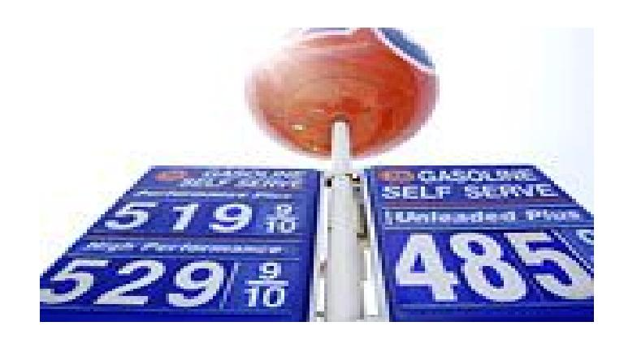

- **1. BP Business Solutions MasterCard Fleet Card** <http://www.bpbusinesssolutions.com/>
- **2. BP Business Solutions Fuel Card** <http://www.bpbusinesssolutions.com/>
- **3. BP Gasoline Card (BP Gas Credit Card)** <http://www.firstusa.com/cgi>bin/webcgi/webserve.cgi?partner\_dir\_name=bp\_pl\_nopremium&page=cont&MKID=690N
- **4. Chevron Business Credit Card** <http://www.chevrontexacobusinesscard.com/>
- **5. Chevron Credit Card / Texaco Credit Card** <http://www.chevrontexacocards.com/>
- **6. Chevron Texaco Visa** [https://www.onlinecreditcenter2.com/dualcardimage](https://www.onlinecreditcenter2.com/dualcardimag)s/generic/chevron/en/landing\_visa.html
- **7. Citgo Celebrity Credit Card** <http://www.citgo.com/CreditCash/CITGOCards/CITGOCelebrity.jsp>

| 8.  | Citgo Fleet Credit Cards http://www.citgo.com/CreditCash/CITGOCards/CITGOFleetPrograms.jsp                      |
|-----|--------------------------------------------------------------------------------------------------------------------|
| 9.  | Citgo MasterCard Credit Card http://www.citgo.com/CreditCash/CITGOCards/CITGOMasterCard.jsp                     |
| 10. | Citgo Plus Card http://www.citgo.com/CreditCash/CITGOCards/CITGOPlus.jsp                                        |
| 11. | ExxonMobil Business Credit Card http://www.exxon.com/USA English/GFM/How_to_Buy/ExxonMobil_Business_Card.asp |
| 12. | ExxonMobil Credit Card http://www.exxon.com/USA English/GFM/How_to_Buy/ExxonMobil_Card.asp                   |
| 13. | ExxonMobil Fleet Credit Card http://www.exxon.com/USA English/GFM/How_to_Buy/ExxonMobil_Fleet.asp            |
| 14. | ExxonMobil MasterCard http://www.citibank.com/us/cards/exmbl/exmb_mstr.jsp                                      |
| 15. | Exxon Preferred Credit Card http://www.exxon.com/USA English/GFM/How_to_Buy/ExxonMobil_Preferred.asp         |
| 16. | Giant Eagle Fuel perks! Credit Card https://onlineaccess.mycreditcard.cc/gianteagle?Action=Intro.jsp         |

**17. Marathon Platinum MasterCard** <http://www.firstusa.com/cgi>-

bin/webcgi/webserve.cgi?pdn=marathon\_aep\_mar07&page=cont&mkid=6W7H

# **18. Shell Credit Card**

<https://www.accountonline.com/ACQ/Apply?app=UNSOL&sc=QOATNI00&m=>0000047339 0&siteId=PLOC\_SHELL

- **19. Shell Fleet Credit Card** <http://www.citibank.com/us/cards/shell/fleet>-crd.jsp
- **20. Shell MasterCard**

[http://www.shell.us/home/content/usa/products\\_services/shell\\_cards/mastercard/mastercar](http://www.shell.us/home/content/usa/products_services/shell_cards/mastercard/mastercar) d\_calculator.html

# **21. Shell Select Member Credit Card**

<https://www.accountonline.com/ACQ/Apply?app=UNSOL&sc=QOATFI00&m=0000047187> 0&siteId=PLOC\_SHELL

- **22. Sunoco Credit Card** http://www.sunocoinc.com/site/Consumer/ApplyforaCreditCard.htm
- **23. Sunoco Fleet Credit Cards**

<http://www.sunocoinc.com/site/Consumer/ApplyforaCreditCard.htm>

- **24. Sunoco MasterCard** <http://www.sunocoinc.com/site/Consumer/ApplyforaCreditCard.htm>
- **25. Sunoco Universal Card**

<http://>www.sunocoinc.com/site/Consumer/ApplyforaCreditCard.htm#SunCard

# **BUSINESS CREDIT CARDS**

# **1. Amazon.com Business Credit Card**

[http://www.amazon.com/gp/cobrandcard/marketing.html/ref=cobrand\\_ch\\_b2/182](http://www.amazon.com/gp/cobrandcard/marketing.html/ref=cobrand_ch_b2/182)-3086995- 4961456?ad=0001&pr=bus321&inc=30stmt&place=marketing&plattr=none&imp=23863313 291&refplace=marketing\_con321

# **2. American Express Business ExtrAA Corporate Card**

<http://corp.americanexpress.com/gcs/cards/bx/default.aspx>

# **3. American Express Business Gold Rewards Card**

[http://www201.americanexpress.com/sbsapp/FMACServlet?request\\_t](http://www201.americanexpress.com/sbsapp/FMACServlet?request_t)ype=alternateChanne ls&lpid=298&openeep=123&ccsgeep=456/12121&PID=1&BUID=SBS&PSKU=BGR&CRTV =BGRSCLP&EAID=elCyaDYKozw-VTxXBBgtD1mPHYu92EQx0g

# **4. American Express Business Green Rewards Card**

[https://www201.americanexpress.com/sbsapply/EACQServlet?request\\_type=applyNow&ct](https://www201.americanexpress.com/sbsapply/EACQServlet?request_type=applyNow&ct) =64&bos=b&eep=22110

# **5. American Express Business Platinum Card**

<https://www201.americanexpress.>com/sbsapply/EACQServlet?request\_type=applyNow&bo s=b&BUID=SBS&CRTV=A000005TY3BPC&eep=22388&ct=16&EAID=elCyaDYKozw-LAbvZF\*WncN11ZXqzePrUA&PSKU=BPC&PID=1&PID=1&BUID=SBS&PSKU=BPC&CRT V=A000005TY3BPC&EAID=elCyaDYKozw-LAbvZF%2AWncN11ZXqzePrUA&lpid=96

**6. American Express Corporate Card** <http://corp.americanexpress.com/gcs/cards/>

# **7. American Express Executive Business Card**

[https://www201.americanexpress.com/sbsapply/EACQServlet?request\\_type=applyNow&bo](https://www201.americanexpress.com/sbsapply/EACQServlet?request_type=applyNow&bo) s=b&eep=16662&ct=15

# **8. American Express Platinum Business Credit Card**

[https://www201.americanexpress.com/sbsapply/EACQServlet?request\\_type=applyNow&ct](https://www201.americanexpress.com/sbsapply/EACQServlet?request_type=applyNow&ct) =48&bos=b&eep=22110

# **9. American Express Simply Cash Business Card**

[https://www201.americanexpress.com/sbsapply/EACQServlet?request\\_type=applyNow&bo](https://www201.americanexpress.com/sbsapply/EACQServlet?request_type=applyNow&bo) s=b&ct=75&eep=22109

# **10. Blue for Business from American Express**

[https://www201.americanexpress.com/sbsapply/EACQServlet?request\\_type=applyNow&bo](https://www201.americanexpress.com/sbsapply/EACQServlet?request_type=applyNow&bo) s=b&ct=46&eep=22109

# **11. Citi Business Card**

<https://www.citicards.com/cards/acq/Apply.do?screenID=3005&app=UNSOL&siteId=BAO&l> angId=EN&sc=6V3ZG3Y7&B=V&m=2CPO010000W&ProspectID=01DD6DCDC17442AEA 99389B294F6224A

# **12. Costco True Earnings Business Card from American Express**

[http://www201.americanexpress.com/sbsapp/FMACServlet?request\\_type=alternateChanne](http://www201.americanexpress.com/sbsapp/FMACServlet?request_type=alternateChanne) ls&lpid=303&openeep=123&ccsgeep=456/7869&PID=1&BUID=SBS&PSKU=COS&CRTV= COSSCLP&EAID=elCyaDYKozw-JoLqinN0L9tsF1%2AjhpLCdA

# **13. First Bank Business Visa Credit Card (California, Colorado)**

<https://www.efirstbank.com/business/creditcards/visacreditcard.html>

| 14. | GM Business Credit Card https://www.gmbusinesscard.com/GMBusinessCard/                                                    |
|-----|------------------------------------------------------------------------------------------------------------------------------|
| 15. | GM Card (GM Flexible Earnings Card) https://www.hsbcapply.com/start/gmflexcard                                            |
| 16. | GM Extended Family Card https://www.gmextendedfamily.com/GMExtendedFamily/                                                |
| 17. | Office Depot Business Credit Card http://www.officedepot.com/renderStaticPage.do?file=/creditcard/business_info.jsp#odbiz |
| 18. | Office Depot Worklife Rewards Visa Business Card http://www.myworkliferewards.com/loyalty/visa/learnMore.do               |
| 19. | OfficeMax Credit Card (Business) http://www.officemax.com/home/custom.jsp?id=m280004                                      |
| 20. | OfficeMax Credit Card (Corporate) http://www.officemax.com/home/custom.jsp?id=m280004                                     |

# **LARGE BANKS AND MISC CREDIT CARD OFFERS**

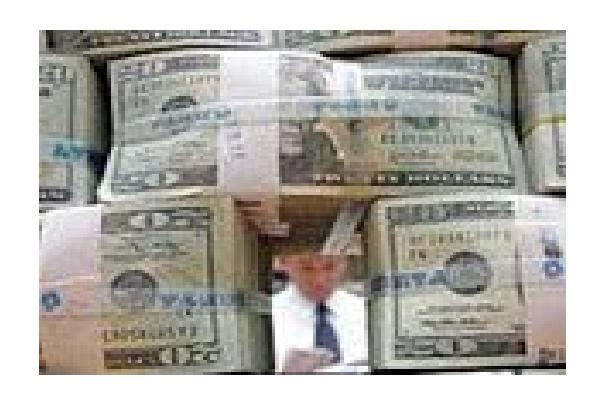

**1. AAdvantage Bronze MasterCard from Citi**

<https://www.citicards.com/cards/acq/Appl>y.do?app=UNSOL&sc=4XUZA288&m=4MNWZC CWAWW&langId=EN&siteId=CB&B=A&screenID=3001

**2. AAA Rewards Visa Credit Card (Northern California, Nevada, Utah)** <http://www.firstusa.com/cgi>bin/webcgi/webserve.cgi?partner\_dir\_name=cac\_aaa\_northern\_ca\_nv\_ut&page=index

# **3. AAdvantage American Express from Citi**

<https://www.citicards.com/cards/acq/Apply.do?app=UNSOL&sc=BXDIW267&m=6MNWZC> CW3WW&langId=EN&siteId=CB&B=X&screenID=303 3

**4. AAdvantage Bronze MasterCard from Citi for College Students**

<https://www.citicards.com/cards/acq/Apply.do?app=COLLEGE&sc=4CTCW2D8&m=70SR0> 0000LW&langId=EN&siteId=CB&B=M&screenID=3008

# **5. AAdvantage Citi Business Card**

[http://creditcards.citica](http://creditcards.citic)rds.com/usc/business/AA/Q4/dual/multichannel/default.htm?screenI D=3006&app=UNSOL&siteId=BAO&langId=EN&sc=6VVZE6B7&B=M&m=NSBC030000W &BT\_TX=1&ProspectID=EE3D74E4DA8643ACAB8F6ED2C3997F4E

**6. AARP Rewards Platinum Visa Credit Card** <http://www.firstusa.com/cgi>bin/webcgi/webserve.cgi?partner\_dir\_name=aarp\_rewards&page=cont

# **7. AARP Travel Plus Visa Signature Card**

[https://www.chase.com/index.jsp?pg\\_name=ccpmapp/cms/special\\_offers/page/AARP\\_Trav](https://www.chase.com/index.jsp?pg_name=ccpmapp/cms/special_offers/page/AARP_Trav) el\_Plus

- **8. Air Canada Credit Card** <https://www5.bankofamerica.com/credit>cards/marketingdetail.action?context\_id=marketing\_detail&offer\_id=ECOMM090RAEF0050 6700140761EN000&requestTimeout=120&router\_flag=y
- **9. The American Express Gold Card** <http://www201.americanexpress.com/getthecard/learn>about/Preferred-Rewards-Gold
- **10. American Express Platinum Card** <http://www201.americanexpress.com/getthecard/learn>about/Platinum-Card

# **11. American Express Platinum Cash Rebate Card**

[https://www212.americanexpress.com/dsmlive/dsm](https://www212.americanexpress.com/dsmlive/ds)/dom/us/en/phaseib/platinumcashrebate .do?vgnextoid=2a4cc6d528ac6110VgnVCM200000d0faad94RCRD&vgnextchannel=e2cb0 db3915e7010VgnVCM10000084b3ad94RCRD&name=platinumcashrebate&type=intprodu ct

# **12. American Express Preferred Rewards Gold Card**

<https://www201.americanexpress.com/cards/Applyfservlet?csi=76/18566/b/240&PID=1&BU> ID=CCG&PSKU=PGO&CRTV=AMEXGOLD&AFFID=tbd&EAID=elCyaDYKozw-Uw3GB%2A59Cq86km%2Akh9RhXA

# **13. American Express Rewards Plus Gold Card**

<http://www201.americanexpress.com/getthecard/learn>-about/Rewards-Plus-Gold

**14. American Savings Bank Visa** [http://www.asbhawaii.com/personal/1\\_3\\_3\\_1.php](http://www.asbhawaii.com/personal/1_3_3_1.php)

- **15. American Savings Bank Visa Gold** [http://www.asbhawaii.com/personal/1\\_3\\_3\\_2.php](http://www.asbhawaii.com/personal/1_3_3_2.php)
- **16. Am Trust Bank Rewards American Express Card** <https://wwwa.applyonlinenow.com/USCCapp/Ctl/entry?directMail=true&>sc=UAAJW5
- **17. Am Trust Bank World Points Credit Card** <https://wwwa.applyonlinenow.com/USCCapp/Ctl/entry?directMail=true&sc=UAAFUA>
- **18. AT&T Universal Business Rewards Card**

<http://creditcards.citicards.com/usc/ATT/Business/CreditCard/openmkt/q109pricing/default.> htm?BTData=C02127E7460617459544A43BEBEB5ACA499918493FEF6F6E8EAC5C2D6 EC663D6&BT\_TRF=678549&BT\_CON=73&app=UNSOL&sc=6VGZF349&m=2CK901000 0W&langId=EN&siteId=ATT&B=V&screenID=3104&BT\_PRD=127&link=Consumer%5F108 523370&ProspectID=DAE141C525FF4198BE0E0604C93632DA

**43. AT&T Universal Savings Platinum Card**

<https://www.citicards.com/cards/wv/cardDetail.do?screenID=951&origincontentId=CONSU> MER&CONTENT\_TYPE=constituency\_detail

**44. AT&T Universal Savings & Rewards Card**

<https://www.citicards.com/cards/acq/Apply.do?app=UNSOL&sc=6UJZJ398&m=4000438CB> 0W&langId=EN&siteId=AC&B=M&screenID=3003&uc=2VP&t=t

- **45. Banco Popular Credit Cards** [http://www.bancopopular.com/us/personal/cards/us-](http://www.bancopopular.com/us/personal/cards/us)per-carcredit-cards-en.jsp
- **46. Bancorp South Credit Card** <http://www.bancorpsouthonline.com/home/personal/credit>

**47. Bancorp South MasterCard Business Card**

http://www.bancorpsouthonline.com/home/business/credit

**48. Bank of America Accelerated Cash Rewards American Express Card**

<https://www6.bankofamerica.com/credit>-

cards/marketingdetail.action?context\_id=marketing\_detail&offer\_id=ECOMM0908ATY0030 0100145160EN000&requestTimeout=120&router\_flag=y

- **49. Bank of America Cash Rewards Credit Card** <https://www5.bankofamerica.com/credit>cards/cardoverview.action?context\_id=overview\_page
- **50. Bank of America Choice Privileges Visa** <https://www6.bankofamerica.com/credit>cards/cardoverview.action?context\_id=overview\_page
- **51. Bank of America Visa Gold** <https://www5.bankofamerica.com/credit>cards/cardoverview.action?context\_id=overview\_page
- **52. Bank of America Visa Signature with World Points**

<https://www5.bankofamerica.com/credit>-

cards/marketingdetail.action?context\_id=marketing\_detail&offer\_id=ECOMM0908AYB0040 6800151520EN000|2003329|5T

**53. BB&T Visa Business Credit Card**

<http://www.bbt.com/business/products/visacreditcard/default.html>

**54. BB&T Visa Corporate Card**

<http://www.bbt.com/business/products/visacorporatecard/default.html>

**55. BB&T Visa Purchasing Card**

<http://www.bbt.com/business/products/vi>sapurchasingcard/default.html

| 56. | Blue from American Express https://www201.americanexpress.com/cards/Applyfservlet?csi=38/31211/b/10                                                         |
|-----|----------------------------------------------------------------------------------------------------------------------------------------------------------------|
| 57. | British Airways Visa Signature Card http://www.firstusa.com/cgi bin/webcgi/webserve.cgi?partner_dir_name=british_airways_20k_kit&page=cont&mkid=6Z HB |
| 58. | Capital Bank Credit Cards http://www.capitalbank nc.com/personal_banking/personal_products/debit_credit_atm_cards/prime_advantage_cr edit_cards.html  |
| 59. | Central Bank Credit Cards (Illinois) http://www.centralillinoisbank.com/consumerlending.html                                                                |
| 60. | Central Bank Credit Cards (Kentucky) https://www.centralbank.com/personal/creditcards                                                                       |
| 61. | CFCU Credit Union Visa http://www.mycfcu.com/personal/borrowing.htm#visa                                                                                    |
| 62. | Charter One Circle Rewards MasterCard http://www.charterone.com/tools/error.aspx                                                                            |
| 63. | Charter One Platinum MasterCard http://www.charterone.com/tools/error.aspx                                                                                  |
| 64. | Chase Freedom Credit Card http://www.chasefreedomnow.com/                                                                                                   |

**65. Citi Diamond Preferred Rewards American Express Credit Card** <https://www.citicards.com/cards/acq/Apply.do?app=UNSOL&sc=BDRZ1497&m=60000000> 00W&langId=en&siteId=CB&B=X&uc=2JN&t=t&screenID=3017

# **66. Citi Platinum Select MasterCard**

<http://creditcards.citicards.com/usc/platinum/affiliate/Q309/default.htm?BTData=C02127E7> 460617459544A43BEBEB5AFAC989B8492F8FAF0EFEAC5C2DE3BE63D6&BT\_TRF=67 8904&BT\_CON=73&app=UNSOL&sc=4T3ZJDQ9&m=7CK9000000W&langId=EN&siteId= CB&B=M&screenID=3000&uc=3JY&t=t&link=Consumer%5F27020748&ProspectID=E2548 9F9649941EC9FDD10E5C2FB49E1

- **67. Citizens & Northern Bank Credit Cards** <https://online1.elancard.com/oad/begin?locationCode=9257&preparerType=customer>
- **68. Comerica Bank Credit Cards** <http://www.comerica>.com/vgn-exttemplating/v/index.jsp?vgnextoid=9b3e90857cf83010VgnVCM1000004302a8c0RCRD
- **69. Commerce Bank Commerce Miles Visa Gold (Kansas, Missouri, Illinois)** <http://www.>commercebank.com/personal/cards/credit/commerce-miles/?rd=1
- **70. Commerce Bank Special Connections Credit Card (Kansas, Missouri, Illinois)** <http://www.commercebank.com/per>sonal/cards/credit/special-connections/
- **71. Continental Airlines World MasterCard** [https://www.continental.com/web/en-](https://www.continental.com/web/en)US/content/products/chase/continental.aspx?offer=WL00&FS=1&mkid=6G5T
- **72. Credit One Bank Credit Cards** <http://www.creditonebank.com/credit>-cards.aspx
- **73. Delta Sky Points Credit Card from American Express** <https://www212.americ>anexpress.com/dsmlive/dsm/dom/us/en/phaseib/deltaskypoints.do?

**Provided By; www.oxfunding.com www.legalcpn.com**

credit-cards.php

vgnextoid=671e2a38e6ac6110VgnVCM200000d0faad94RCRD&vgnextchannel=e2cb0db3 915e7010VgnVCM10000084b3ad94RCRD&name=deltaskypoints&type=intproduct

**74. Discover Open Road Card\*\*** [http://www.discovercard.com/credit-](http://www.discovercard.com/credit)cards/ **75. Dollar Bank City Pride Visa** <http://www.dollarbank.com/creditcard/visacitypride.aspx> **76. Dollar Bank Valued Customer Visa** <http://www.dollarbank.com/creditcard/visa.aspx> **77. Farm Bureau Bank MasterCard** <http://www.farmbureaubank.com/Cred>itCards **78. Fifth Third Bank Professional MasterCard** <https://www.53.com/wps/portal/pv?N>ew\_WCM\_Context=/wps/wcm/connect/FifthThirdSite/P ersonal/Credit+%26+Debit+Cards/Credit+Cards/Professional+MasterCard/ **79. Fifth Third Bank Responsible MasterCard** [https://www.53.com/wps/portal/pv?New\\_WCM\\_Context=/wps/wcm/connect/FifthThirdSite/P](https://www.53.com/wps/portal/pv?New_WCM_Context=/wps/wcm/connect/FifthThirdSite/P) ersonal/Credit+%26+Debit+Cards/Credit+Cards/Responsible+MasterCard/ **80. First Bank Rewards American Express Credit Card (California, Illinois, Missouri, Texas)** <https://wwwa.applyonlinenow.com/USCCapp/Ctl/entry?directMail=true&sc=UAAJW8>

**81. First Bank of San Luis Obispo Credit Cards** <https://www.firstbankslo.com/consumer>-

**Provided By; www.oxfunding.com www.legalcpn.com**

| 82. | First Financial Credit Union Credit Cards (New Mexico) |
|-----|--------------------------------------------------------|
|     | http://www.ffnm.org/ApplyforaCard.aspx                 |

- **83. First Hawaiian Bank Credit Cards** <https://www.fhb.com/creditcards.htm>
- **84. First Interstate Bank Credit Cards** [https://www.firstinterstatebank.com/personal/credit\\_cards.php](https://www.firstinterstatebank.com/personal/credit_cards.php)
- **85. First Merit MasterCard or Visa Standard** <http://www.firstmerit.com/personal/cards/mcStandard.a>spx
- **86. First Merit Visa Platinum Card** <http://www.firstmerit.com/personal/cards/index.aspx>
- **87. First National Bank Omaha Bucks Back Visa** [http://www.firstnational.com/001/html/en/personal/cardproducts/creditcards/credit\\_card\\_mai](http://www.firstnational.com/001/html/en/personal/cardproducts/creditcards/credit_card_mai) n.html?utm\_id=16
- **88. First National Bank Omaha Commercial Edition Visa** <http://www.firstnational.com/001/html/en/personal/personal.html>
- **89. First National Bank Omaha Maximum Rewards Visa Credit Card** [http://www.firstnational.com/001/html/en/personal/cardproducts/creditcards/credit\\_card\\_mai](http://www.firstnational.com/001/html/en/personal/cardproducts/creditcards/credit_card_mai) n.html?utm\_id=16
- **90. First National Bank Omaha Platinum Edition Visa** [http://www.firstnational.com/001/html/en/personal/cardproducts/creditcards/credit\\_card\\_mai](http://www.firstnational.com/001/html/en/personal/cardproducts/creditcards/credit_card_mai) n.html?utm\_id=16

| 92. | First National Bank & Trust Credit Cards (Arkansas) http://www.fnbmh.com/credit.htm                            |
|-----|-------------------------------------------------------------------------------------------------------------------|
| 93. | First National Bank & Trust Credit Cards (Florida) http://www.firstbankcardservices.com/                       |
| 94. | First National Bank & Trust Credit Cards (Michigan) http://www.fnbimk.com/FillForms/CardApp.asp                |
| 95. | First Responders Credit Card http://www.firstresponders.com/products/credit_cards/                             |
| 96. | First Trust Bank Credit Cards https://www.yourbankcard.com/welcome/jsp/dynapp/prodlist.jsp?bank=firstrust      |
| 97. | First Security Bank Credit Cards (Arkansas) http://www.fsbank.ifworld.com/personal_banking/additional_services |
| 98. | First Security Bank/First State Bank Credit Cards (Montana) https://www.fsbmsla.com/persCardsCredit.cfm        |
| 99. | https://www.firsttennessee.com/ First Tennessee First Travel Visa                                              |
|     | 100. 5Star Bank Credit Cards http://www.afbabank.com/Afba_Bank/credit_card_screen_1.htm                        |

- **101. Florida Atlantic University Credit Card** [https://www6.bankof](https://www6.banko)america.com/creditcards/marketingdetail.action?context\_id=marketing\_detail&offer\_id=ECOMM090AAJL0050 080011769EN000&requestTimeout=120&router\_flag=y
- **102. Franklin Templeton Bank & Trust Platinum MasterCard** [http://www.ftbank.com/ftb/jsp/content\\_ns.jsp?url=/credit\\_card/cc\\_main\\_p](http://www.ftbank.com/ftb/jsp/content_ns.jsp?url=/credit_card/cc_main_p)
- **103. Huntington Bank World Points Credit Card** <https://www.huntington.com/pas/HNB1500.htm>
- **104. Iberia Bank MasterCard** <http://creditcards.iberiabank.com/?afid=0010>-A57230248
- **105. Iberia Bank MasterCard Gold Cash Bank** <http://creditcards.iberiabank.com/?afid=0010> C57230252
- **106. Iberia Bank Visa Platinum Rewards Card** <http://creditcards.iberiabank.com/?afid=11cardratingsibplatinum>
- **107. Jeep Rewards Visa** <https://portal.rewards>catalog.com/BankOfAmericaWeb/appmanager/bac/jeep?\_nfpb=true&\_pageLabel=pFrontP orch&\_nfls=false
- **108. JetBlue Business Card from American Express**

[http://www201.americanexpress.com/sbsapp/FMACServlet?request\\_type=alternateChanne](http://www201.americanexpress.com/sbsapp/FMACServlet?request_type=alternateChanne) ls&lpid=299&openeep=123&ccsgeep=456/13497&PID=1&BUID=SBS&PSKU=JBL&CRTV= JBLSCLP&EAID=elCyaDYKozw-4ZJBsi6xXW2FsDp0kOPMkA

| 109. |  | Miles by Discover® Card |  |
|------|--|-------------------------|--|
|------|--|-------------------------|--|

[https://www.discovercard.com/cardmembersvcs/acqs/app/getapp?sc=k3ne&iq\\_id=i94a777](https://www.discovercard.com/cardmembersvcs/acqs/app/getapp?sc=k3ne&iq_id=i94a777) m44ocneutit0p

- **110. MINI Platinum Visa Credit Card** <http://www.4myminicard.com/>
- **111. M&T Bank Visa**

<https://www.mtb.com/personal/loanscredit/creditcard/Pages/CreditCardDetail.aspx>

# **112. National City Everyday Rewards Visa**

<https://www.nationalcity.com/main/pages/choosezip.asp>

- **113. National City Points Visa** [https://www.n](https://www.)ationalcity.com/main/pages/choosezip.asp
- **114. National City Scrapbook Rewards Visa**

<https://www.nationalcity.com/main/pages/choosezip.asp>

# **115. National City Travel Rewards Visa**

<https://www.nationalcity.com/main/pages/choosezip.asp>

- **116. National City Visa Buxx Card** [https://www.nationalcity.com/main/pages/choo](https://www.nationalcity.com/main/pages/cho)sezip.asp
- **117. National City Visa Travel Money Prepaid Credit Card**

<https://www.nationalcity.com/main/pages/choosezip.asp>

# **118. PNC Bank Business Credit Card**

<https://www.pnc.com/webapp/unsec/Solutions.do?siteArea=/PNC/Home/Small+Business/B> usiness+Loans+and+Credit/Business+Credit+Cards/

# **119. PNC Bank Select Rewards Visa**

<https://www.pnc.com/webapp/unsec/Solutions.do?siteArea=/PNC/Home/Personal/Cards/P> ersonal+Credit+Cards

**120. Precious Moments Credit Card** <https://www4.bankofamerica.com/credit>cards/marketingdetail.action?context\_id=marketing\_detail&offer\_id=ECOMM090QVUI0050 0800119462EN000&requestTimeout=120&router\_flag=y

# **121. Rainier Pacific Bank Credit Cards**

<http://www.rainierpac.com/content.asp?chapterID=43&subchapterID=49&pageid=142#Cred> it-Cards-Washington-Bank-Rainier-Pacific

- **122. RBC Bank Business Credit Cards** [http://www.rbcbankusa.com/businesscreditcards/cid-](http://www.rbcbankusa.com/businesscreditcards/cid)96811.html
- **123. RBC Bank Low Rate Visa Gold** [http://www.rbcbankusa.com/creditcards/cid-](http://www.rbcbankusa.com/creditcards/cid)95704.html
- **124. Sovereign Bank MasterCard or Visa**

<https://wwwa.applyonlinenow.com/USCCapp/Ctl/entry?sc=FACQY7>

- **125. Speedway Super America Credit Cards** [http://www.speedway.](http://www.speedway)com/CreditAndPrepaid/
- **126. Speedway Super America MasterCard**

<http://www.speedway.com/CreditAndPrepaid/SSAMasterCard.aspx>

# **127. Visa Black Card**

<https://www.blackcard.com/app/japply/lp/26183.jsp?campaignid=0001072&obcrea>tive=000 0000&obadloc=022&obchannel=005&ibchannel=03&partnerid=1394&referrerid=CJNBWT0 002&AID=10640678&PID=1426657&SID=124057232544

# **128. Wachovia Visa**

<https://www.wachovia.com/foundation/v/index.jsp?vgnextoid=543ffbfaba0aa110VgnVCM10> 00004b0d1872RCRD

- **129. Wells Fargo Prime Rate Visa Credit Card** <http://www.indexcreditcards.com/>
- **130. Wyndham Rewards MasterCard** <https://www6.bankofamerica.com/credit>cards/cardoverview.action?context\_id=overview\_page

# "What lender use which credit bureau?"

This section contains the names of which bureau pulls from which credit bureau. Use the information below to maximize your inquiry to loan approval ratio.

EXPERIAN EQUIFAX TRANSUNION

RBM OF ATLAN Automotive

WELLS FARGO BANK All Banks - non specific

TUXEDO PARTNERS INC

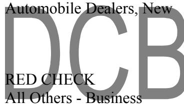

Machines, Catering, Vending Machines, Schools, Aircraft Leasing, Railroads, Clubs, Lodges, Shopping Centers, Travel Agencies

CIC CREDIT Finance Reseller

EXPERIAN BUSINESS CRED Credit Bureaus

PAYMENTECH Credit Card Processors

WELLS FARGO BANK All Banks - non specific

WELLS FARGO BANK All Banks - non specific

WELLS FARGO BANK All Banks - non specific

WESTERN UNION FINANCE Finance Companies - non specific

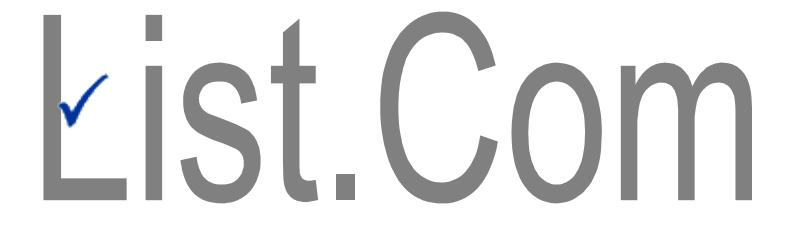

FIRST DATA MERCHANT SV Credit Card Processors

WELLS FARGO BANK All Banks - non specific

PROTECTION SECURITY Home Security Company

FIA CSNA All Banks COMCAST-ATLANTA Telephone Companies ACCREDITED Other DIRECTV Miscellaneous Utilities AT&T SERVICES, INC. Telephone Companies BK OF AMER Banks and S&Ls ON-SITE MANAGER INC Tenant Screeners (Reseller) CAPITAL ONE BANK USA All Banks

*Direct Credit Bureau Lender List*

CAP ONE Banks and S&Ls

BANK OF AMERICA Bank Credit Cards

AT&T SERVICES, INC. Telephone Companies

THE HERTZ CORPORATIO Miscellaneous

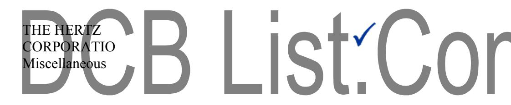

LEXISNEXIS/RESIDENT DA Tenant Screeners (Reseller)

EXPERIAN EQUIFAX TRANSUNION

WANDA W. CROSS ATTOR Legal & Related Services

*Direct Credit Bureau Lender List*

DYNAMIC RS Other

SPRINT NEXTEL

Telephone Companies

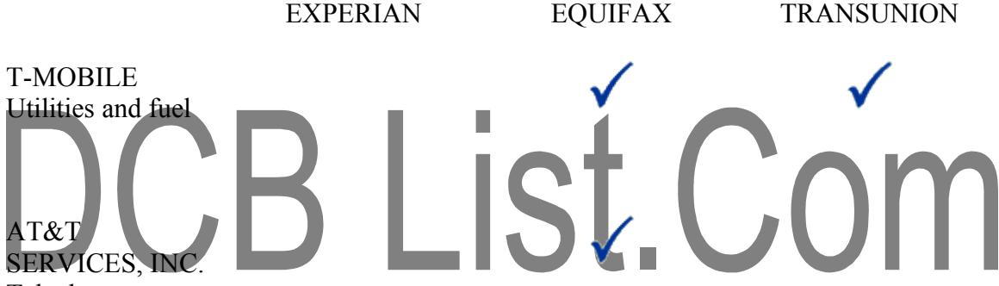

Telephone Companies

VERIZON WIRELESS - D Telephone Companies

AT&T SERVICES, INC. Telephone Companies

*Direct Credit Bureau Lender List*

CAPITAL ONE Auto Financing CAPITAL ONE BANK USA All Banks

VERIZON WIRELESS Wireless Telephone Service Provider

# T-MOBILE Utilities and fuel AT&T SERVICES, INC. Telephone

WELLS FARGO CARD SER National Credit Card Cos.

Companies

CREDCO Finance, personal

# **Credit Inquiries**

This section contains the names of those who obtained a copy of your credit report. Inquiries remain on your report up to two years.

EXPERIAN EQUIFAX TRANSUNION AMG MOTORS INC Automobile Dealers, Old

MAXIMUM AUTO OUTLET Automobile Dealers, Old

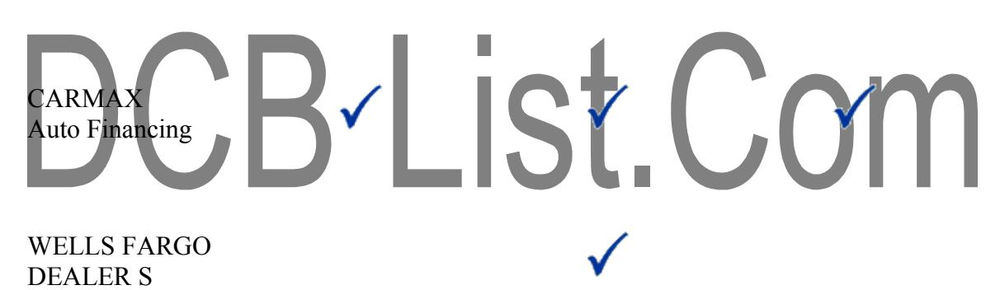

CARMAX Auto Financing Companies

Auto Financing

*Direct Credit Bureau Lender List*

EXPERIAN EQUIFAX TRANSUNION DISCOVER FINANCIAL S National Credit Card Cos. NAVY FEDERAL CU National Credit Card Cos. NAVY FCU Credit Unions CREDIT UNION OF TEXA Credit Unions CREDIT UNION OF TEXA Credit Unions 9 NATIONAL REC Collection services SEWELL VILLAGE CADIL Automobile Dealers, New

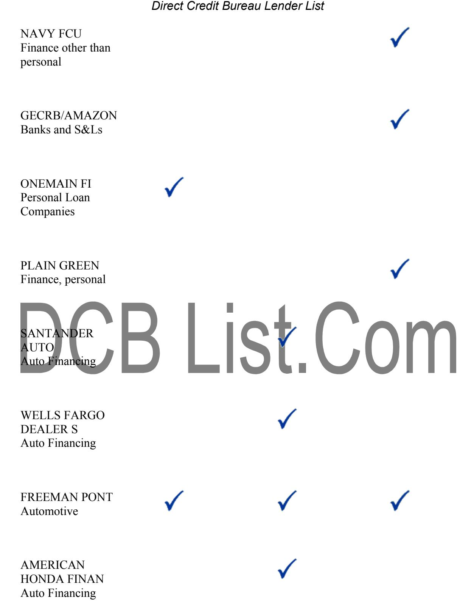

*Direct Credit Bureau Lender List*

| CAPITAL ONE Auto Financing                                   |  |  |
|-----------------------------------------------------------------|--|--|
| FIFTH THIRD Banks and S&Ls                                   |  |  |
| COAF Finance, personal                                       |  |  |
| WESTERN SKY Personal Loan Companies                       |  |  |
| CHASE Bank Credit Cards FDNG STE Mortgage Reporters |  |  |
| CHASE Bank Credit Cards                                      |  |  |
| WESTERN SKY Personal Loan Companies                       |  |  |
| BANK OF AMERICA                                              |  |  |

*Direct Credit Bureau Lender List*

Bank Credit Cards

GECRB/TJX DC Banks and S&Ls

EXPERIAN EQUIFAX TRANSUNION WELLS FARGO

BANK Bank Credit Cards

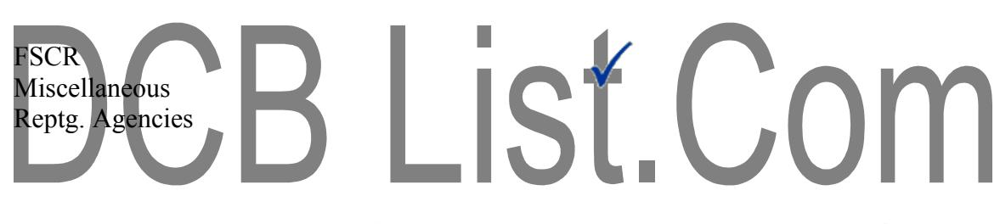

CREDIT PLUS Mortgage Companies

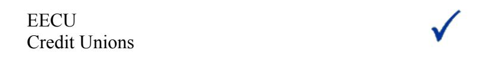

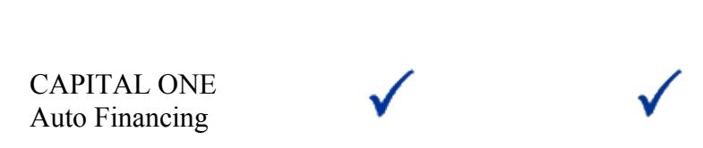

ALLY FINANCIAL Auto Financing SANTANDER CONSUMER U Auto Financing FIFTH THIRD Banks and S&Ls COAF Finance, personal VANDERGRIFF Automotive JPMORGAN CHASE BANK All Banks CALIFORNIA REPUBLIC All Banks

Confidentiality Notice: This document is intended for the exclusive and confidential use of the individual or entity owner. Unless otherwise expressly indicated this document is confidential and privileged information of www.DCBList.Com. Any dissemination, distribution or copying of this material is strictly prohibited. 12

WELLS FARGO

DEALER S Auto Financing

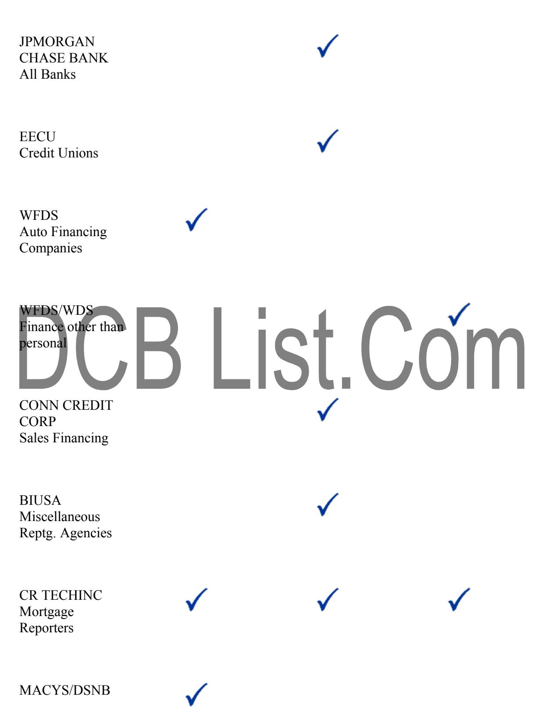

Department And Variety Stores non specific

KOHLS/CAPONE Complete Dept.

Stores

FORT WORTH

TELCO CR UN Credit Unions

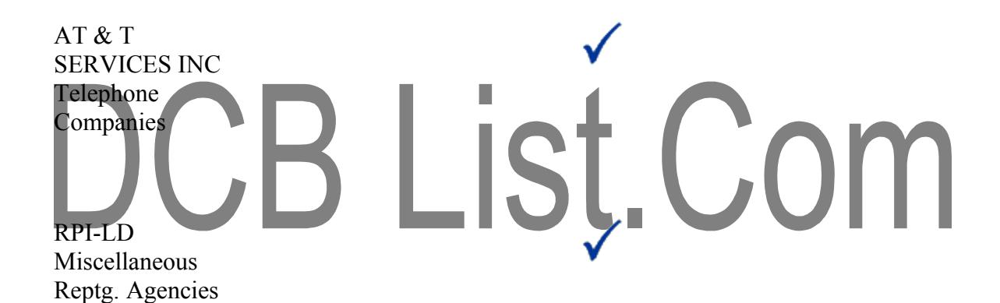

EXPERIAN EQUIFAX TRANSUNION LEXISNEXIS Miscellaneous Reptg. Agencies ACS EDUCATION SERVIC State

SALLIE MAE Finance, personal

AT & T SERVICES INC Telephone Companies

AT&T SERVICES, INC. Telephone Companies

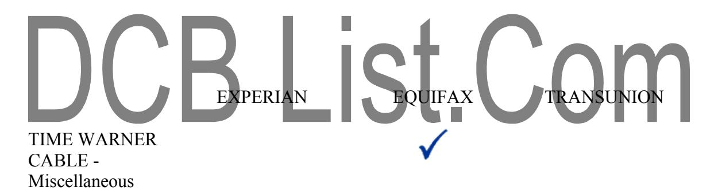

DOMINO REALTY MGT CO Property And Property Management Companies

Utilities

BRCLYSBANKDE Banks and S&Ls

*Direct Credit Bureau Lender List*

BANK OF AMERICA Bank Credit Cards

RBS/CITIZENS BANK All Banks

CHASE Bank Credit Cards

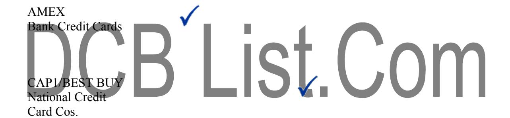

CHASE Bank Credit Cards

EXPERIAN EQUIFAX TRANSUNION

OLD UNION FI Finance,

personal

CBNA Bank Credit Cards

COMCAST CABLE HOUSTO Miscellaneous Utilities

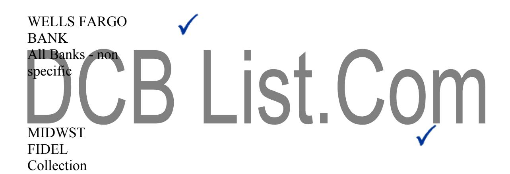

WELLS FARGO BANK All Banks - non specific

services

SPRINGLEAF FIN SRVCS Personal Loans

Cos.

WELLS FARGO BANK Bank Credit Cards

WELLS FARGO BANK All Banks - non specific

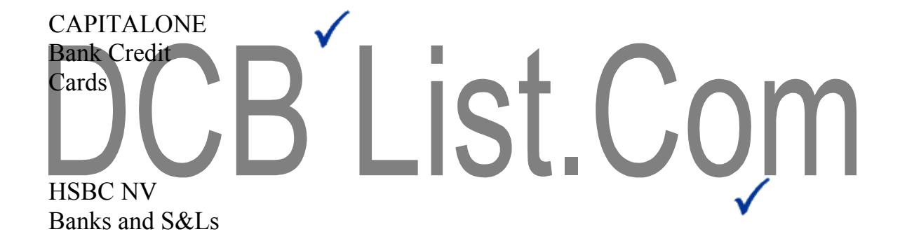

CAPITAL ONE All Banks

UNIV GUARD

A Finance, personal

# ONEMAIN

FINANCIAL Personal Loans Cos.

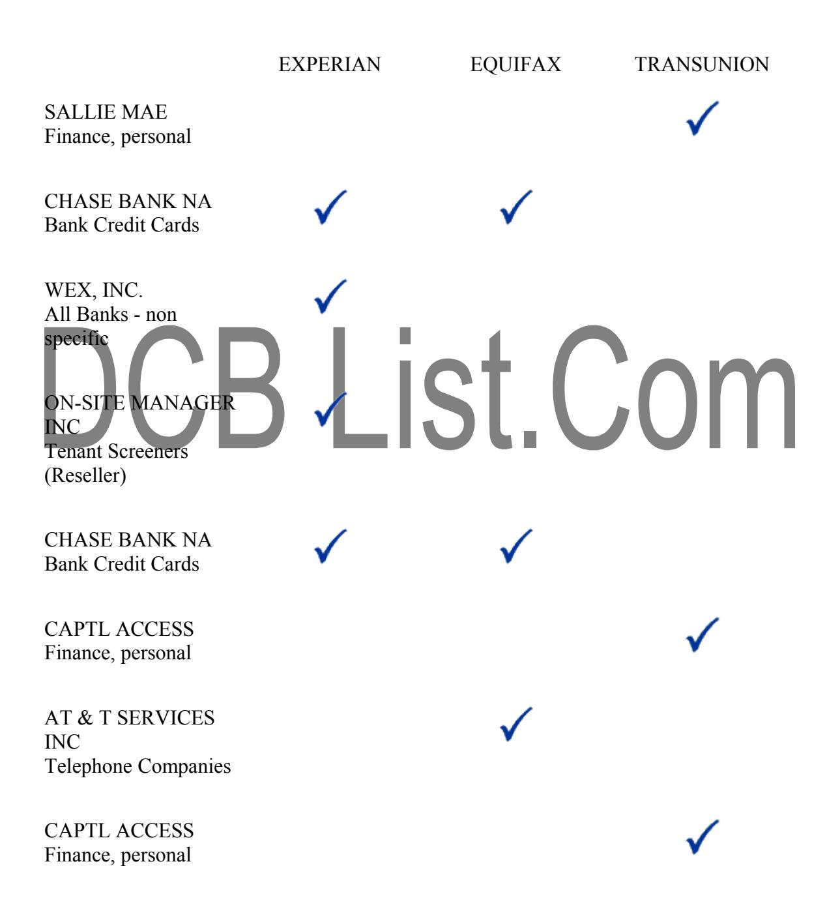

*Direct Credit Bureau Lender List*

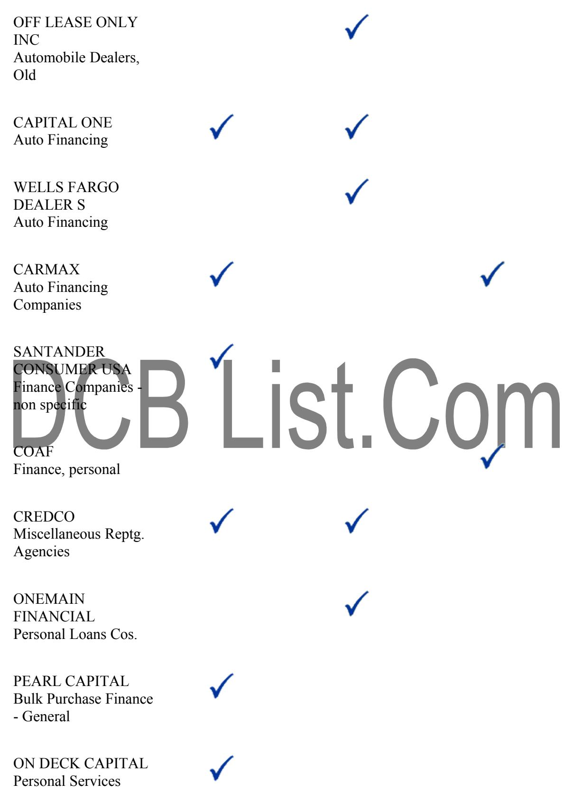

*Direct Credit Bureau Lender List*

(Non-Medical) - non specific

ACRANET/CAPITAL

STACK

Personal Loan

Companies

EXPERIAN

BUSINESS CRED

Credit Bureaus

GECRB/LOWE'S

BRC

Miscellaneous

# CAP1/BEST BUY

National Credit Card Cos.

CAPTL ACCESS

Finance, personal

# BIRD SVCS

Real estate and public accommodations

MARLIN

Equipment Leasing

LSE PROC CTR

Finance, personal

WF EQUIPMENT

FINANCE

All Others - Business

Machines, Catering,

Vending Machines,

Schools, Aircraft Leasing, Railroads, Clubs, Lodges, Shopping Centers, Travel Agencies

CAPITAL ONE BANK USA All Banks

CAP ONE Banks and S&Ls

PNC BANK All Banks - non specific

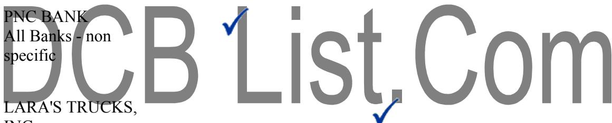

INC. Automobile Dealers, New

ASHRO Mail Order Firms

GECRB/BELK Complete Department Stores

PNC BANK All Banks - non specific

# WELLS FARGO

*Direct Credit Bureau Lender List*

DEALER S Auto Financing

CAPITAL ONE

Auto Financing

SANTANDER AUTO

Auto Financing

AMERICAN CREDIT

ACCE

Auto Financing

COAF

RENT

Finance, personal

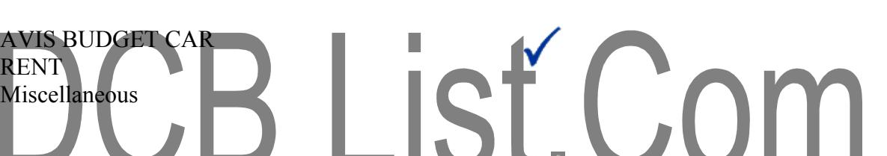

GEORGIA'S OWN

CREDIT Credit Unions

Miscellaneous

NEWLOGIC BUS LOANS/CAN

Finance Companies non specific

ADVANCEME INC/CAN

Finance Companies non specific

CAPTL ACCESS

Finance, personal

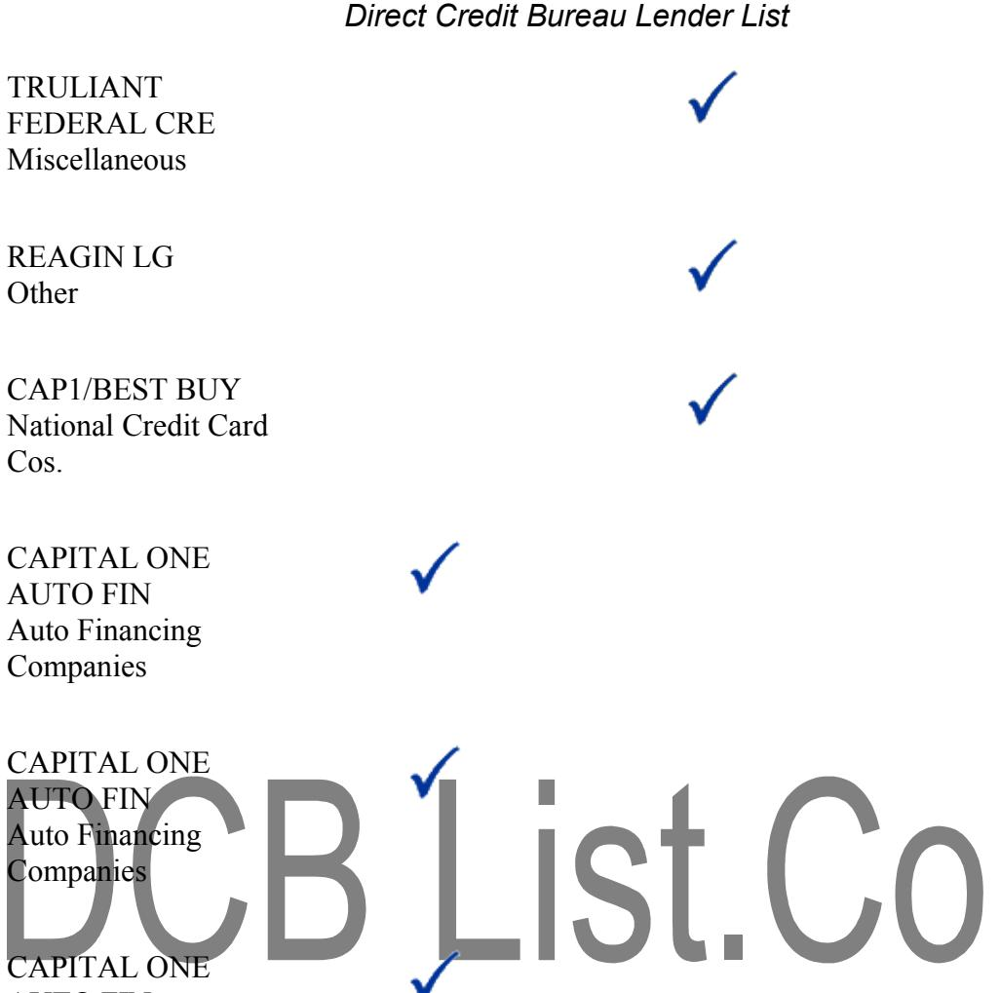

AUTO FIN Auto Financing Companies

APD/HENNESSY CADILLAC Automobile Dealers, New

EXPERIAN EQUIFAX TRANSUNION FINGERHUT/WEBBANK Mail Order Firms

# FIRST PREMIER BANK

*Direct Credit Bureau Lender List*

All Banks

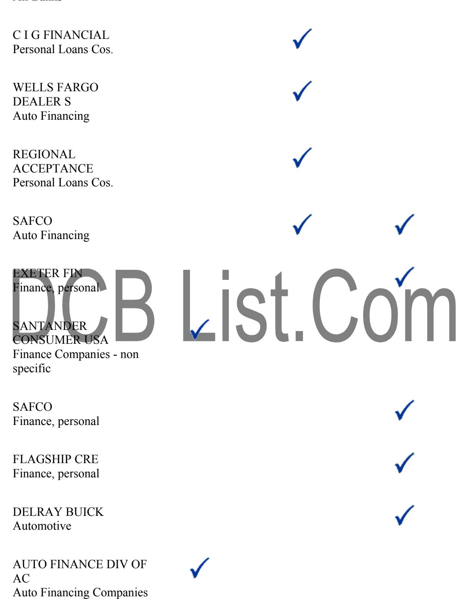

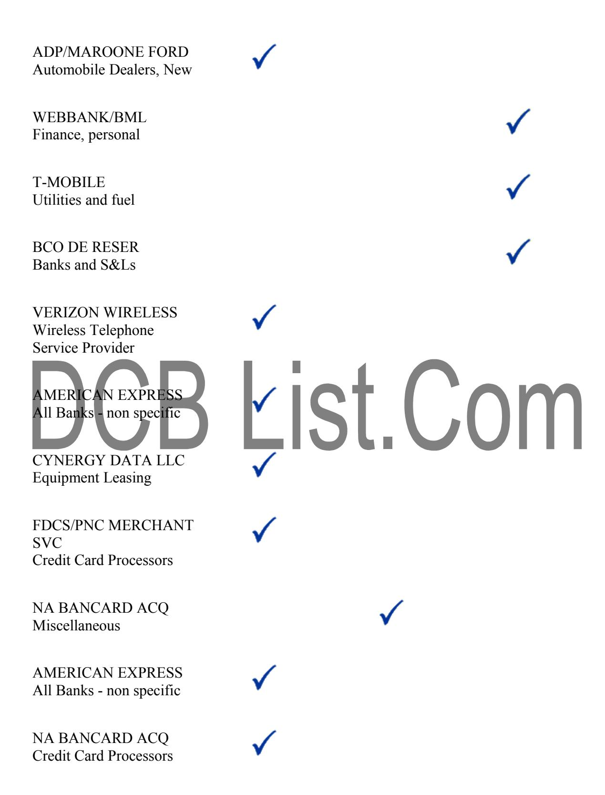

*Direct Credit Bureau Lender List*

| PAYMENTECH Credit Card Processors                                                        |  |  |
|---------------------------------------------------------------------------------------------|--|--|
| TOTAL MERCHANT SERVICE Credit Card Processors                                         |  |  |
| LEASE CORP OF AMERIC Finance Companies - non specific                              |  |  |
| MERCEDES BENZ OF POM Automobile Dealers, New                                          |  |  |
| CREDIT PLUS/AMERICAN H Mortgage Brokers RICK CASE HONDA Automobile Dealers, New |  |  |
| COMCAST - LAKE COUNT Telephone Companies                                              |  |  |
| DEFENDER SECURITY Services, Not Elsewhere, Etc.                                       |  |  |
| DIRECTV LLC Cable TV Providers                                                           |  |  |
| DIRECTV Miscellaneous Utilities                                                          |  |  |

*Direct Credit Bureau Lender List*

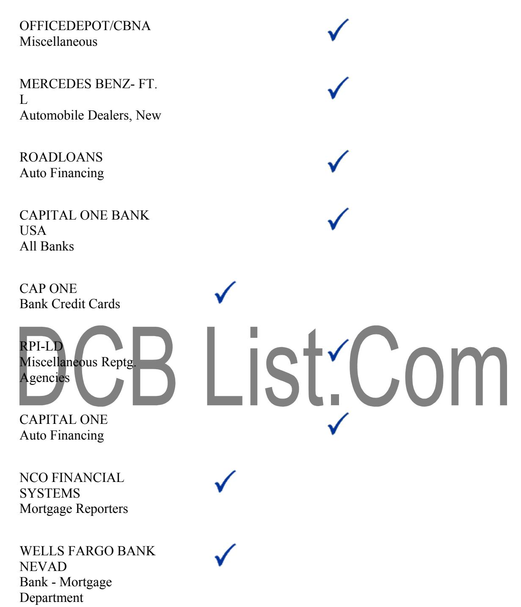

# to Add PRIMARY TRADELINES to a Credit File

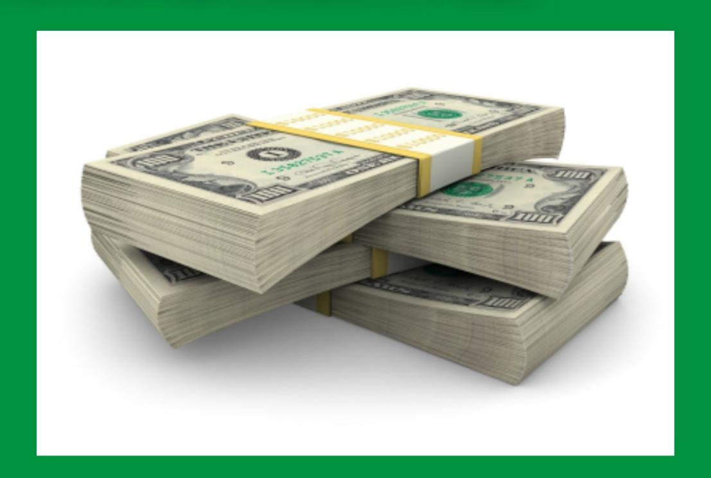

By:
CHRISTOPHER HENRY

# How to add Primary Tradelines to a Credit File

# Everything you need to know about Primary Tradelines by: CHRISTOPHER HENRY

# T A B L E O F C O N T E N T S

# Introduction

Chapter 1: Secrets that some well known credit gurus use to build their customers credit.

Chapter 2: A Sample Promissory Note

Chapter 3: Filing a note/Agreement along with UCC 1.1

Chapter 4: Filing Process Summary

Chapter 5: Rules in Filing

Chapter 6: Sample Security Agreement

Chapter 7: Filing out a UCC 1

Chapter 8: About UCC Article 9

Chapter 9: Releasing the Collateral

Chapter 10: Filing a UCC-3 form

Chapter 11: Alternative way: Setting up a Corporation

11.1 Thing you need in setting up a Corporation

11.1.1 Business Address

11.1.2 Nature of Business

11.1.3 Social Security Number

11.1.4 Type of Business

11.1.5 List of Officers

11.2 The Protection of a Corporation

11.3 Free Tip

Final Word

# What you are about to learn is one of the big secrets that some well known credit gurus use to build their customers credit.

The purpose of this information is to show you how to add personal loans and leases to your personal credit report. The method you will learn is the same technique that banks, auto dealers, and property managers use. We will be using the UCC (uniformed commercial code) to place trade references on your report. Article 9 of the commercial code deals with secured transactions any loan, lease, rental, or purchase where collateral is used to secure terms.

Credit bureaus are connected to a public filings database that updates every 24-72 hours. They automatically receive all liens and bankruptcy information after it is filed at the county, state, or federal level. UCC financing statement is a form of public filing. It is filed with your local County Register's office. Credit bureaus check public records as a part of their investigation. Reporting these public records has an effect on the credit rating of your personal credit. By the way it can be also used for improving business credit.

I could always go into a lot of legal jargon and accounting terms, but I feel it would be better to dive straight into explaining how all this works.

# Let us began….…

I will use a story to help illustrate how everything works. I will try to make it as simply as possible. Really anyone can do it and you certainly do not need a lawyer.

Before we proceed please keep in mind that in the following story, MY FRIENDS credit will improve after the UCC process is complete.

A friend of mine came to me and asked if he could borrow some money. He only needed \$10,000. I knew he was good for it so I agreed under one condition. We agreed that I will file a UCC-1 and will need to show some collateral to secure the loan.

UCC is a financing statement that tells the "public" that collateral is held between parties for an agreement between the parties. In this case the agreement is the \$10,000.00 loan (which will be put on paper of course) and the collateral will be made public knowledge (using UCC filings that will be referencing the agreement). The agreement will also be filed publically.

My friend agreed to use a 4-wheeler, some computer equipment, and an old banged up car as collateral. He said he would only need the loan for 90 days so I decided not to charge interest. We agreed that he would pay me \$3,333.33 a month for three months.

A piece of collateral will be released after every payment. We also decided on what order the collateral will be released. First the computer equipment, then the 4-wheeler and finally the car (This is very important and I will explain later). After we finished hashing out the details I wrote out everything on a piece of paper. This paper (an agreement) also listed the collateral used (making it a security agreement).

I told him that he could keep possession of the collateral at his home but I would need the serial numbers off everything. We then went to a local notary to get the promissory note witnessed/signed.

I gave him the money and he was on his way. It is now left up to me to fill out a UCC-1 financing statement for that agreement that we signed. A sample promissory note (form of agreement) can be purchased from Staples or downloaded free from the web.

# Frankly it can even look as simple as the one below:

Before I file a UCC I must go to the local courthouse to have the original agreement registered with the county. This would be your local County Register's office. Some counties give you a hard time when trying to register a promissory note if it does not involve real estate (like a lease). If this is your case, simply file the note/agreement along with the UCC-1. I have found that it is easier at the state level.

Filing the agreement creates a file number that can be referenced on the ucc-1. The aim is to file BOTH the agreement and the UCC -1 form. Now any investigating Credit bureau will find a UCC filing against the individual (or corporation - for business credit). As they look further into it they will also find the agreement that the UCC was filed for, in the public records. This way there will be a complete picture of what the UCC was about. Remember the UCC does NOT have details of the agreement and hence credit bureaus would want to look further when they find a UCC in the public records.

Bureaus want a complete picture of the individual's financial position. After about two months of the initial filing, the UCC will be amended indicating a release in collateral as the corresponding agreement is fulfilled. So in our example, as my friend pays back the loan, each payment will result in a release in collateral. Since there are 3 total payments there will be 2 amendments and the 3rd will be a termination of the UCC. So in summary I filed a UCC, waited about 2 months and than filed an amendment every month for 2 months after that. Then on the 3rd month it will be time to terminate the UCC, since the complete loan is paid off. This is similar to a loan from a bank being paid off. As a result my friend's credit report will have developed a solid trade line.

# Here is a quick summary of the process:

- · Two (or more) parties get into an agreement. Make it legal by signing and notarizing it.
- · The secured party files a UCC -1 statement indicating the collateral

- being secured.
- · The UCC is then amended showing the collateral being released as the loan is paid off little by little (as the agreement is fulfilled little by little).
- · Finally the UCC is terminated.

There is section for UCC on all credit reports, business and personal. It shows any transactions that were made by way of collateral (security). By filing an Ucc-1, along with a security agreement and promissory note listing the details of the transaction you create a credit reference on your credit report. When the bureaus pick-up all of these public filings and finally show that the lien was cleared, your credit will improve. Remember that the one that is clearing their collateral, the party that borrowed the money will have their credit improve. In our story it was my friend. Now I will show you have to fill the forms.

# Please follow these rules when filing:

- · UCC financing statement is a form that can be obtained from the website of your County Register's Office or from the office itself.
- · The main purpose of the UCC financing statement (UCC-1) is to indicate the collateral (and its description) that is used to secure a separate agreement.
- · The agreement and the UCC financing statement are two separate documents.
- · The Register's office is there to help you with the UCC filing they are NOT there to help you build your credit.
- · You do NOT need an attorney to prepare these documents.
- · Above all keep it simple.

# Sample Security agreement:

The difference between a simple promissory note and a security agreement is that the latter contains the details of the collateral as well. A simple promissory note does not contain collateral details. A promissory note and a security agreement are very straight forward to fill out.

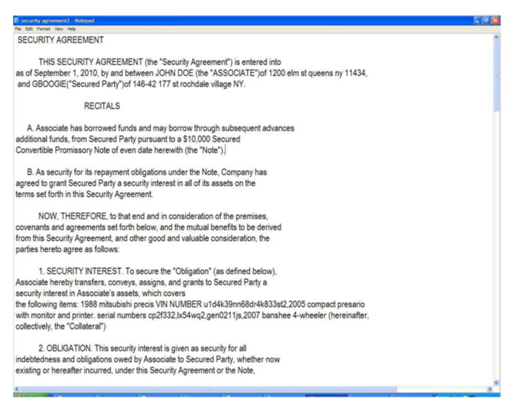

# Filling out a UCC 1:

Below you see a screen shot of the top half of a UCC-1 form.

# Filling out a UCC 1:

Below you see a screen shot of the top half of a UCC-1 form.

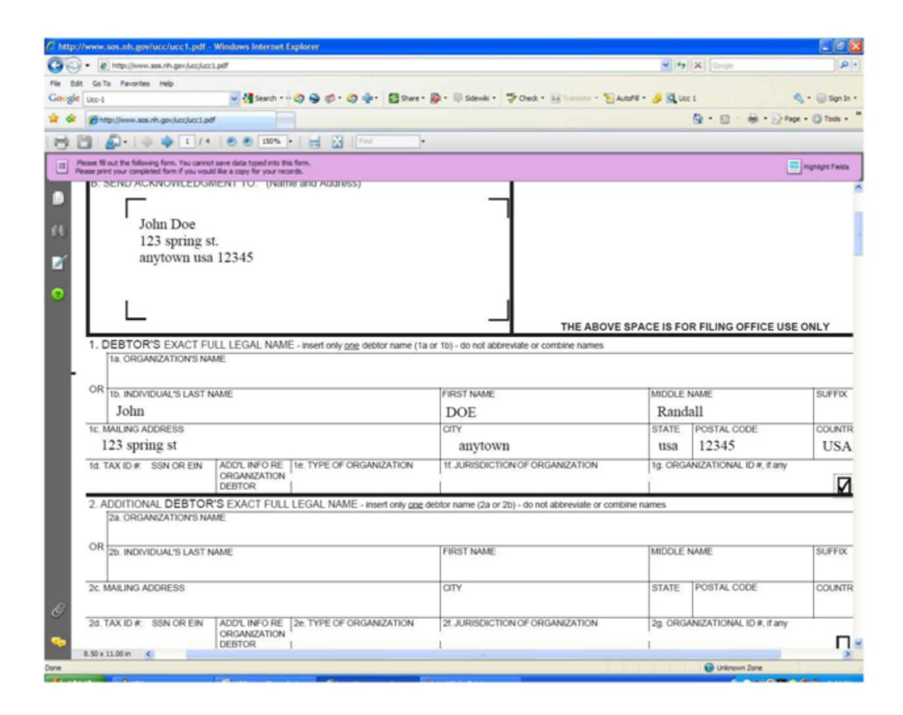

When filing an Ucc-1 on a personal level, it is a good idea to have a friend or family member extend the loan to you. That way they can file in their name. In the above example "John Doe" would be you.

UCC Article 9 is a part of the "commercial code"; this form also applies to secured transactions between businesses as well.

That will help business credit.This is why you see "organizations name", and "type of organization". For our purposes we will ignore those parts of the form. Never list your SS# on the form, it is not needed. Under organization id, check the box that says "none".

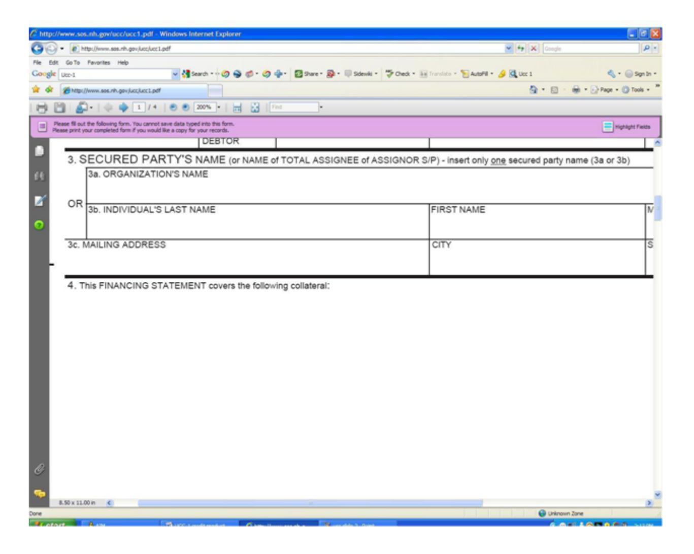

Line 2 is there just in case there is more than one person involved in the transaction that also is in a secured debt relationship with John Doe on this filing. Because it is just John Doe on this transaction all of line two will be left blank.

Line3 list the secured party (lender). It is filled out the same way as line 1 but with the lenders name. At this point I know the form seem easy to fill out. Almost too easy.

Line 4 is where we list the collateral we spoke about earlier. The collateral must be described with as much detail as possible. At this point you should have your promissory note already registered with you local clerk of court. This is very important if you want this filing to be structured as a trade line. Having your note registered with a local authority gives it a registration number that needs to be listed within the collateral section (line 4) of the UCC-1 financing statement. This causes a reference to the details of the secured transaction that the bureaus will sniff out. This information will then be posted to the credit.

I want to clarify this again, since it will give you a very clear picture of the process. Remember that the financing statements do not list the dollar amounts they only list the collateral. The details of the agreement, like the dollar amount will only be found when the bureaus "find" the original agreement in the public records. This is why we give the location of the details (by reference # to the original agreement). The reason the bureaus would pursue it, would be to get an accurate read on your financial position.

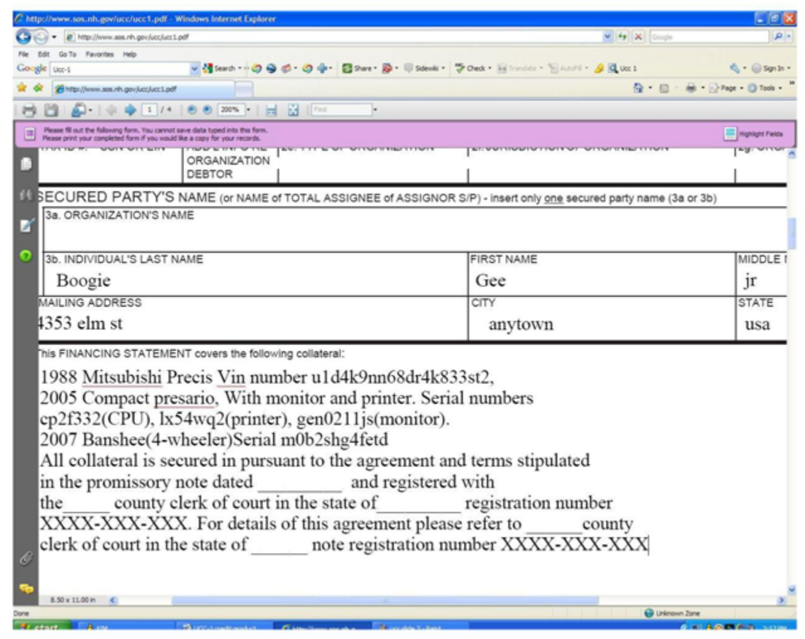

Line3 list the secured party (lender). It is filled out the same way as line 1 but with the lenders name. At this point I know the form seem easy to fill out. Almost too easy.

Line 4 is where we list the collateral we spoke about earlier. The collateral must be described with as much detail as possible. At this point you should have your promissory note already registered with you local clerk of court. This is very important if you want this filing to be structured as a trade line. Having your note registered with a local authority gives it a registration number that needs to be listed within the collateral section (line 4) of the UCC-1 financing statement. This causes a reference to the details of the secured transaction that the bureaus will sniff out. This information will then be posted to the credit

report. I want to clarify this again, since it will give you a very clear picture of the process. Remember that the financing statements do not list the amounts they only list the collateral. The details of the agreement, like the dollar amount will only be found when the bureaus "find" the original agreement in the public records. This is why we give the location of the details (by reference # to the original agreement). The reason the bureaus would pursue it, would be to get an accurate read on your financial position.

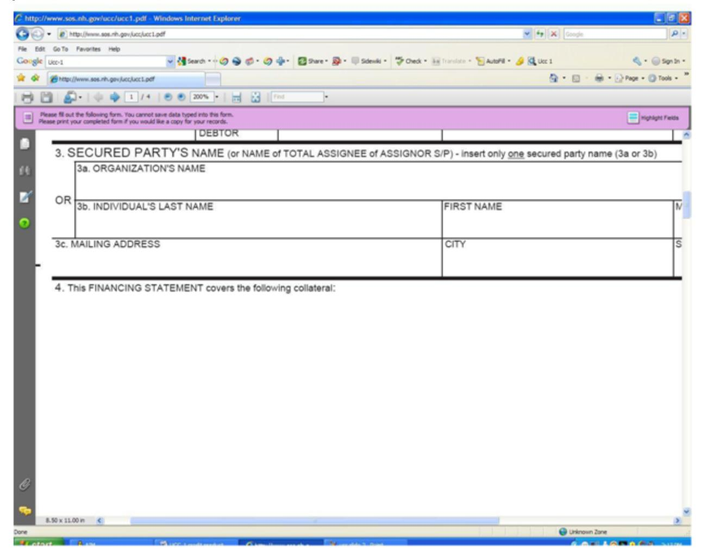

UCC 3, releasing the collateral: A UCC-3 must be filed to indicate this release of collateral – an update to

the original UCC-1. This will reflect that a part of the agreement had been satisfied, and states what collateral is still being used to secure the remaining balance. Once you have filed the ucc-1 and it is time to update it and release collateral, you must file a UCC-3 form. Let's say after about 2 months of filing the UCC-1.

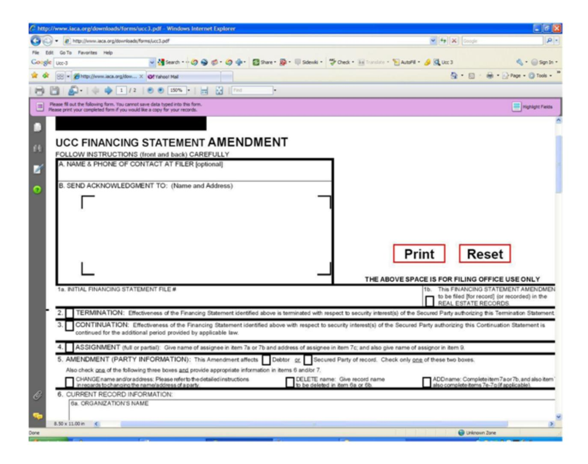

As you can see, the format is still the same. After you file your ucc-1, it will be given a file number. That number will go in line 1a. For releasing collateral we will be focusing on line number 8.

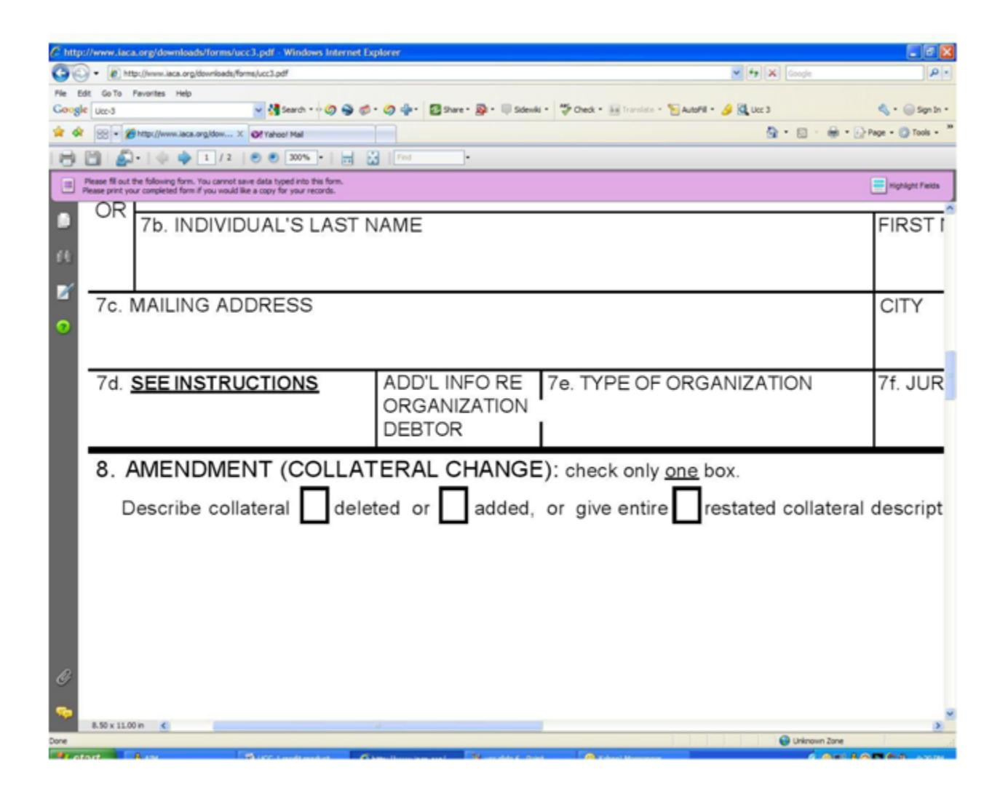

At this point I am sure everything is pretty obvious. Just tick "deleted collateral" and add all the deleted collateral ! Terminating the UCC If you have reached this far the terminating of the UCC should be easy. The SAME form that was used for the amendment of the UCC will be used for the termination.

You would simply tick mark point 2. Termination.

Everything else on the form remains the same except there is no change

to collateral since this is a termination.

We do realize that you might want to keep your personal credit/finance issues separate from friends or family. We can offer an alternative. Instead of having you and your friend carry this out you can actually do it with a corporation.

Setting up a corporation is simply a matter of getting an EIN number and a tax id number for a corporation you set up. Search the web for any of the companies that help get you incorporated. You do not need a lawyer for this. In fact just go to www.irs.org and tell call the help desk. Ask them for an EIN for a C- corp set up. Than you can go to your states website and get the certificate of incorporation.

# Main things you need are:

A business address. You can make it a home based business. If you have another address you can use that but remember that any mail for the business should come to that location.

Nature of business: You can call it "Business management". Something generic remember we are just talking about UCC filings and not business credit. Refer to the website for business credit etc.

# Your SS#.

Type of business: To make it easier let's say a C corp. structure. After you try this UCC method you will realize that there is a whole finance world out there. A C-corp. always allows more flexibility.

Main officer: Of course you are the main officer and hence will sign any documents for decision making. At this point do realize that if you want a relative or a friend to be the main officer you can do that.

Since the whole point of opening a corporation is to have a separate legal entity your friends or relatives are not really directly involved. They have the "protection" of the corporation. But for this example let us say that you are the only officer of the corporation.

After that you have to simply take the corp. papers that you receive (that have the EIN number and Tax ID number) and pay Office-depot a visit. At office depot you can order a corporate kit that will have the company seal. Every time you sign a paper involving the corporation you will use the seal to stamp the company name much like a lawyer does.

Creating a corporation creates a separate legal entity. In effect the corporation can file a UCC against you and vice versa. If you want to improve your credit, have the corporation file a UCC for money that you owe the corp. Follow the same process as outlined previously when you were involved with an agreement with your friend.

When it is time to sign the promissory note you would be signing BOTH as you as an individual and as the corporations chief officer. Be sure to stamp it with the company seal.

By now I am sure you realize that this is real solid information and I am telling you that the world of business credit has even more potential. If you do not have a business at present – do not worry. Just be open to the tremendous opportunity available.

Of course if you already have a corp you can actually make the corp the debtor, you can lend your corp money. That will help build the credit of the business.

# Here is a free tip:

Say you have a corp and you file a UCC for an agreement between you and the corp. The agreement states that the corp borrowed money from you (so the corp is building credit). If both parties involved (you and the corp) agree you can actually back date the agreement. As an example the agreement states that the deal was made (the money was borrowed) one year ago EVEN though the agreement was signed just a month ago and EVEN though the business was not even incorporated a year ago. Yes that is True. Strictly speaking you do not have to be incorporated to start a business. You might need to incorporate for certain licenses (etc) but not to start conducting business.

The beauty of this is that it becomes a part of your business credit file and lenders can see that you really were in business before the business was actually incorporated. That actually is a very good way to backdate the corporation. Of course the agreememt has to be notarized etc . The rest of the process is the same.

Look beyond fancy websites. As far as "no non-sense" information about credit – we have no peers.

# One final word:

Do not go overboard with any aspect of filing. For example the number of UCCs filed and the dollar amount on the agreement should be reasonable. It should look realistic on your credit report. This is a completely legitimate process and it should be one of your big secrets to credit building. So use this technique with care and hand it out with care. A number of years ago a person could become an authorize user of another person's credit and assume that cards complete credit history. That really was too good and too easy. Well guess what - everyone started doing it and now that simple method does not work at all. So please be careful with this powerful UCC filing method.

Start as soon as possible and do not rush the process.

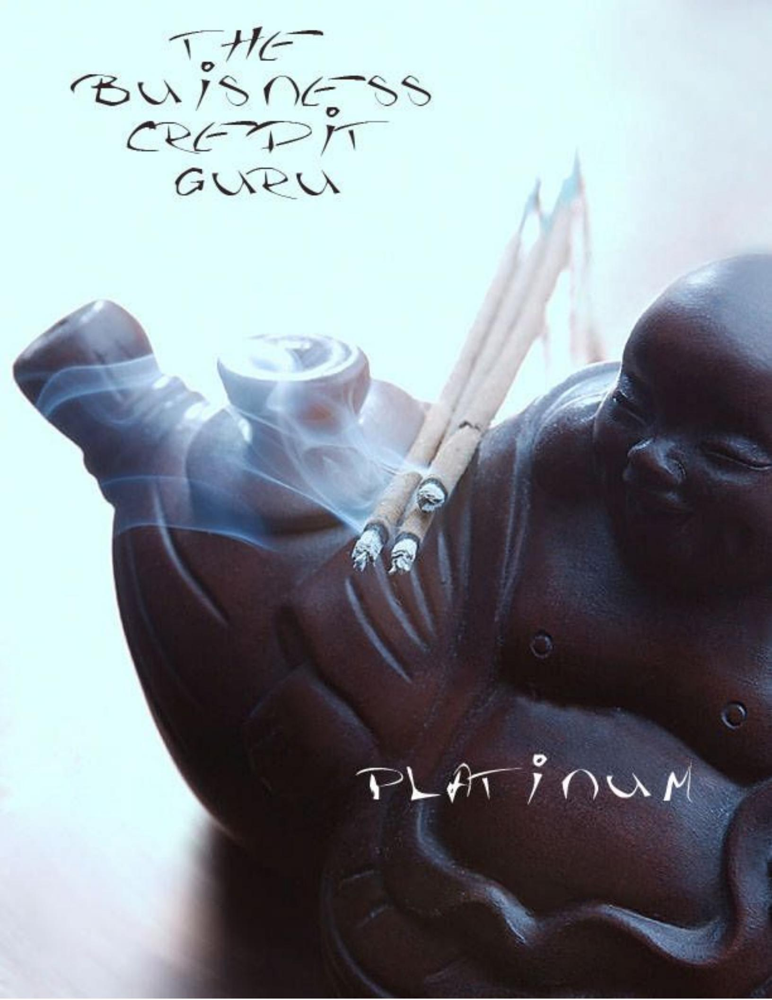

BUISNESS CREDIT GURU STARTUPGOLD

#### **Limits of Liability / Disclaimer of Warranty:**

The authors and publisher of this book and the accompanying materials have used their best efforts in preparing this program.

The authors and publisher make no representation or warranties with respect to the accuracy, applicability, fitness, or completeness of the contents of this program.

They disclaim any warranties (expressed or implied), merchantability, or fitness for any particular purpose. The authors and publisher shall in no event be held liable for any loss or other damages, including but not limited to special, incidental, consequential, or other damages.

As always, the advice of a competent legal, tax, accounting or other professional should be sought. The authors and publisher do not warrant the performance, effectiveness or applicability of any sites listed in this book. All links are for information purposes only and are not warranted for content, accuracy or any other implied or explicit purpose.

This manual contains material protected under International and Federal Copyright Laws and Treaties.

Any unauthorized use of this material is prohibited.

Adobe, Adobe Acrobat and related names are the property or Adobe Systems Incorporated. No relationship with or endorsement of this publication by Adobe Systems Incorporated should be inferred.

# TABLE OF CONTENTS

| INTRODUCTION: A WISE INVESTMENT!                                       | <u>4</u> |
|------------------------------------------------------------------------|----------|
| CHAPTER 1 : CREATE A BUSINESS THAT GETS CREDIT EASILY                  | 6        |
| THE WISDOM BEHIND HOW THE IRS VIEWS YOU                                | 6        |
| UNWISE BUSINESS IDEAS                                                  |          |
| TYPES OF BUSINESSES AND THE IMPACT ON BUSINESS CREDIT                  | 9        |
| CHAPTER 2: BUSINESS CREDITOLOGY 101                                    | 12       |
| THE THREE BUREAUS                                                      |          |
| SOME BASIC BUSINESS CREDIT CONCEPTS.                                   | 14       |
| THE SCORING MODELS OF THE DNB                                          | 15       |
| PERSONAL GUARANTORS AND GUARANTEES DEMYSTIFIED                         | 17       |
| CHAPTER 3. GETTING MERCHANT CREDIT                                     | 19       |
| WHAT YOU SHOULD KNOW BY NOW                                            | 19       |
| TYPES OF VENDORS THAT WILL GIVE YOU INSTANT CREDIT                     | 19       |
| WHY VENDOR CREDIT IS IMPORTANT.                                        | 22       |
| CHAPTER 4: ALL ABOUT CREDIT CARDS AND CREDIT LINES                     | 23       |
| TRUE BUSINESS CREDIT CARDS                                             | 23       |
| WHO GIVES OUT BUSINESS CARDS?                                          | 24       |
| WHAT'S AN UNSECURED CREDIT LINE AND HOW IT FUNCTIONS                   | 25       |
| CHAPTER 5: PUTTING IT ALL TOGETHER: A STEP BY STEP PLAN                | 26       |
| WATCH AND FOLLOW GURU IN ACTION TO LEARN                               | 26       |
| THE FIRST FEW UNSECURED CREDIT CARDS AND A CREDIT LINE OF UP TO \$100K |          |
| YEAR 1 AND BEYOND                                                      |          |
| THE OTHER OPTION: SHELF COMPANIES:                                     | 33       |
| DEFINITION OF A SHELF COMPANY                                          | 33       |
| WHAT A BROKER ISN'T GOING TO TELL YOU                                  | 34       |

# TABLE OF CONTENTS (CONT'D)

| CHAPTER 8: SOME FINAL WORDS OF WISDOM, PASSIVE INCOME | E OPPORTUNITIES, AND GOOD RESOURCES |
|-------------------------------------------------------|-------------------------------------|
| FOR FINANCING                                         | 36                                  |
| APPENDIX OF VENDORS                                   | 3*                                  |
| APPENDIX OF BANKS                                     | 4                                   |

# **INTRODUCTION: A Wise Investment!**

# Matt Says...

"The world of business credit consists of two separate groups of people, the Masters and the Apprentices. The main divider between both is knowledge, for there is nothing the Master can do that the Apprentice can't."

You now have the one source that will save you thousands of dollars in lost broker fees, bad advice and scams. For some, that's worth the price of the book already. If I had a teacher (in a book or in person) like this when I was starting out building my business credit, it would have saved me countless of hours of research, headaches and awful expensive advice.

When I was an Apprentice in the world of Business Credit, I ran into countless brokers or business credit services providers in this market who knew **nothing**, yet charged \$6000 - \$25,000 a pop for shelf companies, credit lines and other over the top offers. I often heard tall tales about what is and isn't possible with a company. I was confused, distraught and felt completely lost in the dark. Every second that passed by, I felt that I was somehow losing ground. If you find yourself in the same situation, rest assured, you are not alone. This is the common fate of the business credit **Apprentice**.

Alternatively, business credit **Masters** exist and operate in a different realm. They flow in and out of the business world being able to attain lines of credit, credit cards, and letters of credit without any difficulty. They are rarely ever led astray or misled for they know what is possible and what isn't. Not only are they able to guide their own credit identities using certain time tested principles, but they also never ask any business credit brokers for advice even though some may opt to use a broker's services. For our purposes, these Masters are considered **Guru s**. They can exist as teachers, leaders or at the very least knowledgeable entities in the realm of business credit. I am a Guru . And if you're willing, I'm going to teach you how to become one.

What you're reading now is a straight to the point hands-on approach to understanding and creating business credit for your startup. That's right; Startup. And not the kind that has raised \$50M from a venture capitalist in Silicon Valley. I'm talking about the old fashioned startups that most of us create on a shoestring (or non-existent) budget. Throughout the book, I assume you have no revenues and no clients. If you find yourself in a better position than that, good, but it's hard for me to imagine a startup in a worse position. Frankly, it doesn't even matter if you're incorporated yet and actually better if you're not as I discuss the benefits and problems with each individual entity. I lay it all out for you in an easy to read guide that you can come back to over and over again.

As you'll notice, the book is rather brief. Being a Guru, I have no time or use for fluff and neither do you. I cut through the falsifications and exaggerations to deliver the truth. The truth rarely requires explanation. You need a fast and straight to the point approach because you're not going to get it from very many other sources on the internet.

Before moving forward, you should know that I've created this book from a perspective of knowledge and giving. It is so important in understanding and getting business credit that if you took away all of the bankers I have come to know, all the credit specialists I speak to regularly, all the seminars I've attended, all the websites and user forums I've researched, and left me just this book, I would know all of what I needed to know to launch a business, get credit and spend almost nothing out of my own pocket! Now that's what a Guru would teach you.

I am the Guru and you are my Apprentice. Let's Get Started.

#### **IMPORTANT**

If you like what I have to say and are looking for some great passive income opportunities I discuss later in the book, do us and yourself a huge favor. Become an affiliate with the Business Credit Guru and promote this book. As you'll see, I don't tout myself as being a Guru for no reason. I know the ins and outs and have no need to lie to exaggerate the truth. Help your fellow entrepreneurs get the right education in this oft elusive market. We give away large commissions to our affiliate partners and even let you in on marketing tips and secrets for generating regular income. Click here to learn more and join.

# CHAPTER 1: CREATE A BUSINESS THAT GETS CREDIT EASILY Matt Says...

"A properly organized company will bear many fruits from the business credit tree."

# The Wisdom Behind How the IRS Views You

In our world, the IRS cares about one thing and one thing only: getting paid what's owed to them. They couldn't care less as to who is doing the paying as long as someone, or something, pays them what's owed. There is an entire world of wisdom in that realization yet it escapes many business owners. Instead, many entrepreneurs start off in the wrong direction right away by assuming that their business and they are one and the same. They're not. The IRS doesn't seem to want to agree with that idea. So why should you? You are a separate entity from your business unless you're a sole proprietor.

Sole Proprietorships usually come with big and often dire consequences to the entrepreneur in the realm of business credit.

Guru: Recommendation

"Stay Away from Them!"

Let's clarify. When you go to a CPA to file taxes at year's end, the IRS taxes both you and the business. Of course, it's a lot more complicated than that, but the IRS already knows that (unless you are sole proprietorship) you and your business are two different entities. They treat you like two different entities. This is advantageous. If your business is separate from you, then so should be your business credit. Our goal in creating business credit is simply to get everyone to view us as separate entities, and not just the IRS.

Our dilemma of course is that initially credit bureaus, banks and other merchants don't view us as separate entities. They don't behave like the IRS in allowing you to separate yourself from your business at the onset. In this case, it is not to their advantage. They don't have any security in the business as it has not

produced any revenues and don't have a track history of prompt payments. What's worse is that throughout the life of a business, most owners won't do enough to separate themselves from the business.

Business owners are so busy creating revenues (as they should be) or lining up funding that the world of business credit is as foreign a concept to them as nuclear engineering. Remember when you were young and your parents told you that establishing good credit history will save you a lot of headache and money over the years? Well they were right! The Guru is now telling you that as an entrepreneur establishing credit history for your business is just as important and if not more important than your personal credit history.

Your business is a source of income for you. A way to pay bills and perhaps one day lead a lifestyle you read about in books or watch in movies. The only thing you can count on for income after yourself (and perhaps your spouse) is your business. And as such, it should be treated with respect, nurtured, regularly monitored, and cultivated.

I can't tell you the number of times I get business owners who want credit after being in operation for 3 years and haven't **ever** taken a look at a copy of their business credit report. I think this is just amazing and massively detrimental. Some have no other source of income other than the business yet when I mention things such as "Your business credit score is too low" or "There are tax liens on your business credit profile" they get insulted, frustrated and of course angry. The reason being is that most of the time when someone \*really\* wants business credit, it's at the 11 th hour when they've finally gotten an opportunity to buy something at wholesale prices from a foreign source, or a large purchase order from a major manufacturer. And as we all know, anything done in the 11 th hour is expensive, frustrating and often bears ill results.

# Guru: Tip

Not Being Aware of Your Business Credit Score is a Recipe for 11th Hour Frustrations and Let Downs

# Guru: Recommendation

"Regardless of whether you are starting a knitting shop selling your blankets for \$4.99 a pop or a software company trying to secure it's first \$30M in seed money, stay AWARE of your business credit!"

#### **Unwise Business Ideas**

There are a few things you need to stay away from as far as startup ideas are concerned. The reasons for this are simple. As a startup you're already viewed as a risk. 90% of startups fail in their first year, and so vendors are leery of new businesses. If I was selling laptops and you came up to me to let me know you're A) a startup B) would like a credit line C) don't want to give me a personal guarantee D) don't want me to check your credit and E) want me to only hold the company responsible for repayment, I'd wish you the best of luck and walk away.

I suppose it's a good thing that I don't run Dell, Home Depot and Staples, because they'll honor that kind of request, but we'll get into that later. Right now let's concentrate on getting some basics out of the way so the remainder of the path isn't confusing. There are a few business ideas that seem like they're home runs on paper but in truth are going to lead you into some serious credit problems down the road.

If you're starting up and looking for business ideas, these are a few to stay away from. If you've got a multi billion dollar plan for one of these ideas, I definitely don't want to tell you to abandon it. Just know that the deck is stacked against you as many people will refuse to deal with you on ethical, legal or financial accountability basis. Here they are:

- i. Anything associated with Adult Entertainment
- ii. Online Gambling Casinos
- iii. A Business that buys/sells Financial Notes
- iv. A Real Estate Investment Firm (my personal favorite)

The first category, Adult Entertainment, doesn't really need to be explained in too much depth so I'll skip it. Just know that putting anything remotely associated with the industry is automatic grounds for denial for most banking credit and quite a few merchants as well.

The second category is where it gets interesting. A while ago, I got approached by a group of young kids trying to startup an online casino; they called it "poker school", and wanted to amass large credit lines to handle their cash inflows and outflows. Apparently these guys were some local poker sharks in the area and had amassed quite a bit of money as they were talking about paying someone \$50K to set up a shelf company (discussed later) and get some credit going for them. They heard about me from one of my Apprentices turned Guru and were really excited about my methods.

At the time, I had never considered going down this road for a potential client base and was a bit excited by the challenge. I called around a few banks and got one of my trusted expert credit officers on the line and discussed the idea with him. He flat out told me that 99% of the banks he knew of would consider this request simply because of their industry. I was quite taken aback. Apparently gambling institutions are not a hot ticket item for banks despite the obvious cash flow implications. Some banks won't even let these institutions open up checking accounts.

The reasons for this vary from State to State, but the gist is that as gambling is outlawed in most states, and any entity dealing with gambling not pre-approved by the state is going to be penalized. Since banks are the most regulated institutions in the country, it's no surprise that no one wants to take any risk associating themselves with an outfit that is potentially doing something illegal. Most banks simply won't risk it.

# Guru: Tips

# Developing Credit and Banking Relationships is Key to becoming a Guru

Financial note sellers and real estate investment firms are lumped into the same category as far as banking relationships are concerned. Both are considered high risk industries due to the sheer amount of defaults, non payments, and inexperienced managers. Real estate investment firms are especially frowned upon because of the lack of stability in this market on "flipping" properties. Startups looking for money or credit are always troublesome and heavily scrutinized. Many companies that have long business histories often have the idea of buying distressed real estate properties and start looking for credit to do so. Though its certainly possible to attain business credit lines, explicitly getting credit for investment purposes is usually grounds for an automatic denial. From a financing perspective, being as expensive as they are with respect to interest rates, general investing simply does not deliver the type of return that would make the credit line worth while anyway.

# **Types of Businesses and the Impact on Business Credit**

In order to become a Guru, first you must learn about foundations of business legalities. The reason being is that in most cases it's important to understand how a C corporation gets credit versus how a Partnership would get credit. I use the term credit loosely for the time being. I will start dissecting its meaning in a few chapters down the road. For now, it's sufficient to know that credit is granted by someone or something and that entity, the **Credit Grantor**, is who we are focused on.

In the world of business credit, what kind of legal entity your company is, has a direct impact on how credit will be granted to you. A Buddhist belief beckons that boredom is one of the keys to enlightenment. If that's so, the following section is both, enlightening and boring.

# Guru: Tip

Credit Grantors view the world in a different way. Evolving from Apprentice to Guru requires one to take a look from their perspective and not your own.

# **Sole Proprietorships**

In the world of Guru s and Credit Grantors, Sole Proprietorships are always a sign of hidden problems. As an entrepreneur, they do little for you. They offer limited protection from any lawsuits and do not create a separate business identity aside of a tax ID number and a starting platform for doing business. Typically, I consider these the lazy way to be in business.

As I said earlier, I advise against Sole Proprietorships. Things such as personal tax liens and collections can easily be reflected in your business credit profile. Your personal credit will rebound quickly from these types of faux pas, but your business credit will not. There are plenty of entrepreneurs out there who have operated for years as a sole proprietorship and then decide to incorporate as either an S or C corporation. In my professional experience, 80% of this group often has hidden liens, judgments and collections that are showing not only against their personal credit but also on their business credit. These are rather difficult to eliminate, so why even bother with the hassle?

# Guru: Recommendation

"Don't be lazy. If your business is producing income; incorporate."

# **Partnerships**

These are a better option for business credit rather than sole proprietorships, but still have some serious limitations. First limitation is that a partnership is again, a "de facto" way to be in business without really taking the time to incorporate. Hence, it too, offers little protection. Each partner is considered a sole and separate entity that is joined with the other(s) to transact under one Tax ID number. This advice is of course limited to small business entrepreneurs and not established corporations that decided to form a partnership agreement to do business under.

The problem we often run into here though is that Credit Grantors usually look at the partners as equal shares in the company. This may work against those in the situation where one partner's credit score is terrible (we're going to need credit scores to get business lines of credit and credit cards). In that case, little if anything can be done.

# **Corporations**

There are two types, S and C corporations. Despite the common perception that C is better than S in business credit decisions, I have never experienced any proof of why this is or if it's even a valid statement. Both are fine. And both leave quite a bit of wiggle room when a business owner has bad credit scores. Getting alternative guarantors on corporations is easy as updating with the state's filing status and appropriate papers and then waiting for seasoning requirements by banks.

# **s'CLL**

I isub eht n n t ,dlrow sse h dedda e tnavda a na fo eg LL vo C e c a r o noitaropr i uorht taht s g a h wef iser d laitne eht ,srednel LL C c na tnednepedni teg r icnanif laitnedise ng itnediseR . a anif l nicn g nac b e g ar n a ot det LL t fo daetsni ,C h lausu( wol si oitar eulav emoh ot naol eht fi ,laudividni e ly %56 o ewol r r ehT .) rc e tid eht fo serocs o srenw o eht f LLC po eht ro( e itar n nam g ag )sre h eb ot eva go ot do gra eht dna naol siht tn LL eb ot sah C mocni na e gen itare ng taht ssenisub p nac ay eht b nala c t fo e h gtrom e ag orht e ug p sti h r .stifo erehT era )etad ot( N d emocni on ro detats O o smargorp noitatnemuc .

I ibdit elttil siht noitnem t l eht rof noitamrofni fo a aes egr o eb dluow f r lae emtsevni etatse ra taht smrif tn e tnatsnoc ly ikool ng b rof u w eno si sihT .tiderc ssenis ay eno htiw c .taeva I f you' a er LLC ra na htiw ar y fo dna senil tiderc a er a arr nging b ot naol a uy r dise e ,etatse laer laitn you h ll' a woh wohs ot ev y 'uo r e c gnimo od egral eht htiw pu nw ap ym .stne I eht n c w esa h ne I ev' dekrow htiw LL C ew ohw s' r rrob e o niw g a g snia t pu emoc ot senil tiderc w p nwod eht hti aym tseuqer eht ,tne w la sa way s dec wlA .denil ays!

B c ssenisu r rof tide LLC' isae si s ly baniatta l ecno tub e a o esac eht ni sa tsuj ,niag t f h proc e o eht ,snoitar imlehwrevo ng irojam ty o nam f aging trap n n sre eed rallets evah ot c ilauq ot redro ni tider fy f o b eht r a kn dna senil tiderc c tider c ecivda sihT .sdra a evah ton od taht seititne ssenisub dna sputrats ot seilppa n silbatse erc ssenisub deh d otsih ti ry T . her a e r w e ays ilauq ot fy f o c lanosrep tuohtiw htob r r skcehc tide ta ro um sa tuohtiw ,tsael eht c lanosrep no sisahpme h c .tider

# uG ru: adnemmoceR t snoi

**CLL oitaroproC dna s' n lauqe evah s w ie g ni th t tiderc ssenisub eh w ro l d w hti vah s'CLL i t gn he o egatnavda dedda f eb i lauq ot elba gn ify f o sepyt niatrec ro f fi gnicnan eht yb ms evle s**

# **CHAPTER 2: BUSINESS CREDITOLOGY 101**

# Matt Says...

"When in Doubt, Understand that All Knowledge Extends From a Few Fundamental Concepts."

#### The Three Bureaus

In the last section you may have picked up on me referring to bank credit lines and merchant lines of credit. If you were confused about how these differ, I will clear them up in this section.

But, let's start with the bureaus first. Understanding the what, the who, and the how of the organizations that are actually creating and monitoring your company's business credit will greatly help in understanding the range of what is and isn't possible.

# Guru: Tips

Credit Grantors look at the data from credit bureaus to determine if a corporation is worthy of credit.

# Guru: Recommendations

"Learn as much as you can about the different types of credit bureaus and how they keep score"

There are multiple credit bureaus in the business credit world and just like in the personal credit market, they are **not** run by a governmental body. All credit bureaus are independent organizations that operate by selling credit information to businesses or consumers. In the business realm, there are 3 major credit bureaus and a few minor ones. The big three are:

Dunn and Bradstreet (DNB)

- Experian Business
- Equifax Business

By far, the most commonly used bureau is **Dunn and Bradstreet, or DNB** for short. Unlike the personal credit markets, businesses inquiring about another entity's credit do not pull all three bureaus. The reason being is that it's simply too expensive. On average, each report can cost anywhere from \$9.99 to \$149.99

for a single pull without a volume account. If pulling all three bureaus was the norm, businesses would be spending potentially \$400+ getting credit for a company. On average, most companies will pull two credit reports: **DNB and Experian**.

The major difference between the bureaus is the number of businesses each one reports on in its database and the scoring system(s) they use. Each bureau has a separate and unique scoring system. We'll dive into these systems later, but for now its enough to know unlike the personal credit market where a 700 score means the same thing for all three personal credit bureaus, a 225 score from DNB is not the same as a 225 score from Experian Business (225 doesn't even exist as a potential score from Experian).

Experian Business and DNB credit reports on a business account for 99% of all the reports I have come across to date. Once a business requests credit from a given merchant or bank the vendor will pull a credit report through one of these bureaus. For example, let's say a small distribution company called Pacific Distribution sells office products to Bay Area law firms. In an effort to expand business, the shareholders decide to court a big Southern California client and receive a huge order for various office products. Let's also assume that Pacific Distribution is a very small outfit (3 man show) and is incredibly cash poor. Instead of paying their suppliers in cash which would leave them severely depleted in reserves, the owners rather request a \$50,000 revolving credit line from each supplier to help manage cashflows. To date, Pacific has made no such request from any vendor and its business credit profile has never been pulled. If all the suppliers use Experian to pull credit, Experian will be the first one notified that Pacific Distribution is seeking credit and will create a new file for the company. There is little the owners can do to modify the information provided to the credit bureau and cannot proactively create a new file with Experian.

The reason why this is important is that DNB is the only bureau to date that provides a way for new companies with no pre-existing relationships with suppliers or other vendors to create a credit file. After getting a Tax ID number, the shareholders or officers of that organization can call the DNB proactively and request a DNB number (DUNS number) for their company. They can also input preliminary information such as length of time in business, names of shareholders, sales, employees, etc.

# Guru: Tip

The DNB uses a proprietary online credit management system called DNBi. It is by far the most comprehensive database of information on over 100 million companies. Credit Grantors often use this system to request information about a particular company.

Once a DUNS number is assigned, a new credit file for the company is created and an overall score, called the **Paydex**, is provided. The Paydex is one of 3 different scores used by DNB to provide credit information on a company. What the Paydex is and its importance is discussed later, but what's important to note here is that the Paydex is just one of a few different scoring systems from DNB. There are others

(Commercial Credit Score and Financial Stress Score). The Paydex can be built to really high levels but in the end it's PART of the entire picture, not all of it.

# **Some Basic Business Credit Concepts**

Most suppliers (or vendors), such as office supply stores, gas stations, computer outfits, usually use DNB to grant store credit to a given legal entity. In other words, if I was to create a brand new C-corporation in state of California with a **DUNS** #, I can request a store credit card or credit line from RadioShack or OfficeMax with nothing more than my DUNS# and my incorporation papers. Usually, no credit checks are used and in quite a few cases personal credit information is not even requested. When a retail business grants credit to be used within its chain of stores (I'm using the word stores loosely, it can mean anything from gas stations, office supply stores, etc) I call it **vendor or merchant credit**.

Vendor credit can be easily and quickly built from a slew of well known vendors as big as Staples and Texaco, to ghost stores that don't sell any products but can be used to inflate the size of your credit lines. This latter of type of credit is often associated with shelf companies that we will discuss in depth in later chapters of this book. For the time being it is sufficient to know that the concept exists.

**Bank credit**, unlike vendor credit, is a parallel concept to credit cards. Banks give unsecured (as in they do not encumber any asset) **credit lines** to organizations that are within the bank's credit risk. Depending on various banks, the risk assigned to a specific borrowing entity may entirely or partially depend on factors such as:

- Company's credit scores and the scores of the guarantors
- Company's Industry
- Company's credit grade
- Amount of time present management has been in place
- Revenues and Income of the Company
- Length of time company has been in business

These credit lines can be used for any business purpose but are most often used for proper cash flow management. Bank credit lines **always** require prime credit scores from the **guarantors**, not necessarily the shareholders. To qualify, the guarantors must be one of the officers of the company that are mentioned in the company's Articles of Incorporation or Operating Agreement.

# **Guru: Tip**

You should see now why its beneficial to have a corporation or LLC instead of a sole proprietorship, general partnership, etc. Guarantors are not the same as the shareholders of the company and can come and go. This leaves for a lot of maneuverability down the road.

# The Scoring Models of the DNB

As a startup, or an established business with little prior business credit history, you really need to focus only on one type of business credit bureau. And that happens to be the DNB. DNB offers multiple scores, as in more than one, on a given company and there are three that we need to really take a look at:

- 1) The Paydex
- 2) The Overall Commercial Credit Score and
- 3) The Financial Stress Score.

The **Paydex** is the easiest score to maintain and is often mistaken as the only score the DNB provides. As they say in France, "au contraire mon frere". This mentality is a true novice mistake. Many an entrepreneur with perfect Paydex scores have gone down the path of requesting credit and financing only to be declined because of "Serious Derogatory or Delinquency" items found on the credit report. I can't begin to tell you the number of times I have found myself discussing this issue with clients. The Paydex is used as an indicator for how prompt the company is in paying its bills. That's it. It's not the end all be all of credit scores and is only part of the picture.

The following chart breaks down the scores of the Paydex and what they mean:

| D&B PAYDEX Score | Payment Habit         |
|------------------|-----------------------|
| 1 0              | 0 Anticipate          |
| 90               | Discount              |
| 80               | Prompt                |
| 70               | 15 days beyond terms  |
| 60               | 22 days beyond terms  |
| 50               | 30 days beyond terms  |
| 40               | 60 days beyond terms  |
| 30               | 90 days beyond terms  |
| 20               | 120 days beyond terms |
| LIN              | Unavailable           |

Commercial Credit Score (CCS) is the next big item and is often completely overlooked by entrepreneurs when assessing their own company's creditworthiness. The importance is akin to the overall FICO score of the company and is often used in determining whether a company is creditworthy. It is this score that is often the determining factor in bank credit line decisions. The Commercial Credit Score creates a statistical model for the likelihood of a company being delinquent, or 90 days past terms to any of its vendors over the next 12 months. In other words, the CCS, shows whether or not the company may default or be delinquent at some point in the future. It's a predictive score that anticipates when a company will generally pay its bills.

A table of these scores and how they rank is provided below:

| Commercial   | Credit Score     | Credit Score |
|--------------|------------------|--------------|
| Credit Score | Percentile       | Class        |
| 536-670      | 91-100           |              |
|              |                  | _            |
| 493-535      | <del>71-90</del> | 2            |
| 423-492      | 31-70            | 2            |
| 423-472      | 31-70            | ,            |
| 376-422      | 11-30            | 4            |
| 101-375      | 1-10             | 5            |

If it's not obvious from the table, anything below a 400 Commercial Credit Score is usually grounds for automatic denial of credit. I have seen few companies with scores below 400 get approved for bank credit lines. Once a company reaches and maintains itself among the higher echelons of credit scores in the chart above, **less emphasis** is put on the personal FICO score of the shareholder in credit based decisions.

# Guru: Tips

The Paydex and Commercial Credit Score account for most of the criteria that Credit Grantors look for when approving or declining a credit request. To determine how much credit to grant is dependent upon the recommended credit limit by the bureau.

# **Guru: Recommendations**

"Periodically check your business credit scores. It never hurts to know how good or bad you look to a Credit Grantor."

The final score that is taken into consideration is the **Financial Stress Score**. This score predicts the likelihood of a firm going out of business without paying its creditors in full, reorganizing, filing for

bankruptcy protection and/or relief from its creditors over the next 12 months. Here is the scoring model used by the DNB:

| Financial Stress Score |               |             |              |  |
|------------------------|---------------|-------------|--------------|--|
| Financial              | Stress        | 5           | Incidence of |  |
| Stress                 | Score         | Percentile  | Financial    |  |
| Class                  | Rang          | Score Range | Stress       |  |
| 1                      | 1377- 1875 | 21-100      | 0.49%        |  |
| 2                      | 1353-         | 11-20       | 1.37%        |  |
|                        | 1376 1303- |             |              |  |
| 3                      | 1352          | 5-10        | 3.73%        |  |
| 4                      | 1225- 1302 | 2-4         | 8.30%        |  |
| 5                      | 1001- 1224 | 1           | 35. 80 %     |  |

All scores are normalized using other factors such as company size in terms of employees, annual revenues reported from the year prior, public filings, trade payments made, length of histories with vendors, etc and given a fourth rating, called a **Composite Credit Appraisal**. These can be classified into two separate categories: 1) companies that provide financial data to DNB and 2) companies that don't. The latter, and this is important, can never get above a "Good" or 2 rating on the system. To get the highest rating possible, A1, a company must report its financials to the DNB.

As a startup, the only scores you need to worry about for right now are the Paydex and the Commercial Credit Score. Once we get into how to create business credit, I'll dive into both of these a bit more and how you should monitor them. For right now, just think of this section as a good reference guide.

# Personal Guarantors and Guarantees Demystified

• A great deal of ignorance lies in this statement:

"I want to get \$1M in business credit but I don't want to give out a personal guarantee."

Every time you find yourself thinking of such a statement, understand that you are thinking like an Apprentice and not a Guru . Guru s know that personal guarantees are a part of every, and I do mean, every credit and lending decision. Even credit cards have within them a personal guarantee clause. Essentially,

all a personal guarantee is that you pledge your assets (your bank account, your home, your cars, and your credit) to the payment of a specific debt. A personal guarantee means that you are personally guaranteeing the debt. A bank or a merchant would be foolish not to ask for one. It would be like me going up to you to buy something from your store and saying "I don't want to be held liable for the debt in case I can't make payments on this item." That's a pretty foolish request. Yet many are lulled into this false sense of security that personal guarantees are somehow not needed on certain financing and credit decisions. It simply isn't true.

Checking personal credit and/or encumbering personal assets though are completely separate matters. A personal credit check may be required by the Credit Grantor to ensure that the individual asking for the credit request is credit worthy. In other words, does the individual have a good personal credit history that shows a track record of making prompt payments on similar requests when credit has been granted? This step may or may not be a part of a given credit decision.

To encumber something on the other hand, in the business sense, means to put a physical lien or other security instrument against it. That is considered collateralizing your assets to secure a loan and is not the same as a personal guarantee.

Therefore, a guarantor is an individual (or group of individuals) who have the assets and/or the credit to support the prompt payment of the credit request plus the interest. In credit and lending decisions, a guarantor personally guarantees repayment of debt through their own assets in case the debt defaults. A lender may or may not choose to collateralize the guarantor's assets to complete this guarantee. It is not always required.

# Guru: Tip

You'd be surprised to find out that a few individuals don't understand this simple concept and use the terms credit checks and guarantees synonymously. If in doubt, ask what they mean.

# CHAPTER 3. GETTING MERCHANT CREDIT

# Matt Says...

"Once the fundamentals are known to the Apprentice, the journey towards becoming a Guru consists of fortitude, perseverance and exercising their knowledge"

# What you should know by now

I neglected to put this section at the end of the last chapter because reviews are most beneficial when done beginning an experience, rather than when ending it. Before moving forward, I have provided some terms that you should have a good understanding of by now. From this point forward, I will use these terms interchangeably:

DNB, DNBi

- Equifax Business
- Experian Business
- Business Credit Bureaus
- Commercial Credit Score
- Paydex
- Financial Stress Score
- DUNS Numbers
- Vendor Credit Lines
- Bank Credit Lines
- Personal Guarantors
- Personal Guarantees
- Credit Grantor

....

# Types of vendors that will give you instant credit

We will now begin to take our knowledge of the fundamentals and begin to create credit. If you're with me so far, the next few sections and chapter are the equivalent of a graduate course in business credit. I will go through step-by-step how we're going to get your company from where it's at currently to have a large amount of credit lines from vendors and banks in as short of a time as possible.

Believe it or not, phone companies, wireless providers and a whole slew of office product companies will give your company credit without any financial or personal credit information. These are the easiest types

of vendor credit to attain and being a startup our goal is to get a total of 20 vendors reporting to our business credit file in 90 days. Here are the \*types\* of merchants that grant credit to startup firms.

# **Phone Companies and Local Broadband**

AT&T is available in most areas and they provide an easy way to get a business account. All you need is your Tax ID information and maybe your articles of incorporation/organization to verify that you are in fact a legitimate business. Usually, a phone company will setup an account for you without using any personal credit information. The only thing that I would suggest here is to find a way to get yourself in your local pages listing. This will help you in getting listed in case a merchant decides to do company verification. Most phone companies will provide this as an option for you and if they do not, do ask your sales representative on how you can get this setup.

# Guru: Tip

An 800 number greatly enhances the profile of your company and makes it look like more than just you running your firm out of your home.

# Guru: Tip

"Always make sure your company has an 8\*\* number"

Next, your representative should give you the option of setting up a broadband type of service (via cable or DSL) through your account. This is also a good idea, though you may want to shop around for the cheapest provider as its not always necessarily going to be your phone company. Depending on what you're doing with your business, I highly recommend starting slow and then building up. And that means starting cheap. DSL/cable modems can be instantly activated to faster speeds so there's no need to get the latest greatest services available with high transfer speeds. **Start making some revenue first and then upgrade as you see fit.** 

Your phone company may also ask you if you'd rather use VOIP (voice over IP) service. This is gaining in popularity and is cheap, fast and flexible. If you're on a shoestring budget and need to place a high volume of calls for your business but can't afford the long distance charges, this is not a bad option. Just ensure that you are listed in the phone books and have a 411 listing to your business. That should accommodate what we're trying to accomplish.

#### Wireless

Wireless phone providers (Sprint, Nextel, T-mobile, AT&T, etc) ALL provide business accounts for startup companies. I've found though that the page links to get started with ordering business services is not readily available on their websites. Instead, you'll have to call into the new customer service departments and ask for information on how to setup business accounts. One of the reps will usually

provide information (in some cases, they may ask you to visit a local dealer with a copy of your articles of incorporation/organization and a utility bill of your company). In all cases, these wireless companies will grant as many as 20 lines for your firm. If you need them, they're there, but having seen quite a few entrepreneurs start companies and fail, I have some golden advice for you. Only spend cash if it somehow increases your productivity, increases your revenue or decreases your expenses. Don't increase your monthly expenses in the hopes that down the line the increase will help in increasing productivity. This is a gamble that 90% of the time causes startups to be upside down in expenses before they get out of the gate. Spend wisely. Think of it as an investment. If there are 4 of you in the firm and they're giving away 20 lines, only take 4.

# Guru Tip

Business credit is not free money. Don't be exuberant. Buy only what you can afford to pay back.

# **Office Supply Stores**

The easiest merchants to get credit out of are office supply stores. Staples, Officemax, Office Depot and even online e-commerce stores like Nebs and Quill regularly grant credit. These stores grant super small lines (\$300 - \$1000) for your company but then once you have an established history with them, they will easily jack these lines up to as much as \$5000. That's a lot of office supplies if you ask me.

Almost all of these stores have a separate business credit section built into their websites. If for some reason you can't find it, call one of the 800 numbers for the stores and ask for a credit application for your business. You will get one emailed and or faxed to you right away.

#### **Large Technology Outfits**

Firms like Dell, IBM, HP and Xerox love granting small credit lines to newly formed companies though you must have a history of a few accounts with positive trade history reporting to the DNB before this step can be taken. Before going to these outfits, ensure that you have at least 5 other vendors on your credit profile that have been around for at least 90 days. Once you're over that hump, you can list the new vendors as reference accounts and then start with a small business credit line from these companies.

#### **Gas Stations**

Texaco and Chevron are among the few gas companies that regularly give out business credit lines without a personal credit check. I have yet to see something similar from Amoco or Exxon. With a few credit lines built into your credit profile and a few vendors reporting (ideally you want to have total credit up to \$2500 before you go down this route) you can start applying to Texaco and Chevron. Don't go overboard with credit limits; try requesting a modest credit limit of \$300 to get everything started. Every month you are welcome to call in and ask for an increase. Once you have a few months of track history

with these firms, you can apply for additional or supplemental lines with companies like 76, Circle K, and BP Amoco.

#### **Other Retail Giants**

The final category, and often the most difficult to qualify for, is the retail giants such as The Home Depots, Best Buy and Circuit City. The trick to getting qualified here is to have at least \$7500 in credit built up that is reporting on your business credit profile with, of course, no history of late payments and a super high Paydex score (75+). Once you are at this stage, applying for credit with these large outfits is easy. In the case when they ask for personal information, I have often told my Apprentices to leave it blank. Surprisingly, we found a 50% approval rating when the business was for at least 6 months or more, had a good DNB profile and a high Paydex along with \$7500 in credit from other vendors.

# Why Vendor Credit is Important

In 6 – 12 months of starting to apply for business credit, you can easily build \$10K in vendor credit (if you're still not convinced I will give you a step by step approach soon enough). Once there, your company has enough credit to compete with a normal average 19 year old teenager. In other words, your company begins to take an identity of its own. You, being the owner or shareholder, should treat it as such and furtively promote your business as a separate identity when applying for credit. But why is any of this important? Why can we not just start applying for credit cards and bank lines of credit?

The answer lies in understanding what vendor credit does to the overall credit score of your company. Simply put the more vendors are reporting on your company's credit profile, the more robust your company appears. Credit Grantors will always look for a detailed credit history of any business entity that they are about to grant credit to. The longer, broader and more diverse this history appears in a credit profile, the more your company is operating as its own entity and the less it matters of the individual personal fico scores of the shareholders (guarantors will always be required for loan or credit requests).

# CHAPTER 4: ALLABOUT CREDIT CARDS AND CREDIT LINES

# Matt Says...

"The final frontier in credit development lies in attaining unsecured credit."

#### **True Business Credit Cards**

When I was a business credit Apprentice, I knew a family member who started a business and was able to get \$50K in credit cards virtually overnight. When asked how, he replied "Simple. I have great credit."

If you and your shareholders have great credit, applying for an unsecured business credit card is a cinch. Simply go to any of the credit card companies I mention in the next table, apply for a credit card and you'll wind up getting one virtually overnight. Just ensure that among the plethora of offers these companies regularly endorse on the table, the card you are applying for is truly unsecured. In other words, that the business credit card shows up only on your businesses credit profile. I've done most of the work for you and given you some good hard and fast rules for each company, their qualification criteria if it was available, and then the contact information for each.

Despite this information, I don't consider these offers "true" business credit cards. In my perspective, no personal credit check should be required in order to grant an unsecured credit card to a business. If you've done a good job of separating your business from your own identity, than there area few companies that offer credit cards without personal credit checks. One such entity is discussed in this book in the following section.

Out of the gate as a startup, you're not going to qualify for true business credit cards. The reason being, of course, most do not have established business credit history and definitely not enough merchants reporting on your credit profile. If you are in the situation where you don't mind having your personal credit run and can qualify for one of these credit cards, your goal is to get 3-5 unsecured business credit cards on your profile along with 20-25 vendors reporting. If you establish good positive trade history with each of your merchants, pay your bills on time and keep your balances low (don't max out your credit cards) then applying for credit as a business becomes a whole lot easier down the line (6-12 months of positive credit history at the minimum).

There are a few companies that offer true business credit cards and I show you in the next few sections how to find them and apply for them.

# **Who Gives out Business Cards?**

Quite a few companies regularly give out business credit cards. But they are not really selling their own credit cards...they are usually using their own logos and branding but someone else's programs to make you qualify for credit. Here are the largest business credit card companies I know of. I call them the "usual business credit card suspects":

ABN AMRO\*

GE Business Card

Advanta Business Services

HSBC Bank USA\*

Bank of the West Huntington National Bank

Chase Manhattan Bank \*Key Bank USACitibank USA, N.ALaSalle Bank

Comerica Bank, N.A. \* MBNA America Bank, N.A.

FIFTH THIRD BANK

QuickBooks Business MasterCard®

First Hawaiian Bank Standard Federal Bank

First National Bank Of Omaha \*

As promised earlier, I've done most of the work for you. I've broken down three of the top credit granting companies for startups, the types of programs they offer, and where they offer them. Some companies even offer working capital loans and leases, but as a startup most are going to base their decision off of personal credit.

| Advanta Business Services | Will consider new companies Annual Sales Volume: not to exceed \$10 million           |
|---------------------------|------------------------------------------------------------------------------------------|
|                           | <ul><li>No minimum years in business</li><li>Up to \$50,000 in working capital</li></ul> |
|                           | - Your business name at the top of the card                                              |
|                           | Additional cards for employees     Rewards and discounts                                 |
|                           |                                                                                          |
| Key Bank USA              | In business 1 or more years                                                              |
|                           | Geography: AK, CO, ID, IN, ME, MI, NH, NY, OH, OR, UT, VT, WA                            |
| The Home Depot            | , ,                                                                                      |
| <u>MasterCard</u>         | In business for 1 or more years with established business credit                         |
|                           | Geography: Nationwide                                                                    |
|                           |                                                                                          |
|                           |                                                                                          |

## What's an Unsecured Credit Line and How it Functions

Unsecured lines of credit are revolving bank credit lines given to companies and do not show up on the owner's personal credit reports. The words "unsecured" comes from the fact that these credit lines do not require any collateral and do not encumber any assets of the business owner (remember our discussion of personal guarantors?). In other words, no physical lien is put against the personal property of the entrepreneur. The worst most banks will do is put a UCC filing that will encumber the assets of the business up to the point of the size of the line of credit. But even that is rare.

There are two main types of LOC's: the ones requiring no income documentation and the ones requiring full documentation. The former are aggressive programs that provided by certain big national or regional banks. The latter are usually the product of small community banks that are spread across the country.

The main differentiator is this. No income documentation programs always, and I do stress always, require prime credit from each guarantor. There are no exceptions to date and I don't presume that there will ever be. Banks operate on risk mitigation. To think like a bank, you have to start asking yourself the following question, if this was my money, would I lend to someone else in my position and if I could, how would I ensure I get my money back? That's risk mitigation.

How do you mitigate the risk of lending to someone that's looking to borrow? For banks, part of the risk can mitigate itself if the borrower has high credit scores. Typically, these borrowers have a lower chance of defaulting on loans and have demonstrated responsibility in payments. Thus, in the absence of any income documentation, credit can be extended to these borrowers by virtue of their high personal credit scores, their industries, their business credit scores and their **declared** annual revenues from the year prior.

That last statement should raise an eyebrow or two. "Last year's gross income?" you should be asking yourself. "But if that's the case, how do shelf companies get lines of credit when in fact they've made no money?" By lying about income. That's bank fraud and a common Apprentice mistake. Be very careful about shelf companies and shelf company providers. All banks, and I list a few of them in this book for you; look for a declaration of income. If you've bought a shelf company, your gross income is \$0.

How you qualify for bank lines of credit is a completely separate matter. If you are a prime borrower (have great FICO's), have a company that has been around for more than 2 years, you can qualify for up to 20-25% of your company's gross annual sales from the year prior from each lending institution that is listed in the appendix. Simply navigate to the websites indicated, by state, and look for the small business section. You're looking for a business credit line, not a loan, but a revolving credit line on these sites. These lines are interest only and are usually referred to as SBAExpress Credit Lines, Business Express Credit Lines, or Business Credit Express Lines.

# CHAPTER 5: PUTTING ITALL TOGETHER: A STEP BY STEP PLAN

Matt Says...

"Follow the footsteps of those that have gone before you....

....and never get swept off your feet."

# Watch and Follow the Guru in Action to Learn!

In the past few chapters I've given you just enough of what you'll need to establish credit for your startup company. But I'm not finished yet. We're now going to create business credit for a company as if I was doing it myself and narrating my actions. As the Apprentice, all you have to do is follow my lead for the same results with your company.

# **Step 1: Incorporation: CPN's Do Work Best!!**

As I advised you earlier, incorporation is the key. Before I do anything, I incorporate. And before incorporate, I file for a Tax ID Number. (<a href="http://www.legalcpn.com/personal\_cpn.html">http://www.legalcpn.com/personal\_cpn.html</a>). This is synonymous with a Tax ID number and Legal CPN works best to ensure your Tax ID Number creditability inspecting for mergings.

Next, I will incorporate a firm called "The Guru, Inc" as a C Corporation through an online provider such as The Company Corporation (Click Here to be connected to this site and incorporate). I already have searched for example that "The Guru, Inc" is a valid name for a company in Alaska. I choose 100 shares for no par value and assign them to myself. I also grant myself the positions of the President, Secretary and Treasurer. I do this because the Business Credit Guru is confident of his personal credit scores. If you find that you do not have confidence of your personal credit, please read my alternate book: The Business Credit Guru: Bad Credit Business Credit Guide and I show you how to get around bad credit problems. I could not address this vast subject in this book especially as it doesn't apply to everyone opening a startup. Once filed, I choose an option for delivery from The Company Corporation and then I wait. Once I receive my package, I immediately open a business checking account.

# Step 2: DNB Profile, DUNS, and ScoreBuilder

My next step is to create a DNB profile, get a DUNS number and signup for the ScoreBuilder program. Start by visiting http://www.dnb.com/us and selecting to get a D-U-N-S number. At the time of the publishing of this book, this option was a link on the upper right of the page. If that has changed, remember that the D-U-N-S number is absolutely free. There is no charge and despite what anyone tries to sell you, all you need for starters is the number and the ScoreBuilder package for reporting on vendors.

Next I want to create an online account for my company and sign in to create my company profile. Here, I'll list myself as the CEO, tell them the number of employees I have and my revenues.

The only item that I want to explain a bit further here is the ScoreBuilder. In the business credit world, vendors and banks don't HAVE to report to the credit bureaus. It is an option for them. Some do, some don't. Unlike personal credit bureaus that rely on creditors to proactively report on payment trends, the DNB allows business owners the option to have a service placed on their account where DNB goes out and monitors your payment trends on given vendors. Even though there are some Guru s that are purists and do not wish to go down this route, I find that typically, this is a great way to add vendors that you pay in full every month to build your company's Paydex credit score to high levels fast (within 90 days). The payment trends will also be reflected in the Commercial Credit Score also.

# **Step 3: DNB, Phone Lines and Broadband**

In what follows, I will follow a formula that has a pretty good hit rate for most startup companies in my experience. For companies already in existence, applying the formula below may take some finagling depending on how your credit is currently. If your Paydex score is flawed and you have liens on your credit report (best to pull the DNB \$150 comprehensive insight report on yourself to find out), you most likely will not be able to repeat the following with the same results. In this case, refer to the business credit repair section on where to go next.

Once I've established a DNB number, the next step is to open a business phone line and get broadband service with my DNB number (if needed) and my Tax ID number. This can be done without the Article of Incorporation and so I'm not going to wait for them to arrive in the mail. I ensure that my company's address is different than my residential address (if I don't have an office I use Postal Annex to create an artificial forwarding address).

The simple reason for this step is once this information is enlisted with the DNB, the information becomes public and I do not want my home address out there for everyone to see. A private mailbox with a local Postal Annex and will have suite numbers instead of PO Box numbers and do the job of creating a separate mailing address rather quickly.

Once my business phone lines are established, I list my company with the Yellow Pages with the new phone number and the new address. Upon receiving my first phone bill, I will add in my phone company as a vendor for my ScoreBuilder profile. Throughout this entire endeavor I will ensure that I pay all my bills on time.

# Guru: Tip

Remember that we are trying to build credit. Prompt payment of the entire bill is required to get stellar credit scores.

Copyright 2012

# **Step 4: Adding Wireless and Office Vendors**

Next, large office supply vendors, such as Staples are good about giving out small credit lines to companies but need a copy of a utility bill showing your address. Since I have already received my first phone bill I will apply for a credit line of \$750 at http://www.staples.com for a business credit account. While I'm at it, I also open a business account with NEBS (<a href="http://www.nebs.com">http://www.nebs.com</a>) and QUILL (http://www.quill.com). Once approved on all three, I add them to my ScoreBuilder profile. I fully know by this time the amount of total credit I'm approved for (\$750 from Staples, \$300 from Quill, and \$300 from Nebs in most cases). On my business credit report, after 30 days of these vendors being added, I will show three trade lines totaling \$1,350 with perhaps a small balance on them.

Next I realize that I need cell phones and I know that the easiest ones to apply for are either Nextel or T-mobile. I follow the same principles as above. I go to the website, call the general number, ask to apply for a business account and follow their procedures. Usually these lines come in 5s so I may wind up having 5 lines in no time that are from my company and not myself. They will even have "The Guru" on caller ID when calling other phones. This is a revolving account and works much like the AT&T account. It usually has no credit limit and so does not do much to boost scores. If I have room on my ScoreBuilder, I will add this account in as well, but if I do not, phone and wireless providers are not the types of vendors I want reporting on credit histories. Since I cannot raise credit limits, I will not gain anything except prompt payment history.

# Guru: Tip

The ScoreBuilder product comes in various sizes. If you are strapped for cash and cannot afford the \$700 yearly subscription, only add the accounts where your credit limit can be raised over time and ones that will show prompt payment history. Having one without the other serves little purpose.

# **Step 5: "Fattening" the Credit File**

Once all these vendors are reporting on my credit file, my next step is to "Fatten" my credit file to get over \$3500 in total business credit. I can accomplish this easily over the next 60 days by adding vendors from Appendix A. I only pick and choose the vendors that I know correlate with my industry. For example, if I had registered myself as a trucking company, it would not make too much sense to have 1800Flowers as a vendor. Down the road, a credit grantor may choose to take a look at the "type" of vendors that are reporting on my credit file. Were a trucking company and had nothing but flower companies as my vendor base, it would not lend too much credibility to my business' actual activities. It is doubtful for any trucking company to only have flower companies as the vendors it normally works through.

Being "The Guru, Inc" I consider myself an online retailer as I am in the eBooks industry. Accordingly, I will pick companies that directly impact my business. To give you an example, I will most likely pick vendors from the following industries:

- Shipping
- Packaging
- Hosting
- eCommerce
- Computers
- Electronics

I will stay away from companies requiring any kind of a personal credit check and continue to add them in until my total credit reaches \$3500.

# Step 6: Adding 2 Behemoths to Get to \$15000 in Total Credit

Once I reach \$3500 in total credit, I first call Staples and ask to extend my credit line to \$1500. Prior to making this request I ensure that my payments were all on time and that I have a \$0 balance on my account. When asked for a reason for the increase, I state the truth. I am building my companies credit and it would work to our advantage of having a well known firm such as Staples increase our credit line. We're responsible, well managed and as our records show, do not abuse credit. I repeat this procedure with Nebs and Quill. Both should double my initial credit lines. Once my credit total credit is increased to \$5000, I move to the first of two credit behemoths.

I call Dell's (www.dell.com) small business division and ask to apply for a business credit account of \$5000. I know that they will ask for all the same company information but they will most likely also ask for my company's DUNS number. At this point in time it is to my advantage that my Paydex is above 80. The other credit scores don't really matter much here unless I've missed payments on my report. If Dell denies me, it may be due to a seasoning reason (not been in business for too long) but this is a rarity.

Once Dell has been established as a vendor, I will add them in on my ScoreBuilder profile and move to the other behemoth. The Home Depot is a tough cookie to deal with. Primary reason being that their qualification criteria are elusive and they have a habit of initially declining applicants and then approving them 30, 60, or 90 days later. The most important things to qualify for are the Home Depot vendor credit account. I follow the same basic procedure as before except in this case, I already know which website to go to and will point it out for you as it's tough to find for the Apprentice.

Click Here: <u>Home Depot Revolving Charge Card</u>

# **Step 7: The Goal**

After following steps 1 – 6, and adding The Home Depot and Dell to my ScoreBuilder profile, my goal is to repeat Step 5 until I have amassed 25 vendors reporting on my credit profile. My strategy is as follows. I add new vendors every 30 days. After 90 days of adding them, I ask for credit increases. Once I have broken in to one industry of vendors (Shipping for example) I add similar vendors after 90 days. In the example above, I added Staples, Nebs and Quill all within the office supplies industry within my first 30 days of incorporation to my ScoreBuilder profile. Following suit, in 90 days I will add in Office Depot and OfficeMax while requesting credit increases from Nebs, Quill and Staples. 90 days later, I ask for credit increases from all 5.

To take this a step further, I added Dell and The Home Depot as part of step 6. 90 days later, with Dell and The Home Depot both reporting on my credit profile, I will add in Xerox, HP, Compaq, and Lowes while asking for credit increases from The Home Depot and Dell. 90 days later, I ask for credit increases from all fully knowing that I may not get subsequent increases and may get declined.

Usually, most vendors will allow 1 or 2 credit increases all year. Responsibility in repayment and keeping balances low is the key.

# The First Few Unsecured Credit Cards and A Credit Line of up to \$100K

Credit cards and credit lines require some seasoning on your company. Advanta Business Credit (in our chart above) is one of the only credit card providers I know of that will give an unsecured VISA/MC credit card to a company using a personal guarantor that has been in operations for less than 6 months. Citibank also has some aggressive programs but they usually require being in business for at least one year. American Express is one company that regularly extends credit cards to small startup companies. Qualifying for any of these credit cards is as simple as visiting their websites and applying.

However, we're concerned with getting qualified for business credit cards without the hassle of going through random credit checks and such. If you need a credit card badly and have stellar credit, I'm sure one of the above 3 will provide a business credit card for you. But if you're willing to wait and build your business credit, there is an easier way.

Once you have 25 vendors reporting on your DNB credit profile and you have been in business for 1 year, there are 3 lenders that will grant you credit (provided that you can qualify for it and that your guarantors have credit that is above 700). One is Bank of America, the other is the Home Depot MasterCard (Click this link: The Home Depot MasterCard to go to the website), and the third is Key Bank USA (Click here:

**Key Bank USA** 

The HDMC remains to date one of the only credit cards that don't require any personal credit information. After months of tinkering with the formula, I finally found that what I've laid out for you above to have the greatest chance of success in attaining this card. Once approved, of course you'll want to add these two items in to the ScoreBuilder.

Next, call Bank of America and ask to apply for a SBAExpress credit for up to \$100K. A BofA representative will ask you a few questions, the most important of which is your gross revenues from last year. Bank of America will give you up to 15 - 20% of your gross revenues from the year prior as a credit line with stated income documentation. The only required documentation needed prior to closing will most likely be the Articles of Incorporation, business licenses, utility bills, etc.

Between the three lenders I just pointed out, you should be able to rack up at least \$50K of unsecured lines provided your revenues were sufficient to get that aggressive of a credit line from Bank of America.

# Year 1 and Beyond

If you've come this far, the next few sections should be incredibly important and beneficial to you. Your temperament drastically changes after year 1 and having accomplished everything I've listed in the last few sections. As a first year company, you are no longer an entity that can be ignored. Your company is beginning to look and feel like it has a life of its own.

Even if you weren't able to accomplish everything with the unsecured credit lines and credit cards (due to credit problems, etc), your direction is not going to change much. At this point, Apprentices can act very Guru like by calling the DNB and Experian Business directly and asking to increase the overall credit limit assigned to them. Prior to taking this step, ensure that you have updated your company's profile with updated revenues, employment and management changes if there were any.

In my example of "The Guru, Inc", in my first year of business I would have had \$100K in a credit line, \$20K in credit cards against my company and 25 vendors all totaling upwards of \$25K - \$35K in credit. My total credit on my company would be somewhere in the \$150K range with a 10% rotating balance on my credit lines. No late payments and no derogatory public record/collection are on my business credit report. Let's say on my one year anniversary, I pull my Comprehensive Credit Report and find out the following details:

Overall Commercial Credit Score: 600
 Paydex: 85
 Recommended Credit Limit: \$25,000

To me, though the credit scores are great, what's concerning is that the DNB is only allowing a maximum of a \$25K limit. I don't think that's very credit worthy of my company. Being a Guru, I will call the DNB and ask them to increase my credit limit. I tell the DNB something to tune of "Our Company is

growing fast and we cannot routinely get approved for small credit lines. We've demonstrated a history of prompt payment and credit responsibility and would like to request a credit increase so that we can apply for larger credit lines to help manage our growing cash flows."

In the case above, the DNB will most likely double, or even triple my recommended my credit line after a review. Why? Because I have demonstrated that my company is a responsible borrower. We've kept our records clean and have shown credit responsibility. We are definitely very credit worthy. As a Guru, my next step is to go back to each one of my vendors and credit accounts and ask them to "re-evaluate our credit line" for an increase. They run credit again and they see that our recommended credit limits are larger. They act accordingly.

Using this same approach, I've managed to take a few companies with \$150K of total credit to \$250K in less than 60 days. After 6 months of waiting and prompt payments, I once again called the DNB and requested a credit line increase. I repeat this process until I have the credit I desire.

# Guru: Tip

The above approach works to perfection with one caveat. Your company has to be an income producing company that is commensurate with your credit increases. You cannot list on your profile that your company made \$50K and request a credit limit increase to \$250K. These types of requests are usually a total waste of your time as they'll get declined 99.9% of the time.

# THE OTHER OPTION: SHELF COMPANIES: Matt Says...

"Avoid deceit. Gurus have far more effective methods."

#### **DEFINITION OF A SHELF COMPANY**

Quite a few business credit Apprentices stumble upon the concept of the shelf company and are immediately seduced with advertising as brash as:

"Want to get \$1M in credit? Buy a Shelf Company! Our companies come with millions of dollars of credit lines!"

Who wouldn't be seduced?

Business credit Guru s fully know that such advertising is little more than a sales gimmick. Though a shelf company may indeed have millions of dollars in credit lines, they definitely aren't from banks or lenders. But first, let's clear up this elusive concept. What is a Shelf Company?

In my example I've been using, "The Guru, Inc" is a perfectly good example of a shelf company that is until it reaches its first year. I created a company, filed all the appropriate paperwork, got all the appropriate vendors to report and have been building my credit profile. Had I not applied for credit cards and bank credit lines, I could have kept building these vendor trade lines and kept the company around for years without actually making any money. Just as easily, after amassing a large chunk of credit lines, I could have sold it to someone and saved them the headache of having to do all the work themselves.

That is a shelf company. Why would I not want to create credit lines and credit cards for "The Guru, Inc" had I intended for it to be a shelf company from the start? If my original goal was to put "The Guru, Inc" on the shelf and let it season for a few years while I develop a vendor database, I would have definitely not given any banks or any lenders a personal guarantee on a revolving charge against my personal credit! That would be foolish. That way, when I go to sell the company, the new owner assumes all the credit lines with me as a personal guarantor. I'd be bankrupt and up to my ears in debt in 30 seconds.

# **W TAH B A OR EK R I NS ' T G GNIO OT TELL YOU**

W a srekorb neh r enisub fo aes tsav eht ot gnilles e s rppA tiderc s e avdasid rieht ot si ti ,secitn tn ag t e o a taht esolcsid ny eno c na aerc t flehs a e apmoc ny w oillim hti n .senil edart fo srallod fo s L s'te ex oh enima w S .taht tsuj od dluow eno ay y uo era vas a vy isub n tiderc sse uruG dnu dna e c ssenisub woh dnatsr red ti

 oS .skrow y cni uo o opr r c a eta mo pany s'tel , c YX ti lla Z I ,seirtsudn I cn orppa eht lla teg dna p ir a et apmoc a htiw delif noitatnemucod ny C ehT ekil o apm ny proC o Y .noitar o dna nnuD a pu nepo u Br eertsda t ssa dna eliforp ign y ruo c apmo ny P a ay ed x .erocs oprocni neht uoY r na eta o oc reht apm ny c della A CB ,stcudorP In wollof dna c orp emas eht c erude .

AB ,stcudorP C I cn dna XYZ I ,seirtsudn In a c re tcefrep si ti dnA .seititne tnednepedni htob ly l egal eb ot fo srodnev e hto hca e ro ,r edivorp sdrow rehto ni ea nwo rieht htiw rehto hc p a stcudor vres dn i E .sec a hc apmoc ny t nac h orp ne cee ot d g a evi large dna rehto eht ot enil tiderc roper t eht no hcus sa c ub tider r suae . latot s'ti ,lla retfA ly eht c apmo ny isub s' n al woh sse rg fo e c a r ac ti enil tide n gr .tna

Let cnoc siht otni evid s' e elttil a tp S .repeed ay yo einevnoc llams a nwo u n erots ec evah dna d dice e ot d g evi y uo r htiw stneilc go ocs tiderc do r erots a se cr .drac tide I ot pu si t y uo , t fo renwo eht h apmoc e ny, t o gr fo tnuoma eht tna c der i nac uoY .enoemos ot t al sa ti ekam rg e o s sa r m lla sa you tfA .ekil d' e r a 'ti ,ll s yo ru vidni ehT .tiderc i nac laud g o a a dnuor n a ti fo hcum sa esu d s ht ey ots eht ni ekil d' r b dna e uy t revetahw hey T .tnaw eh y c p na ay ht sa ey g ni ,o c nirru g tseretni na ahc r eg eve ry taht htnom y esopmi uo aM .meht nopu ny em ot snruter suoires dda ot ledom siht esu seinapmoc r aR .esidnahc rely od peo elp niksa g f o c r r t evah tide h iliba e ty p ot ay f o eht r e esiwrehto ;tcudorp eritn they' b d uy .hsac ni ti tsoM ivah evol sremusnoc ng t tilps fo noitpo eh nit g p rieht aym wols dna stnemllatsni otni stne ly p ay b kca t eh wo tsoM .ecnalab n a sre n a seinapmoc d r ko e ay w p laudividni eht dedivorp ,taht hti ay etni s r eht no tse nidnatstuo g alab n fo ec w ht tah ey o e ew very nom t .h

W fi tahw ,lle y w uo e t er o wa pirts ay lla y orp ruo d ivres dna stcu c morf se yo erots ru ? W fi tah y dlos uo etulosba ly ihton ng? nac uoY gr hcum sa tna c a ot tider nyone y il d'uo k eb e c rehto taht esua p re s sah no etulosba ly ihton ng b ot uy . I nac g oemos evi n \$ e 1 c a fo M r troper ,enil tide erub eht ot taht sua I h va e enod rehto taht dna ,hcus sa ep fo enil M1\$ a sah nosr cr morf tide my ots r .e W nosrep rehto taht fi tah w a t'nsa ta a nosrep lla ? W i fi tah t pmoc a saw any? ahc ti seoD nge any iht ng?

etulosbA ly sA !ton f ra ub tiderc eht sa r suae a c er o enrecn c ti ,d hang on se t nih g . I c na gr iderc tna t ot anyon ts dna e a art a tr d apmoc taht rof enil e ny no any giv c ne r .uaerub tide .enod dna enO taht dnA 's ineppah s'tahw ng h .ere AB ,stcudorP C I cn dna XYZ I ,seirtsudn In nod c ' a lles t ny iht ng ht teY . ey gr tna hto hcae e fo senil M1\$ r c peek dna tider itroper ng t rub tiderc o e ve sua ery 3 0 d ays .secnalab 0\$ htiw woN ami g ht fi eni e er w na sa e eseht fo puorg eritn ? seinapmoc 002 tuoba woH t rehto hcae ot taht tsuj did tah ? W tiderc rieht dluow tah r ekil kool trope nehw you tiderc dellup ? I t w w sa o srodnev 002 evah dlu er p gnitro frep e c tc r otsih tide ry f or nol a g .emit W od tah yo ocs tiderc ssenisub a ot seod taht kniht u re?

ecnesse ni dnA tahw a er yo b u uying? b er'uoY uying a apmoc ny \$ sah taht 1 orf senil tiderc fo M o m t eh r baborp taht seinapmoc ly a lles t'nod ny iht ng fo v ivaH .eula ng o ,taht dias b suoiv ly fi AB eve stcudorP C r

 rof deilppa c ona ta tider t itcepsusnu reh ng dnev or lles seod taht a stcudorp n eht ,ecivres d v w rodne o eb dlu nirats g terp a ta ty erpmi s eliforp tiderc evis w dna o nilliw eb dlu g teg ot aggr oS .enil tiderc sti no evisse m seinapmoc flehs ay i n emoc tcaf al htiw rg e c c morf senil tider e niatr ( srodnev nwonk llew di essucs d )woleb .

W c fo senil rehto dna senil knab tuoba tah r tide ? C flehs a na apmoc ny lauq fi y esoht rof ? rewsna ehT a si ib g talf " memeR ."oN eb b tuoba noissucsid ruo r a pa nehw rof kool skn pro niv g c r oc rof senil tide m seinap ?

- .1 s'redloherahS rc e s tid oc re
- .2 In nemucod emoc t ocni fo tnemetats" ro noita me"
- .3 Leng ht o ssenisub ni emit f

F a ro giv apmoc flehs ne ny, eht bmun ot rewsna er ib a si 2 g f flehS .0\$ ta c t'nevah seinapmo b nee gnikam any om ney mialc ot dna t ht tah ey h \* si eva lying .\* a kool a ekaT w t h s'ta go ni g gtrom htiw no ag m e a stekr ividni fo wels eht dna d a dna emocni tuoba deil taht slau r f e a ic ng al r p eg ay ht stnem ey c droffa tonna . b ot nossel a si erehT e denrael h .ere I f y uo o apmoc eht r ny sah n ikam neeb t' ng a c niatre a fo tnuom nom ey od , n ehto mialc t' r orht rehtiE .esiw ug a h ab ner ro tidua kn e law y uo h a evah ig fo ksir h gnitteg ac ug nillet ton th g urt eht t .h Lying t emocni tuoba o g te ot knab a g tnar anif n nic g ro cr etulosba eht si tide senob erab d fo noitinife duarf knab .

# CHAPTER 8: SOME FINAL WORDS OF WISDOM, PASSIVE INCOME OPPORTUNITIES, AND GOOD RESOURCES FOR FINANCING

# **Matt Says**

"The path to becoming a Guru is one of patience.

Never be led off the path by greed."

I want to be brief in parting ways from you. I have described as best as I can a straight and narrow way of establishing business credit ethically. In doing so, my number one priority was to convey information and enlighten the many would be Apprentices on the market today. If you're a businessman or businesswoman, I'm sure you can see the value in having an unbiased text such as the one I have provided for the myriad of entrepreneurs and business credit seekers that are often led astray by offers that are not honest. It is with this spirit that I ask you to share the information I have provided wisely and profitably.

First, is to become an affiliate of our products from the Business Credit Guru. We provide hefty commissions to our partners who help us enlighten others on any one or all six of our products. Please email us (legalcpn@legalcpn.com) to find out more about our affiliate program.

Second, one of the best resources I have to my disposal is an army of top lawyers. Despite the money I've made as a successful business credit Guru and a business financing Guru, you'd be surprised to hear how much I pay per month for my legal bills: Less than \$30.00. That's right, not \$3000, but thirty dollars a month. There are no gimmicks and no other hidden costs. To date, I have encouraged all my clients, colleagues and friends to join this service through Pre-Paid Legal. For \$30.00/month, you can't get a better bargain. Plus you get commissions for referring others as well. To register, email us directly at <a href="mailto:legalcpn@legalcpn.com">legalcpn@legalcpn.com</a>

Finally, there have been numerous times when the needs of a startup are better served through financing rather than credit. The Gallant Group, Ltd (<a href="http://www.gallantgrp.com">http://www.gallantgrp.com</a>) is THE company for any sort of working capital loans, commercial, residential or business financing. I have seen these guys pull off deals that I didn't think could get funding. They have almost 10000 different programs for entrepreneurs in the early or middle stages of growth. The owners have a nice consultative style and I can't say enough good things about them. Use these guys and use them often!

These resources are yours to use. They are provided as some good references that I can personally attest to being your Guru .

# APPENDIX OF VENDORS

Here are the complete names and websites addresses of all the vendors I've ever used in creating business credit. I give it all to you here.

# **ABC** Building Supply

http://www.abcsupply.com/Services.aspx?id=710

# Home Depot Supply

 $\frac{\text{http://www.homedepot.} \underline{\text{com/webapp/wcs/stores/servlet/ContentView?pn=SV\_CC\_Commercial\_Credit\_Main\&langId=-1\&storeId=10051\&catalogId=10053}{\text{limited of the commercial of the commercial}}$ 

#### United Parcel Service

http://www.upscapital.com/solutions/creditcardsvc.html

# Tiffany and Company

http://business.tiffany.com/business/index.asp

#### Radio Shack Biz

http://www.radioshack.com/uc/index.jsp?page=researchLibraryArticle&articleUrl=..%2Fgraphics%2Fuc%2Frsk%2FResearchLibrary%2FBuyersGuides%2Fresearch%2Fcredit.html

# Federal Express

https://www.fedex.com/us/OADR/index.html?link=4

#### Border's Books Corp

http://www.bordersstores.com/bbps/welcome.do

# Kinko's

https://www.fedex.com/us/OADR/index.html

#### **Interstate Batteries**

http://www.interstatebatteries.com/estore/business\_new2.asp

#### Valero Oil Co

http://www.valero.com/OurStores/CreditCards/

#### Wal-Mart Corporate

http://www.walmart.com/catalog/catalog.gsp?cat=435440

# JC Penney Biz

https://www.onlinecreditcenter2.com/eapplygen2/load.do?cHash=1342177401&subActionId=1000

#### **Exxon-Mobil Business**

http://www.exxonmobil.co.uk/Norway-English/PA/Policy/NO P firmakort.asp

## CITGO Gas Card

http://citi.bridgetrack.com/usc/07/Exp/Citgo/PL/default.htm?BTData=C0210797760617459564946BABEB0AFA19E908 490F1FDF6EBEAC5C2DE13FCB56&BT\_TRF=645463&app=UNSOL&sc=QRATNI00&m=N0000975850&DS=p1309 132&ProspectID=8A1361D193964FCC83473CD031A3D31F

# Staples Biz

http://www.staplescentral.com/

#### Office Max Biz

http://www.officemax.com/omax/home/custom.jsp?id=m280004

# Shell Corp. Gas Card

https://www.citibank.com/us/cards/shell/index.jsp

#### Sam's Club Biz

http://www.samsclub.com/shopping/navigate.do?catg=7057

#### Amazon

http://www.amazon.com/Corporate-Accounts/b/ref=gw\_br\_corpacc/002-9560064-5360060?%5Fencoding=UTF8&node=600460&pf\_rd\_m=ATVPDKIKX0DER&pf\_rd\_s=left-nav-3&pf\_rd\_r=1E8RQT91V57TK3BJJ8CP&pf\_rd\_t=101&pf\_rd\_p=328657701&pf\_rd\_i=507846

#### **Target**

http://redcard.target.com/redcard/page.jsp?ref=nav%5Fredcards&contentid=rc%5Fmain

#### Tractor Supply

http://www.mytscstore.com/customer\_service.asp?pageID=a

#### Office Depot

http://www.officedepot.com/renderStaticPage.do?file=/creditcard/creditcard.jsp

#### Dell

http://www.dell.com/content/topics/segtopic.aspx/dpa\_payment\_options?c=us&cs=19&l=en&s=dhs&~ck=anavml

# Expo Design Center

http://www.expo.com/finance.aspx

#### Sunoco Fuel Card

http://www.sunocoinc.com/site/Consumer/ApplyforaCreditCard.htm

#### John Deere Credit

http://www.deere.com/en US/jdc/apply now/index.html?tm=jdcus&link=a level&location=apply

#### Chevron-Texaco

http://www.chevrontexacocards.com/cccard/en/public/cce home.asp

#### Marathon Fuel

http://www.marathonpetroleum.com/credit%5Fcard/

# Quicken

http://quicken.intuit.com/creditcard.jhtml?lid=site banner

#### Lowe's

http://www.lowes.com/lowes/lkn?action=pg&p=CustServ/cc tab commercial.html

# Wright Express

http://www.wrightexpress.com/MasterCard/index.html

# Capital One

http://www.capitalone.com/smallbusiness/cards/index.php?linkid=WWW 1107 SBUS 09 HOME C1B 02 T SBCD

http://www.capitalone.com/smallbusiness/index.php?linkid=WWW 1107 SBUS 09 HOME C1B 02 T SB1

#### Verizon

http://b2b.vzw.com/productsservices/businesscallingplans/?lid=//global//business//business+plans

#### AT&T

http://www.wireless.att.com/businesscenter/business-programs/small/programs/exclusively-business.jsp?WT.syl=calltoaction

#### T-Mobile

http://www.t-mobile.com/shop/plans/default.aspx?plancategory=21

# Sprint together with Nextel

http://www.sprint.com/business/?id12=UHPCHP\_Link\_ShopBusinessSolutions

## Marriott

http://www.marriott.com/specials/default.mi

#### Hilton Hotels

http://doubletree.hilton.com/en/dt/promotions/dt\_eadvantage/index.jhtml;jsessionid=1QUYAN23LW02KCSGBJBMVCQ ?xch=98358609,10F141000AF6EC3C5E92049F34FDDB48.etc23&adId=eadvantage,mini,30&cid=OM,DT,Eadvantage, Mini

# Hyatt

http://www.hyatt.com/hyatt/specials/index.jsp;jsessionid=UNWUFTS3IZJJFTQSNW2VAFWOCJWYOUP4

# La Quinta

http://www.lq.com/lq/coolsavings/specialrate/index.jsp

#### Best Western

http://www.bestwestern.com/programs/business/index.asp

#### Motel 6

http://www.motel6.com/promotions/

#### Radisson

http://www.radissonsas.com/cs/Satellite?c=Page&cid=1051345091143&language=en&pagename=RadissonSAS%2FPage%2FrsasSectionFrontpage

# My Tool Store

http://www.mytoolstore.com/busacct.html

# JDR Micro Computers

http://www.jdr.com/premier/

#### Northwest Builder's Network Inc

http://www.nwbuildnet.com/help/credit.html

# Savoya (Limousine Company)

www.savoya.com

# Carey International (Limousine Company)

www.carevint.com

# Davel (Limousine Company)

www.davel.com

#### Oakwood (Corporate Housing)

www.oakwood.com

# Bridgestreet (Corporate Housing)

www.bridgestreet.com

# Empire Limousine (Limousine Company)

www.empireint.com

Greyhound Bus www.greyhound.com

Hewitt Packard HP www.hp.com

IBM Computers www.ibm.com

# Crestwood Suites (Hotel)

 $\frac{http://www.crestwoodsuites.com/cwdirbill.p...0Bill\%20Account}{www.credtwoodsuites.com}$ 

Super Shuttle (Limousine Company)
<a href="https://www.supershuttle.com/webrez/Update.aspx">https://www.supershuttle.com/webrez/Update.aspx</a>

United States Postal Service www.usps.com

Korman Communities (Corporate Housing) www.korman1.com

Ballantye Resort (Hotel) <a href="http://www.ballantyneresort.com/">http://www.ballantyneresort.com/</a>

Peapod Food Delivery Service www.peapod.com

Huntington Bank (Relocation Direct Bill Service) <a href="http://www.huntington.com/pas/HNB1725.htm">http://www.huntington.com/pas/HNB1725.htm</a>

Rio Pavilion (Hotel)

http://www.harrahs.com/our\_casinos/rlv/gro...ll\_app\_form.pdf

Billing Direct (affiliate program, like CJ.com) http://www.billingdirect.net/

Sonesta Hotel & Suites

http://www.sonesta.com/coconut\_grove/page.asp?pageID=10904

# ASAP Coach (Limousine Company)

http://www.asapcoach.com/opeccount.htm

Boston Coach (Limousine Company)

http://www.bostoncoach.com/common/resources/account.jsp

Air Culnaire (Food Service)

http://www.airculinaire.com/ordering.asp

Hyatt Regency Lake Tahoe

http://www.cflr.com/courses/Dir billing.pdf

Hertz

http://www.hertztrucks.com/business/bap.pdf

Waiter.com (food take out company)

http://www.waiter.com/documents/waiter-corp-account-form.pdf

**AAMCO Transmissions** 

http://www.aamcotransmissions.com/national...ng options.html

Metro Hosting (Web Hosting Provider)

http://www.metrohosting.net/new.php?sub=newAccount&plan=gla

Jacopos (Pizzeria)

http://www.jacopos.com/CorporateAccounts.htm

Masters Inn (Hotels)

http://www.mastersinn.com/extended stay.shtml

SelectATicket.com

http://www.selectaticket.com/CorporateAccounts.asp

FTD com

http://www.ftd.com/528/corporate/

1800-flowers.com

http://ww2.1800flowers.com/flowers/corporate/benefits.asp

Wilkinson's Flowers

http://www.wilkinsonsflowers.com/help.asp

Monster (They give net 14 terms)

www.monster.com

# My Coffee Supply

http://www.mycoffeesupply.com/corp\_login.asp

# Luggage Pros

http://www.luggagepros.com/policies/corporate-sales.shtml

## **Exclusive Tickets**

http://www.exclusivetickets.com/corporateInfo.cfm

# Linens n Things

http://www.lnt.com/corp/index.jsp?page=cor...2 corpsales txt

# Macys

http://www1.macys.com/store/corporate/index.jsp?bhcp=1

#### BladeSmart

http://bladesmart.com/bladesmart.com/statp.../corpsales.html

# HydePark Jewelers

http://www.hydeparkjewelers.com/HPSite/dep...application.pdf

# Franklin Sports

http://www.franklinsports.com/fsm/files/cr...application.pdf

#### Cognigen PCs

https://www.cognigen-pc.com/main/eaccount/c...pplication.aspx

#### Viracon

http://www.viracon.com/corporateCreditApp.html

#### TradeName.com

https://www.tradename.com/fees/corpacc.html

#### Fairytale Brownies

http://www.brownies.com/Corporate%20Credit%20Application.doc

#### Monte Vista

http://www.mvcoop.com/credit/index.asp

## Sencore

http://www.sencore.com/orderinfo/corpopen.htm

#### Amtech

http://www.amtechdisc.com/payment.htm

#### Headsets

http://www.headsets.com/headsets/credit/cr...pplication.html

# Bloomingdale's

http://www1.bloomingdales.com/about/shopping/corporate.jsp#

#### USA LEGAL FORMS

http://www.uslegalforms.com/accountopen.doc

Vac Hut Plus, Inc.

http://www.vachutplus.com/corpacct.htm

# Ideal Industries

http://www.idealindustries.com/pdf/EndUserSetUpForm.pdf

#### Discount Awards

http://www.discountawards.com/CorpAccounts.asp

# Corporate Express

http://www.corporateexpress.com/faq.html

#### Continental Airlines

http://www.continental.com/programs/uatp/

#### Alson's Jewelry

http://www.alsonjewelers.com/services.htm

#### Kohls

http://www.kohlscorporation.com/GiftCard/GiftCards01.htm

# Luberman's building

http://www.lumbermens-building.com/pdf/con...-credit-app.pdf

#### **GETTY GAS**

http://www.getty.com/gettycardapp.pdf#

#### Thrifty

http://www.thrifty.com/images/rx/img2076.pdf

## JEB Leasing Company

http://www.jebleasing.com/apply.html

# Powell Company

http://www.powellcompany.com/customer\_credit\_application.asp

# Earthlink Business Services

http://www.earthlink.net/biz/majoraccounts/

#### A-Vidd Electronics

http://www.a-vidd.com/pdf/aviddcreditapp.pdf

# **EBC Computers**

http://www.ebccomputers.com/Documents/netterms.PDF

# Circuit City Business Sales

http://business.circuitcity.com/b2b landing page.htm

# Walgreens

http://www.walgreens.com/about/community/g...rds/default.jsp

# Disney

http://disneymeetings.disney.go.com/dwm/in...oupOverviewPage

# Ingram Micro

http://www.ingrammicro.com/

# 3 M Company

http://solutions.3m.com/wps/portal/!ut...VAQA-irWmQ!!

# Mitsubishi Digital Electronics America

http://www.mitsubishi-tv.com/

#### Pioneer Electronics (USA) Inc.

http://www.pioneerelectronics.com/pna/cont...l?fpSiteId=2076 http://shopping.franklincovey.com/shopping...rt/payment info

# Harley Davidson

http://www.harley-davidson.com/wcm/Content...sp?locale=en US

#### Starbucks

http://www.starbucks.com/business/bizgifts.asp

#### Bed, Bath & Beyond

http://www.bedbathandbeyond.com/CorpSales.asp?order\_num=-1

#### REI

http://www.rei.com/cgs/?stat=footer corp sales

# DTV City

http://www.dtvcity.com/help/corporate.html World Lux

http://www.worldlux.com/corporate\_sales.html

GAP

http://www.gapincbusinessdirect.com/index.asp

Rose City Software

http://www.rosecitysoftware.com/corporate/

Axion Tech

http://www.axiontech.com/corp.php

Bacario

http://www.bacario.com/Corporate.asp

Patagonia

http://www.patagonia.com/custserv/corporate\_sales.shtml

Sharper Image

http://www.sharperimage.com/corporatesales/

Amherst Technologies

http://www.amherst1.com/

Corporate Outfitter

http://corporateoutfitter.cabelas.com/

Weems Plath

http://www.weems-plath.com/corporate\_sales.html

Gempler's

http://www.gemplers.com/a/pages/corpsales.asp

Saab

http://www.saabfleet.com/

Staceys

http://www.staceys.com/corporatesales.html

Samys

http://www.samys.com/industrial.php?PHPSES...8f5165a2082651f

# L.L. Bean

http://www.llbean.com/corporateSales/?feat=ln

# Handago

http://www.handango.com/Information.jsp?si...CKey=1 BUSINESS

# US LUGGAGE

http://www.usluggage.com/corpsales.htm

# Surray Luggage

http://www.surrayluggage.com/corporatesales.html

# Williams-Sonoma

http://www.williams-sonomainc.com/bsa/index.cfm

# **APPENDIX OF BANKS**

Here are the names of major banks and their websites broken down by each state.

#### Alabama

**AmSouth Bank** 

**Bank Independent** 

**Bank of Brewton** 

**Bank of Pine Hill** 

**Bank of Wedowee** 

**Barbour County Bank** 

**Citizens Bank** 

**Colonial Bank** 

Commercial Bank of Ozark

**Community Bank & Trust** 

**Compass Bank** 

**Cullman Savings Bank** 

**Eva Bank** 

**Farmers & Merchants Bank** 

Farmers & Merchants Bank (Centre & Leesburg)

First Citizens Bank of Luverne

**First Commercial Bank** 

**First Federal Bank** 

# **deF tsriF e eht fo lar htuoS**

 **tsriF M naB orte k**

**noitaN tsriF a naB l k rB fo we ton**

**noitaN tsriF a naB l k B fo r egdidnu**

**noitaN tsriF a naB l k C fo e lartn A al b ma a**

**noitaN tsriF a naB l k D fo o eiz r**

**noitaN tsriF a naB l k S fo c orobstto**

**noitaN tsriF a naB l k S fo h le by nuoC ty**

**noitaN tsriF a naB l k fo T gedalla a**

**htuoS tsriF e naB nr k**

**htuoS tsriF e anoitaN nr l B na k**

 **tsriF T eegeksu naB k**

**detinU tsriF ceS u ir ty Bank**

 **reitnorF N aB lanoita kn**

 **dnaldaeH N lanoita B na k**

**gatireH e naB k**

**M naB stnahcre k**

**M tnuoC eorno y B na k**

**lpoeP e aB s n & k T tsur**

**lpoeP e aB s n htroN fo k Al maba a**

**xinehP - iG r dra B na k**

**aB snoigeR kn**

**naileR c aB e kn**

**ceS u ir ty eF d are l Sav naB sgni k**

**South Alabama Bank** 

SouthTrust Bank

**Union Planters Bank** 

**United Bank** 

West Alabama Bank &Trust

# Alaska

**Denali State Bank** 

First Bank

First Interstate Bank of Alaska

Northrim Bank

#### **Arkansas**

**Arkansas National Bank** 

**Arvest Bank Group** 

**Bank of England** 

**Bank of Eureka Springs** 

**Bank of Fayetteville** 

**Bank of Pocahontas** 

**Bank of Rogers** 

**Bank of the Ozarks** 

**Bank of Yellville** 

**Citizens Bank & Trust Company** 

**Citizens Bank of Batesville** 

Citizens State Bank

**Commercial National Bank of Texarkana** 

**Community Bank** 

**Community First Bank** 

**Cross County Bank** 

**Delta Trust and Bank** 

**Elk Horn Bank & Trust Company** 

Farmers Bank & Trust

**Farmers Bank & Trust Company** 

First Arkansas Bank & Trust

First Arkansas Valley Bank

First Federal Bank of Arkansas

# **tsriF Arv tse naB k**

# **noitaN tsriF a aB l nk & T apmoC tsur ny goR fo ers**

## **noitaN tsriF a naB l k & T apmoC tsur ny fo M nuo iat n moH e**

**noitaN tsriF a naB l k ni M ane**

**noitaN tsriF a naB l k eB fo rr yv lli e**

**noitaN tsriF a naB l k C fo r ttesso**

**noitaN tsriF a naB l k oF fo r htimS t**

**noitaN tsriF a naB l k H fo o ep**

**itaN tsriF no a naB l k P fo ra bsenoJ dna dluoga oro**

**noitaN tsriF a naB l k P fo ra bsenoJ dna dluoga oro**

**noitaN tsriF a naB l k pS fo r ladgni e**

 **tsriF S uce rity aB kn**

 **tsriF S uce rity aB n F fo k a ettey v lli e**

 **detinU tsriF B scna h ra e ,s I .cn**

 **tsriF W tse e naB nr k & T tsur**

 **tserroF City aB kn**

**aneleH lanoitaN H( knaB N )B**

**M knaB eeheGc**

**M orlIc y aB n & k T sur t**

**M B lanoitaN natiloporte a kn**

**Mi knaB htuoSd**

**aB lanoitaN n fo k Ar nak as s**

 **knaB enO & T tsur**

 **etatS ttoggiP B na k**

# Pulaski Bank & Trust Company

**Simmons First Bank of Searcy** 

**Springdale Bank & Trust** 

**Superior Federal Bank** 

**The Capital Bank** 

**The Union Bank** 

#### Arizona

**Armed Forces Bank** 

**Bank of America** 

**Bank of the Southwest** 

**Bank One** 

**Commerce Bank of Arizona** 

**Community First Bankshares, Inc.** 

**Compass Bank** 

First International Bank & Trust

Marshall & IIsley Bank (M&I)

**Mohave State Bank** 

**National Bank of Arizona** 

**Northern Trust Bank of Arizona** 

**Stearns Bank** 

**Sunrise Bank of Arizona** 

**Valley Commerce Bank** 

Wells Fargo Bank

**Western Security Bank** 

# **ilaC f inro a**

**A ll nai c aB e kn**

**A em ri ac C inrofila a naB k**

**fo knaB Ala dem a**

**fo knaB A am d ro**

**fo knaB Ame ir ac**

**aC fo notnaC fo knaB l ofi r ain**

**retnI fo knaB n U te SA**

**soL fo knaB A otl s**

 **fo knaB M nira**

 **fo knaB P mulate a**

**otS fo knaB c notk**

**rO eht fo knaB i tne**

**eht fo knaB eiS rra**

 **eht fo knaB W se t**

 **fo knaB V asi lia**

 **eht fo knaB W se t**

 **fo knaB W C tunla r ee k**

**Bay Area naB k**

**Bay eiV w naB k**

 **leroB B dna kna T C tsur o apm ny**

**ogerroB nirpS g naB s k**

**tnerB w inrofilaCfo knaB doo a**

**daorB way F ede r la B na k**

## **Business Bank of California**

**Butte Community Bank** 

California Bank & Trust

**California Center Bank** 

**California Federal Bank (Cal Fed)** 

**Canyon National Bank** 

**Capital Corp of the West** 

**Cathay Bank** 

**Central Sierra Bank** 

**Citibank** 

**Citizens Bank of Nevada County** 

**City National Bank** 

**Civic Bank of Commerce** 

**Coast Commercial Bank** 

**Comerica Bank** 

**Community Bank of San Joaquin** 

**County Bank** 

**Downey Savings** 

**Eldorado Bank** 

**El Dorado Savings Bank** 

**Exchange Bank** 

**Fallbrook National Bank** 

**Far East National Bank** 

**Feather River State Bank** 

# Fidelity Federal Bank

#### First Bank of Beverly Hills

# FirstBank of San Luis Obispo

#### **First Community Bank**

# First National Bank of Northern California

# **First National Bank of Olathe**

First Regional Bank

First Republic Bank

**First Western Bank** 

# **Foothill Independent Bank**

**Fremont Bank** 

**General Bank** 

**Goleta National Bank** 

**Guaranty Bank** 

**Hanmi Bank** 

**Heritage Bank East Bay** 

#### **Heritage Bank of Commerce**

**Humboldt Bank** 

**Imperial Capital Bank** 

**Jackson Federal Bank** 

**Kerman State Bank** 

La Jolla Bank

**Lake Community Bank** 

**Liberty Bank** 

#### Life Bank

**Los Angeles National Bank** 

**Luther Burbank Savings** 

**Manufacturers Bank** 

**Marathon National Bank** 

**Mechanics Bank** 

Merchants Bank of California, N.A.

Mid-State Bank

Mid Valley Bank

**Mission Community Bank** 

**Montecito Bank & Trust** 

**National Bank of California** 

**North Valley Bank** 

Pacific Crest Bank

Pacific Mercantile Bank

**Pacific State Bank** 

**PFF Bank & Trust** 

**PriVest Bank** 

**Redlands Centennial Bank** 

Rancho Bank

**River City Bank** 

**Sacramento Commercial Bank** 

San Benito Bank

San Diego National Bank

San Joaquin Bank

Santa Barbara Bank &Trust

Santa Lucia Bank

**Scott Valley Bank** 

**Sentinel Community Bank** 

**Six Rivers National Bank** 

**Southern Pacific Bank** 

**Sunwest Bank** 

**Tehama Bank** 

**Tokai Bank of California** 

**Union Bank of California** 

**United Commercial Bank** 

Universal Bank

US Bank

Valley Bank

Valley Independent Bank

**Vineyard National Bank** 

Vintage Bank

**Visalia Community Bank** 

Wells Fargo Bank

Westamerica Bancorporation

**Western Security Bank** 

Western Sierra Bank

**Wilshire State Bank** 

Yosemite Bank

#### Colorado

1st Choice Bank

**Alpine Bank** 

**American Bank** 

**Bank of Colorado** 

**Bank of the San Juans** 

**Bank One** 

**Cañon National Bank** 

**Castle Rock Bank** 

**Century Savings & Loan Association** 

**Citizens State Bank of Cortez** 

**Citywide Banks** 

**Colorado Bank and Trust** 

Colorado Business Bank

**Colorado East Bank & Trust** 

**Community Banks of Colorado** 

**Eaton Bank** 

First Commerce Bank of Colorado

**First National Bank** 

**First National Bank of Arvada** 

**First National Bank of Canon City** 

First National Bank of Durango

**First National Bank of Lamar** 

**First National Bank of Las Animas** 

**First National Bank of Longmont** 

**First National Bank of Paonia** 

First National Bank of Stratton

**First State Bank of Hotchkiss** 

**Firstate Bank** 

**Heritage Bank** 

**Home State Bank** 

**Liberty Savings Bank** 

**North Valley Bank** 

**Premier Bank** 

**Rocky Mountain Bank and Trust** 

San Luis Valley Federal Bank

**TCF National Bank Colorado** 

**UMB Bank** 

**Union Colony Bank** 

**Valley Bank & Trust** 

**Valley National Bank** 

Vista Bank

**Weld County Bank** 

Wells Fargo

WestStar Bank

**Young Americans Bank** 

#### Connecticut

**American Savings Bank** 

**BankBoston** 

**Banknorth Connecticut** 

Citibank

**Cornerstone Bank** 

**Dime Savings Bank** 

Fairfield County Savings Bank

**Farmington Savings Bank** 

**First County Bank** 

**First International Bank** 

First National Bank of Litchfield

First National Bank of Suffield

Fleet Bank

**Guilford Savings Bank** 

**Jewett City Savings Bank** 

La Jolla Bank

**Liberty Bank** 

**Litchfield Bancorp** 

**Mechanics Savings Bank** 

**The Milford Bank** 

**National Iron Bank** 

Naugatuck Savings Bank

**New Haven Savings Bank** 

#### **Newtown Savings Bank**

**North American Bank** 

**Nutmeg Federal Saving Bank** 

People's Bank

**Salisbury Bank & Trust Company** 

**Savings Bank of Manchester** 

Savings Bank of Rockville

**The Simsbury Bank** 

**Southington Savings Bank** 

**Stafford Savings Bank** 

**Thomaston Savings Bank** 

**Tolland Bank** 

**Torrington Savings Bank** 

**Union Savings Bank** 

**Webster Bank** 

**Westport National Bank** 

# **Delaware**

**Artisans' Bank** 

**Bank of Delmarva** 

**Delaware National Bank** 

**First Union** 

First USA Bank

Mellon Bank

**PNC Bank** 

Sovereign Bank

**Wilmington Trust** 

WingspanBank.com

#### Florida

**American National Bank** 

**AmSouth Bank** 

**AmTrust Bank** 

**Atlantic States Bank** 

**BankAtlantic** 

**BankFirst** 

**Bank of America** 

**Bank of Tidewater** 

Bay Bank & Trust Co.

**Capital City Bank** 

**CenterState Bank of Florida** 

**Century Bank** 

**Citibank** 

Citizens Bank of Oviedo

**Citizens Community Bank** 

Citizens Federal Savings Bank of Port St. Joe

**Citrus Bank** 

**City National Bank of Florida** 

**Clay County Bank** 

**Coconut Grove Bank** 

**Colonial Bank** 

**Columbia County Bank** 

**Community Bank of Homestead** 

#### **Community Bank of Naples**

**Community National Bank** 

**Community Savings** 

**Compass Bank** 

**Crown Bank** 

**Destin Bank** 

**Emerald Coast Bank** 

**Englewood Bank** 

**Farmers & Merchants Bank** 

**First Bradenton Bank** 

First City Bank

First Commercial Bank of Tampa

First Federal Savings Bank of Florida

First Federal Savings Bank of Lake County

**First Home Bank** 

First International Bank & Trust

**First National Bank and Trust** 

**First National Bank and Trust Company** 

First National Bank of Florida

**First National Bank of Mount Dora** 

First National Bank of Naples

First National Bank of Pasco

1st National Bank of South Florida

**First Navy Bank** 

**First Southern Bank** 

**First State Bank** 

**First Union** 

Flagship National Bank

Florida Bank of Commerce

Florida Choice Bank

**Grand Bank of Florida** 

**Gulf State Community Bank** 

**Gulfstream Business Bank** 

**Hamilton Bank** 

**Harbor Federal Savings Bank** 

Horizon Bank, FSB

**Huntington** 

**Independent National Bank** 

Interamerican Bank

**Intercredit Bank** 

**International Finance Bank** 

**Liberty National Bank** 

**Liberty Savings Bank** 

Mackinac Savings Bank F.S.B.

**Madison Bank** 

**Marine National Bank** 

**Monticello Bank** 

Northern Trust Bank of Florida

#### **Ocala National Bank**

Ocean Bank

**Oceanside Bank** 

**Pacific National Bank** 

**Peoples Bank** 

**Peoples First** 

**Perkins State Bank** 

**Pointe Bank** 

**Premier Bank** 

Raymond James Bank, FSB

**Regions Bank** 

Republic Bank

**Republic Security Bank** 

Signature Bank

**Skylake State Bank** 

Sofisa Bank of Florida

**Southeastern Bank** 

**Southern Commerce Bank** 

**Southern Community Bank** 

Southern Exchange Bank

**Southern Security Bank** 

**SouthTrust Bank** 

**SunTrust Banks Inc.** 

**The Terrace Bank** 

# **TIB Bank of the Keys**

**TransAtlantic Bank** 

<u>UniBank</u>

**United Bank** 

**United Southern Bank** 

**Valrico State Bank** 

**Village Banc of Naples** 

<u>VirtualBank</u>

**Warrington Bank** 

**Washington Mutual** 

**West Coast Guaranty Bank** 

# Georgia

**Adel Banking Company** 

**AmSouth Bank Georgia** 

**Atlantic States Bank** 

**Bank of America** 

**Bank of Dade** 

**Bank of Eastman** 

**Bank of Hiawassee** 

**Bank of Hiawassee** 

**Bank of LaFayette** 

**Bank of Perry** 

**Bank of Toccoa** 

Bank of Upson

Blackshear Bank

**Bryan Bank & Trust** 

**Buckhead Community Bank** 

**Cherokee Bank** 

**Chestatee State Bank** 

**Citizens Bank of Washington County** 

Citizens Trust Bank, Atlanta

**Columbus Bank & Trust Company** 

**Community First Bank** 

**Community Trust Bank** 

**Darby Bank & Trust Co.** 

**Decatur First Bank** 

**Douglas County Bank** 

**Douglas Federal Bank** 

**Eagle Bank and Trust** 

**Embry National Bank** 

**Exchange Bank** 

**Farmers & Merchants Bank** 

Farmers & Merchants Bank/Dublin

The Farmers Bank

**First Capital Bank** 

First Community Bank of Southwest Georgia

First Georgia Community Bank

**First National Bank and Trust** 

First National Bank of Alma

First National Bank of Camden County

**First National Bank of Griffin** 

First National Bank of Polk County

First National Bank of Scottsboro

**First National Bank of the Internet** 

**First Nation Bank** 

First Peoples Bank

**First Union** 

Firstate Bank

Flag Bank

#### **Gateway Bank & Trust**

# **Georgia Bank Trust Company of Augusta**

**Georgia State Bank** 

**Greater Rome Bank** 

**Habersham Bancorp** 

**Lumpkin County Bank** 

Morris State Bank, Dublin

**NetBank** 

**Northwest Georgia Bank** 

**Oconee State Bank** 

Park Avenue Bank

**Patterson Bank** 

**Pelham Banking Company** 

Peoples Bank

Pinnacle Bank

**Premier National Bank of Dalton** 

**PrimeSouth Bank** 

**Quantum National Bank** 

**Regions Bank** 

**Rockdale National Bank** 

**SouthTrust Bank** 

**Spivey State Bank** 

**Summit National Bank** 

SunTrust Banks, Inc.

# **Synovus Financial Corp.**

**The National Bank of Georgia** 

**Thomasville National Bank** 

**Tucker Federal Bank** 

**Union County Bank** 

**United Bank** 

**Wachovia Bank** 

West Central Georgia Bank

West Georgia National Bank

# Hawaii

**American Savings Bank** 

**Bank of Hawaii** 

**Central Pacific Bank** 

**City Bank** 

First Hawaiian Bank

#### **Iowa**

**Amcore Bank** 

**American State Bank** 

**American Trust & Savings Bank** 

**Bank Midwest** 

**Bank of America** 

**Bankers Trust** 

**Banklowa** 

**Bennett State Bank** 

**Boone Bank & Trust Co.** 

**Burlington Bank and Trust** 

**Carroll County State Bank** 

**Central State Bank of Muscatine** 

**Central Valley Bank** 

Citizens Bank

**Citizens Bank** 

**Citizens First National Bank** 

Citizens Savings Bank

**Citizens State Bank** 

**City State Bank** 

City State Bank (Central City)

**Clear Lake Bank & Trust** 

**Clinton National Bank** 

#### **Community Bank**

#### **Community First Bank**

#### **Community First National Bank ofDecorah**

**Community Savings Bank** 

**Community Savings Bank** 

**Community State Bank** 

**Community State Bank** 

**Cresco Union Savings Bank** 

**DeWitt Bank & Trust Co.** 

**Dubuque Bank & Trust** 

**Earlham Savings Bank** 

**East Dubuque Savings Bank** 

**Exchange State Bank, Ames** 

F & M Bank

**Farmers Savings Bank** 

**Farmers State Bank** 

Farmers Trust & Savings Bank

Federal Home Loan Bank of Des Moines

First Central State

First Citizens NationalBank

**First Community Bank** 

First Federal Bank

First Federal Savings Bank of Iowa

First Federal Savings Bank of Twin Falls

#### **First National Bank of Ames**

First National Bank of Cedar Falls

First National Bank of Farragut and Shenandoah

**First National Bank of Hampton** 

**First National Bank of LeMars** 

First National Bank of Muscatine

First National Bank of Sioux Center

First National Bank of Waverly

First Security Bank &Trust

First State Bank

First Trust & Savings Bank

**Fort Madison Bank and Trust Company** 

**Fortress Bank** 

**Green Belt Bank & Trust** 

**Grundy National Bank** 

**Guaranty Bank & Trust Company** 

**Guthrie County State Bank** 

**Hampton State Bank** 

**Hancock County Bank & Trust** 

**Hardin County Savings Bank** 

**Heartland Bank** 

**Hills Bank and Trust Company** 

**Home State Bank** 

**Houghton State Bank** 

**Iowa Savings Bank** 

**Iowa State Bank** 

Iowa State Bank & TrustCo.

**Iowa State Savings Bank** 

**Iowa Trust & Savings Bank** 

**Keokuk Savings Bank &Trust Company** 

**Kerndt Brothers Savings Bank** 

**Keystone Savings Bank** 

Le Mars Bank & Trust Company

**Lincoln Savings Bank** 

**Mahaska State Bank** 

**Manufacturers Bank & Trust Company** 

**Maquoketa State Bank** 

**Marion County State Bank** 

Mercantile Bank

**Midwest Federal Savings** 

**Midwest Heritage Bank** 

Northwest Bank & Trust Company Bank

**Northwest Federal Savings Bank** 

**Northwoods State Bank** 

**Norwalk-Cumming State Bank** 

**Norwest Online** 

**Okey Vernon First NationalBank** 

**Onward Bank Bancshares** 

**Page County State Bank** 

**Panora State Bank** 

**Pella State Bank** 

**Peoples National Bank** 

**Peoples State Bank** 

Peoples Trust & Savings Bank

**Pioneer Bank** 

**Poweshiek Bank** 

**Premier Bank of Dubuque** 

**Principal Bank** 

Randall-Story State Bank

Sanborn Savings Bank

**Security Bank & Trust Company** 

**Security Savings Bank** 

**Security National Bank** 

**Security State Bank** 

Security State Bank (Anamosa - Cascade - Monticello)

**Shelby County State Bank** 

**State Bank & Trust** 

**State Bank of Waverly** 

**State Central Bank** 

**Tama State Bank** 

**The State Bank** 

**Tri-County Bank & Trust** 

# **Union Bank & Trust Company**

**Union Planters Bank** 

**United Bank of Iowa** 

**United Community Bank** 

**Washington Federal Savings Bank** 

**Washington State Bank** 

**Wayland State Bank** 

**Webster City Federal Savings Bank** 

# **Idaho**

**Bank of Pullman** 

**Bank of the West** 

**D.L. Evans Bank** 

**Farmers & Merchants State Bank** 

**Farmers National Bank** 

First Federal Savings Bank

**Home Federal Savings** 

**Idaho Banking Company** 

**Lewiston State Bank** 

**Panhandle State Bank** 

**Pend Oreille Bank** 

U.S. Bank

Washington Mutual Bank Idaho

#### Illinois

A. J. Smith Federal Savings Bank

**Alpha Community Bank** 

**Alpine Bank of Illinois** 

**Amalgamated Bank of Chicago** 

**Amcore Bank** 

**Armed Forces Bank** 

**Associated Bank** 

**Bank & Trust Company** 

**Bank Champaign** 

**Bank of Herrin** 

**Bank of Illinois** 

**Bank of Pontiac** 

The Bank of Marion

**Bank One** 

**BankPlus** 

**Belvidere Bank** 

**Black Hawk State Bank** 

**Bluestem National Bank** 

**Bradford National Bank** 

**Busey Bank** 

**Cambridge Bank** 

**Capstone Bank** 

**Central Trust & Savings Bank** 

#### **Charter National Bank**

#### **Chesterfield Federal Savings & Loan**

Citibank

**Citizens First National Bank** 

**Citizens National Bank of Macomb** 

**Cole Taylor Bank** 

**Columbia National** 

**Community Bank of Joliet** 

**Corus Bank** 

Cosmopolitan Bank and Trust

**CoVest Banc** 

**Devon Bank** 

**East Dubuque Savings Bank** 

**Edens Bank** 

The Edgar County Bank & Trust Co.

**Effingham State Bank** 

**Elgin Financial Savings Bank** 

**Elgin State Bank** 

**Exchange State Bank of Lanark** 

Fairfield Savings Bank

The Farmers Bank of Liberty

Farmers State Bank

Federal Home Loan Bank of Chicago

First American Bank

**aB tsriF n C ,k a mr i**

**aB tsriF n dnalhgiH fo k Park**

**aB tsriF n kaO fo k Park**

**aB tsriF n ek r s T apmoC tsur ny**

**tipaC tsriF a aB l kn**

**inummoC tsriF ty B kna dna T sur t**

**deF tsriF e lar aS v sgni aB ngiapmahC fokn - abrU an**

 **tsriF M di - & knaB sionillI T tsur**

 **tsriF Midw knaB tse**

**noitaN tsriF a knaB l - pmE l O eeyo w den**

**noitaN tsriF a naB l k & T apmoC tsur ny C , a ladnobr e**

**tsriF noitaN a naB l k & T apmoC tsur ny , C notnil**

**noitaN tsriF a naB l k ni P nkcni eyv lli e**

**noitaN tsriF a naB l k B fo r dleifkoo**

**noitaN tsriF a naB l k D fo e utac r**

**noitaN tsriF a naB l k oJ fo l tei**

**noitaN tsriF a naB l k aL fo gnarG e**

**noitaN tsriF a naB l k fo Ma gner o**

**noitaN tsriF a naB l k R fo ay nom d**

**noitaN tsriF a naB l k oRfo c lleh e**

**noitaN tsriF a naB l k tS fo e ele v lli e**

**noitaN tsriF a naB l k uS fo l il v na**

**noitaN tsriF a naB l k fo W olreta o**

**nosniboR tsriF aS v sgni B na k**

#### **First State Bank**

#### First State Bank ofBeardstown

**Fisher National Bank** 

Flora Bank & Trust

# Forest Park National Bankand Trust Company

**Foster Bank** 

**Galena State Bank** 

**Grand National Bank** 

**Hardware State Bank** 

**Harris Bank** 

**Havana National Bank** 

**Heartland Bank and Trust** 

**Henry State Bank** 

**Heritage Bank of Central IL** 

**Herrin Security Bank** 

**Illini State Bank** 

**Illinois National Bank** 

**Interstate Bank** 

Itasca Bank & Trust Co.

Lake in the Hills Bank

**Lakeland Community Bank** 

**LaSalle National Bank** 

**Liberty Bank for Savings** 

**Lincoln Park Savings Bank** 

#### **Lincoln State Bank**

# Marine Trust Company(Marine Bank)

**Mazon State Bank** 

**Mercantile Trust & Savings Bank** 

**Merchants Bank** 

**MidAmerica Bank** 

**Mid Town Bank** 

# Midwest Bank and Trust Company

**Morton Community Bank** 

**Murphy Wall State Bank** 

**National Bank** 

**National City Bank** 

**New Century Bank** 

**North Community Bank** 

**North Federal Savings Bank** 

**North Shore Trust Bank** 

**Northern Trust** 

**Northview Bank & Trust** 

Oak Brook Bank

Old Second Bank

Oswego Community Bank

**Oxford Bank & Trust** 

**Park National Bank** 

**Peoples State Bank of Newton** 

Peru Federal Savings Bank

**Pontiac National Bank** 

**Prairie State Bank & Trust** 

**Pullman Bank** 

Rantoul First Bank

**Regency Bank** 

**Riverside Community Bank** 

**Royal American Bank** 

Sauk Valley Bank & Trust Co.

Second Federal Savings of Chicago

**Security Bank** 

**Security Savings Bank** 

**Security State Bank of Hamilton** 

**South Holland Trust & Savings Bank** 

**South Pointe Bank** 

**South Shore Bank** 

South Side Trust & Savings Bank

**Soy Capital Bank** 

St. Paul Federal Bank

**Standard Bank and Trust Co.** 

**State Bank of Augusta** 

**State Bank of Niantic** 

**State Bank of The Lakes** 

**State Bank of Waterloo** 

#### Stillman BancCorp, N.A.

Suburban Bank & Trust Co.

**Success National Bank** 

Tempo Bank

The Bank of Edwardsville

**Tremont First National** 

**Union Savings Bank** 

**United Community Bank** 

**University National Bank** 

Warren-Boynton State Bank

Waukegan Savings and Loan, SB

**West Pointe Bank and Trust Company** 

West Suburban Bank

Williamsville State Bank & Trust

#### Indiana

**American Savings FSB** 

**Bank One** 

**Centier Bank** 

**Citizens First State Bank** 

**FCN Bank** 

**Farmers State Bank** 

Fifth Third Bank

**First Bank Richmond** 

First Farmers Bank & Trust

First Federal Savings Bank

First Indiana Bank

First Internet Bank

**First Merchants Bank** 

First National Bank & Trust

**First National Bank of Portland** 

**First National Bank of Valparaiso** 

**First Source Bank** 

**First United Bank** 

<u>Firstar</u>

**Grabill Bank** 

**HomeBank SB** 

**Indiana Trust Company** 

**Irwin Union Bank** 

**Jackson County Bank** 

Key Bank

**Lafayette Bank & Trust** 

**Lafayette Savings Bank** 

**LaSalle Bank** 

**Lincoln Federal Savings Bank** 

**MarkleBank** 

**MetroBank** 

MFB Financial

**Monroe Bank** 

**Mutual Federal Savings Bank** 

**National City Bank** 

**Old National Bank** 

**Owen Community Bank** 

**Owen County State Bank** 

**Pacesetter Bank** 

**Peoples State Bank** 

**People's Trust Company** 

**Randolph County Bank** 

Regional Bank

Salin Bank & Trust Company

**Spencer County Bank** 

**Springs Valley Bank & Trust Company** 

**STAR Financial Bank** 

# **State Bank of Oxford**

**Terre Haute Savings Bank** 

**The Friendship State Bank** 

**Union County National Bank** 

**Union Federal Savings Bank** 

**Union Planters Bank** 

**United Fidelity Bank** 

#### Kansas

**Armed Forces Bank** 

**Capital City Bank** 

**Capitol Federal Savings** 

**Central National Bank** 

**Citizens Bank of Kansas** 

Citizens National Bank of Kansas

**Citizens Savings & Loan Association, FSB** 

**Columbian Bank & Trust Company** 

**Commerce Bank and Trust** 

**Community National Bank Topeka** 

**Country Club Bank** 

**Douglas County Bank** 

**Emporia State Bank and Trust Company** 

Farmers & Merchants Bank of Colby

**Farmers State Bank of Oakley** 

Federal Home Loan Bank of Topeka

**Fidelity Bank** 

**Fidelity State Bank & Trust Company** 

**First National Bank (Goodland)** 

First National Bank (Hays)

First National Bank & Trust of St. John

**First National Bank of Kansas** 

#### **First National Bank of Olathe**

First Security Bank of Norton

First State Bank and Trust Company

**Fort Riley National Bank** 

**Grant County Bank** 

**Home National Bank** 

Intrust Bank

**Kansas State Bank** 

State Bank of Ottawa/Baldwin City

**Kaw Valley State Bank** 

**Lyons Federal Savings** 

**MidAmerican Bank** 

**Mutual Savings Association** 

**New Farmers National Bank** 

**Ottawa County Bank** 

**Peoples Bank** 

**Peoples Bank & Trust** 

**Security State Bank** 

St. John National Bank

**Sunflower Bank** 

**Union State Bank** 

**University National Bank** 

**Valley State Bank** 

# Kentucky

Bank of Jamestown

**Bank of McCreary County** 

**Bank One** 

**Berea National Bank** 

**Bowling Green Bank &Trust** 

**Citizens National Bank& Trust** 

**Citizens Union Bank** 

**Cumberland Security Bank** 

Farmers Bank and TrustCompany

**Farmers National Bank** 

First Capital Bank of Kentucky

First City Bank & Trust

First National Bank of Manchester

**Heritage Community Bank** 

**Home Federal Bank** 

**Independence Bank** 

**Kentucky Bank** 

**Louisville Community Development Bank** 

**Monticello Banking Company** 

**Owensboro National Bank** 

**Paducah Bank** 

Peoples Bank of Northern Kentucky

Republic Bank & TrustCompany

# **Shelby County Trust Bank**

# **South Central Bank of Barren County**

Southern Deposit Bank

**Springfield State Bank** 

**Star Bank** 

**The Bank - Oldham County** 

The Bankers' Bank

**Union Planters Bank** 

**US Access Bank** 

# Louisiana

**Bank of Erath** 

**Bank of Louisiana** 

**Bank of Montgomery** 

**Bank of West Baton Rouge** 

**Bank One** 

**Cameron State Bank** 

Citizens Bank & Trust

**Citizens National Bank** 

City Bank & TrustCompany

**Exchange Bank & Trust Company** 

Fifth District Savings & Loan Association

**Guaranty Savings and Homestead Association** 

**Gulf Coast Bank & Trust Company** 

**Hibernia National Bank** 

Iberia Bank

**Iberville Bank** 

**Liberty Bank** 

**Merchants and Farmers Bank & Trust Company** 

Metaire Bank & Trust

**MidSouth National Bank** 

Mutual Savings & Loan

**Parish National Bank** 

**Progressive Bank** 

# **Rayne State Bank**

**Red River Bank** 

**Ruston Building and Loan Association** 

**Security First National Bank** 

**Teche Federal Savings Bank** 

#### Massachusetts

# **Asian American Bank & Trust Company**

**Auburndale Co-operative Bank** 

**Bank Boston** 

**Bank of Fall River** 

**Banknorth Massachusetts** 

**Bank of Western Massachusetts** 

**Bay State Federal Bank** 

**Benjamin Franklin Savings Bank** 

**Beverly National Bank** 

**Boston Private Bank & Trust Company** 

**Brookline Savings Bank** 

**Cambridge Savings Bank** 

**Cambridgeport Bank** 

**Canton Co-operative Bank** 

**Cape Cod Bank and Trust Company** 

**Cape Cod Cooperative Bank** 

**Cape Cod Five Cents Savings Bank** 

**Capital Crossing Bank** 

**Central Cooperative Bank** 

**Century Bank** 

**Charter Bank** 

**Chicopee Savings Bank** 

**Citizens Bank** 

# **Citizens-Union Savings Bank**

**Clinton Savings Bank** 

**Community Bank** 

**Community National Bank** 

**Compass Bank** 

**Country Bank** 

**Danvers Savings Bank** 

**Dean Bank** 

**Dedham Savings** 

**East Boston Savings Bank** 

**Eastern Bank** 

**Easton Cooperative Bank** 

**Enterprise Bank & Trust Company** 

**Everett Co-operative Bank** 

Falmouth Co-operative Bank

First Essex Bank

FirstFed America BankCorp Inc.

Flagship Bank

Fleet Bank

**Gloucester Cooperative Bank** 

**Greenfield Savings Bank** 

**Haverhill Cooperative Bank** 

**Hingham Institution for Savings** 

**Hudson Savings Bank** 

#### **Hyde Park Savings Bank**

#### **Investors Bank & Trust Company**

**Ipswich Co-operative Bank** 

**IpswichBank** 

Lee Bank

**Lenox Savings Bank** 

**Lowell Co-operative Bank** 

Milford Federal Savings & Loan Assn

Mansfield Co-operative Bank

**Marblehead Savings Bank** 

Marlborough Co-Operative Bank

**Middlesex Savings Bank** 

Milford National Bank & Trust Company

**Monson Savings Bank** 

**Natick Federal Savings Bank** 

**Nantucket Bank** 

**Newburyport Five Cents Savings Bank** 

**North Brookfield Savings Bank** 

**Northern Bank and Trust Company** 

Northampton Cooperative Bank

**Peoples Federal Savings Bank** 

**People's Savings Bank** 

**Plymouth Savings Bank** 

**Revere Federal Savings** 

#### **Rockland Trust**

#### **Roxbury Highland Bank of Jamaica Plain**

**Salem Five Cents Savings Bank** 

Saugus Co-operative Bank

**Scituate Federal Savings** 

**South Shore Savings Bank** 

**State Street Bank** 

**Stoneham Co-operative Bank** 

**Stoneham Savings Bank** 

**The Cooperative Bank** 

**The Pittsfield Cooperative Bank** 

**United Cooperative Bank** 

Wainwright Bank & Trust Company

Warren Bank

**Watertown Savings Bank** 

**Webster Five Cents Savings Bank** 

**Wellesley Co-operative Bank** 

**Westborough Savings Bank** 

**Williamstown Savings Bank** 

**Woronoco Savings Bank** 

# Maryland

**1st Mariner Bank** 

**Allfirst Bank** 

**American Bank** 

**Baltimore County Savings Bank** 

**Baltimore Trust** 

**Bank of Delmarva** 

**Bank of Glen Burnie** 

**Bank of Southern Maryland** 

**Bay National Bank** 

**Bay-Vanguard Federal Savings Bank** 

**Bradford Federal Savings Bank** 

**Calvert Bank** 

Calvin B. Taylor Bank

**Carrollton Bank** 

**Cecil Federal Savings Bank** 

**Centreville National Bank of Maryland** 

**Chesapeake Bank of Maryland** 

**Chestertown Bank** 

**Chevy Chase Bank** 

**Columbia Bank** 

**Community Bank of Tri-County** 

**County Bank** 

**County First Bank** 

#### **Eastern Savings Bank**

**Enterprise Federal Savings Bank** 

**Equitable Federal Savings Bank** 

F & M Bank - Allegiance

Farmers & Mechanics National Bank

**Farmers and Merchants Bank & Trust** 

**FCNB Bank** 

**Fidelity Bank** 

First Shore Federal S & L Assn

First Virginia Bank

**Forest Hill Bank** 

**Hagerstown Trust** 

Hebron Savings Bank

**Home Federal Savings Bank** 

**Homewood Federal Savings Bank** 

**Industrial Bank** 

**Key Bank and Trust** 

**Leeds Federal Savings Bank** 

Madison & Bradford Federal S & L Assn

Maryland Bank and Trust Company

**Mercantile Bankshares Corporation** 

**NBRS Financial** 

**OBA Bank** 

Patapsco Bank

#### **Peoples Bank**

**Peoples Bank of Elkton** 

**Presidential Savings Bank** 

**Provident Bank of Maryland** 

**Provident State Bank** 

**Regal Bank** 

**Sandy Spring National Bank** 

Sequoia Bank

**Severn Savings Bank** 

**Sparks Bank** 

St. Michaels Bank

Suburban Federal Savings Bank

**Talbot Bank** 

**Union National Bank** 

**Washington Savings Bank** 

**Westminster Bank** 

Wyman Park Federal S & L Assn

#### Maine

#### **BankBoston**

# **Bar Harbor Banking & Trust Company**

**Bath Savings Institution** 

**Biddeford Savings Bank** 

**Border Trust Company** 

**Camden National Bank** 

First Citizens Bank

First National Bankof Bar Harbor

First National Bankof Damariscotta

Fleet Bank

Franklin Savings Bank

**Katahdin Trust Company** 

**Kennebec Savings Bank** 

Kennebunk Savings Bank

**KeyBank** 

**Machias Savings Bank** 

**MBNA America Bank** 

**Mechanics SavingsBank** 

Merrill MerchantsBank

**Ocean National Bank** 

Peoples, a Div. of Banknorth, N.A.

**Pepperell Trust Company** 

**Union Trust Company** 

**United Kingfield Bank** 

# Michigan

**1st Source Bank** 

**Alden State Bank** 

**Alliance Banking Company** 

**Bank of Ann Arbor** 

**Bank One** 

**Bay Bank** 

**Byron Bank** 

**Capitol Bancorp Limited** 

**Century Bank and Trust** 

**Charlevoix State Bank** 

**Charter Bank** 

**Chelsea State Bank** 

**Chemical Bank** 

**ChoiceOne Bank** 

Citizens Bank

**Comerica Bank** 

**County National Bank** 

**Crestmark Bank** 

**Empire National Bank** 

**Farmers State Bank** 

First Independence National Bank of Detroit

First National Bank of America

**Farmers State Bank of Munith** 

# First National Bank (Iron Mountain & Kingsford)

**First National Bank of Gaylord** 

**First National Bank of Negaunee** 

First National Bank of Three Rivers

First State Bank of EastDetroit

Flagstar Bank

**Founders Trust Personal Bank** 

**Franklin Bank** 

**Grand Bank** 

**Hastings City Bank** 

**Honor State Bank** 

**Huntington National Bank** 

Isabella Bank & Trust

**Kalamazoo County State Bank** 

LaSalle Bank

**Marshall Savings Bank** 

**Metrobank** 

**National City** 

Northern Michigan Bank

**Oxford Bank** 

**Peoples State Bank** 

Republic Bancorp - Republic Bank

**Shelby State Bank** 

**Shoreline Bank** 

# **Standard Federal Bank**

**Sterling Bank & Trust** 

**Sturgis Bank & Trust Company** 

**The State Bank** 

**United Bank & Trust** 

**United Bank of Michigan** 

**University Bank** 

**Wolverine Bank** 

#### Minnesota

**Atwater State Bank** 

Bank of Elk River

**CenBank** 

**Cenex Finance Association** 

**Central Bank** 

**Community Bank Group** 

**Community National Bank** 

**Eastwood Bank** 

**Excel Bank** 

**Farmers State Bank of Madelia** 

**First Farmers & Merchants National Bank** 

First Federal Bank

First Integrity Bank

First National Bank and Trust of Pipestone

First National Bank of ElkRiver

First National Bank of St.Peter

**First National Bank of Walker** 

**First State Bank of Bayport** 

First State Bank of Rosemount

First State Bank of Wyoming

**Fortress Bank** 

**Goodhue County National Bank** 

**Grand Rapids State Bank** 

**Heritage Bank** 

**Lake Area Bank** 

**Lakes State Bank** 

**Liberty Savings Bank** 

**Liberty State Bank** 

Midway National Bank of St. Paul

**National City Bank of Minneapolis** 

**Nicollet County Bank** 

**Norwest Corporation** 

**North Shore Bank of Commerce** 

Pine River State Bank

**Premier Banks** 

**Prior Lake State Bank** 

**Queen City Federal Savings Bank** 

**Red River State Bank** 

Republic Bank

**Saint Anthony Park Bank** 

**Security State Bank of Maple Lake** 

**Security State Bank of Mankato** 

Stearns Bank

**Sterling State Bank** 

U. S. Bank

**Wells Federal Bank** 

**Western Bank** 

Winona National and Savings Bank

#### Missouri

**Allegiant Bank** 

Bank of Belton

**Bank of Jacomo** 

**Bank of Kirksville** 

**Bank of Monticello** 

Bank of Versailles

**Bank of Washington** 

**Bannister Bank & Trust** 

**Boone County National Bank** 

**Callaway Bank** 

**Cass Commercial Bank** 

CBC Bank

**Central Bank (Jefferson City)** 

**Central Bank (Lebanon-Conway)** 

**Central Bank of Lake of the Ozarks** 

**Century Bank of the Ozarks** 

**Commerce Bank** 

**Community State Bank** 

Concordia Bank

**Country Club Bank** 

**Empire Bank** 

**Exchange Bank** 

Farmers and Merchants Bank of St. Clair

# **Farmers and Merchants Bankof Hale**

**First Federal Bank** 

**First National Bank** 

**First National Bank and Trust Company** 

**First National Bank of Missouri** 

First National Bank of St. Louis

**Heartland Bank** 

Heritage Bank of St. Joseph

Jefferson Bank of Missouri

**Kearney Commercial Bank** 

**Kearney Trust Company** 

**Liberty Bank** 

Liberty Savings Bank F.S.B. Bank

**Midwest Independent Bank** 

**Neosho Savings and Loan Association** 

O'Bannon Bank

**Ozark Bank** 

**Ozark Mountain Bank** 

**Peoples Bank** 

**Premier Bank** 

Pulaski Bank

**Ripley County State Bank** 

St. John's Bank and Trust

**Stone County National Bank** 

# The Bank of Salem

# **Third National Bank of Sedalia**

**UMB Bank** 

**Union State Bank** 

# Mississippi

**Bancorp South** 

**Bank of Commerce** 

**Bank of Holly Springs** 

**Bank of Winona** 

**Bank of Yazoo City** 

**Britton & Koontz First National Bank** 

**Carthage Bank** 

**Century Bank** 

Citizens Bank of Philadelphia

**Cleveland State Bank** 

**Copiah Bank** 

First Bank

First National Bank of Clarksdale

First National Bank of Picayune

First National Bank of South Mississippi

**First Security Bank** 

**Bank of Franklin** 

First State Bank

**Hancock Bank** 

**Lamar Bank** 

Merchants & Farmers Bank (Kosciusko)

**Bank First Financial Services** 

**Merchants & Marine Bank** 

# **National Commerce Bancorporation**

# **Planters Bank and Trust Company**

SouthTrust Bank

**Trustmark National** 

#### Montana

# **American Bank Montana**

#### **American Federal Savings Bank**

**Big Sky Western Bank** 

**Citizens State Bank** 

First Citizens Bank

First Interstate Bank

**First Security Bank** 

**Glacier Bank** 

Heritage Bank of Kalispell

**Manhattan Bank** 

Pioneer Federal Savings & Loan Assn.

**Ravalli County Bank** 

**Rocky Mountain Bank** 

**Ronan State Bank** 

**State Bank & Trust Company** 

**Stockman Bank** 

**Western Bank of Wolf Point** 

**Western Security Bank** 

Yellowstone Bank

#### **North Carolina**

**Anson Bank & Trust** 

**Ashe Federal Bank** 

**Bank of America** 

**Bank of Granite** 

**Bank of Oakridge** 

**Bank of Stanly** 

BB&T

**Cabarrus Bank & Trust** 

**Cardinal State Bank** 

**Central Carolina Bank** 

**Centura Bank** 

**Coastal Federal** 

**Cooperative Bank** 

**Fidelity Bank** 

**First BanCorp** 

First Charter

**First Citizens Bank** 

**First Commerce Bank** 

**First Community Bank** 

First National Bank and Trust Company

First Trust MortgageCorporation

**First Union Bank** 

**Lexington State Bank (LSB)** 

**Lincoln Bank** 

**Macon Bank** 

**Mechanics and Farmers Bank** 

**NationsBank** 

**NBC Bank** 

**North Carolina Trust** 

**Piedmont Bank** 

Roanoke Rapids Savings Bank

SouthTrust Bank

**The Community Bank** 

**Triangle Bank** 

**Wachovia Bank** 

#### **North Dakota**

#### **American Federal Bank**

**American State Bank and Trust Company** 

**American State Bank and Trust of Dickinson** 

**Bank Center First** 

**Citizens State Bank - Midwest** 

Community First Bankshares, Inc.

**Community National Bank of Grand Forks** 

**Dacotah Bank** 

**Drayton State Bank** 

First International Bank & Trust

First Southwest Bank

First State Bank (Buxton, Grand Forks, Thompson)

First State Bank of NorthDakota

**Peoples State Bank of Westhope** 

**The First and Farmers Bank** 

**Union State Bank Fargo** 

**United Community Bank of North Dakota** 

**Union State Bank Fargo** 

**United Community Bank of North Dakota** 

#### Nebraska

**Adams Bank & Trust** 

**Cass County Bank** 

**Citizens National Bank of Wisner** 

**City National Bank (Greeley)** 

**City National Bank & Trust (Hastings)** 

**Commercial Federal Bank** 

Cornhusker Bank

**Enterprise Bank** 

Farm Credit Services of America

Farmer's Bank & Trust Co.

First Bank & Trust Company (Cozad)

**First National Bank** 

First National Bank of Holdrege

First National Bank of Minden

First National Bank of Valentine

First National Beatrice Bank & Trust Company

First Nebraska Bank

Fort Calhoun State Bank

Fremont National Bank & Trust Company

**Great Western Bank** 

Jones National Bank & Trust Company

**McCook National Bank** 

**National Bank of Commerce** 

**Omaha State Bank** 

**Pender State Bank** 

Platte Valley State Bank & Trust Company

**Plattsmouth State Bank** 

Sidney Federal Savings & Loan Assn.

**State Bank of Hildreth** 

**State Bank of Odell** 

**The Cattle National Bank of Seward** 

**Two Rivers State Bank** 

**Union Bank & Trust Company** 

**United Nebraska Bank** 

Western Nebraska National Bank

**United Nebraska Bank** 

# **New Hampshire**

**Bow Mills Bank and Trust** 

**Centrix Bank & Trust** 

Connecticut River Bank, N.A.

Federal Savings Bank - Dover

First Signature Bank & Trust

Fleet Bank

Franklin Savings Bank

**Granite Bank** 

**Laconia Savings Bank** 

Lake Sunapee Bank

**Ledyard National Bank** 

Mascoma Savings Bank

Meredith Village Savings Bank

Pemigewasset National Bank

Piscataqua Savings Bank

Profile Bank, F.S.B.

St. Mary's Bank

**Savings Bank of Walpole** 

**Woodsville Guaranty Savings Bank** 

**Savings Bank of Walpole** 

**Woodsville Guaranty Savings Bank** 

# **New Jersey**

**Amboy National Bank** 

**American Savings Bank of NJ** 

Bergen Commercial Bank

**Boardwalk Bank** 

**Boiling Springs Savings Bank** 

Bridge View Bank

**Cape Savings Bank** 

**City National Bank** 

**Clifton Savings Bank** 

**Columbia Savings Bank** 

**Community Bank of Bergen County** 

**Commerce Bank** 

**Crest Savings Bank** 

**Crown Bank** 

**Delanco Federal Savings Bank** 

**Equity Bank** 

First Savings Bank of Little Falls

First Savings Bank (Woodbridge)

**First Union** 

Franklin Savings Bank

Freehold Savings & Loan Association

**Great Falls Bank** 

**Greater Community Bancorp** 

**Harvest Community Bank** 

**Hudson City Savings Bank** 

**Kearny Federal Savings Bank** 

**Lakeland Bank** 

Magyar Bank

Manasquan Savings Bank

Metropolitan State Bank

Millington Savings Bank

NJM Bank

**NVE Savings Bank** 

**Ocean First Bank** 

**Provident Savings Bank** 

Pulaski Savings Bank

**Rahway Savings Institution** 

**Rock Community Bank** 

Roma Federal Savings Bank

SI Bank & Trust

**Skylands Community Bank** 

**Sovereign Bank** 

**Spencer Savings Bank** 

**Sturdy Savings Bank** 

**Sun National Bank** 

**Synergy Bank** 

**The Bank of Gloucester County** 

**The Towne Center Bank** 

**Trust Company Bank** 

**Union Center National Bank** 

**United National Bank** 

**Valley National Bank** 

**Woodstown National Bank and Trust Company** 

**Yardville National Bank** 

#### **New Mexico**

**AccessBank** 

**Bank of New Mexico** 

**Bank of the Rio Grande** 

**Carlsbad National Bank** 

**Centinel Bank of Taos** 

**Century Bank** 

**Citizens Bank of Clovis** 

**Citizens Bank of Las Cruces** 

First National Bank of Santa Fe

**Los Alamos National Bank** 

**Mountain Community Bank** 

New Mexico Bank & Trust

Peoples Bank of Taos

**Union Savings Bank** 

**Union Savings Bank** 

**Western Commerce Bank** 

#### **New York**

**Adirondack Trust Company** 

**Astoria Federal Savi**ngs

**Atlas Savings & Loan Association** 

**Ballston Spa National Bank** 

**Banco do Brasil** 

**Bank Audi USA** 

Bank of New York

**Bridgehampton National Bank** 

**Broadway National Bank** 

**Brooklyn Federal Savings Bank** 

**Brown Brothers Harriman& Company** 

**BSB Bank & Trust** 

**Canandaigua National Bankand Trust Company** 

Carver Federal Savings Bank

**Cattaraugus County Bank** 

**Central National Bank** 

**CFS Bank** 

**Chase Manhattan Bank** 

**Citibank** 

**Cohoes Savings Bank** 

**Commercial Bank of New York** 

Commerzbank

**Cross County Federal Savings Bank** 

#### **Dime Savings Bank of Williamsburgh**

**Elmira Savings & Loan** 

**Financial Federal Savings** 

First National Bank of Dryden

First National Bank of Jeffersonville

First National Bank of Northern New York

First National Bank of Scotia

First Tier Bank & Trust

Flatbush Federal Savings and Loan Association

Fleet Bank

Flushing Savings Bank

**Geddes Federal Savings & Loan Association** 

**Great Eastern Bank** 

**Highland Falls Federal Savings** 

**HSBC Bank USA** 

**Hudson River Bank & Trust Co.** 

**Independence Community Bank** 

**Israel Discount Bank of NewYork** 

Jamaica Savings Bank, FSB

Lake Shore Savings

LBS Bank

**Long Island Commercial Bank** 

M &T Bank

**Marine Midland Bank** 

**Maspeth Federal Savings** 

Monaco Bank of Trade Inc.

MTB Bank

**National Bank of Geneva** 

**National Bank of Stamford** 

**NBT Bank, NA** 

**North Country Savings Bank** 

**North Fork Bank** 

**Orange County Trust Company** 

Oswego County Savings Bank

**Pavilion State Bank** 

**Pioneer Savings Bank** 

Ponce de Leon Federal Savings Bank

**Provident Bank** 

**Queens County Savings Bank** 

Reliance Bancorp, Inc.

Republic National Bank of New York

**Richmond County Savings Bank** 

Ridgewood Savings Bank

**Rondout Savings Bank** 

Roslyn Savings Bank

**SBU Bank** 

SI Bank & Trust

**Skaneateles Savings Bank** 

# Sound Federal Savings and Loan Association

**Standard Chartered** 

**State Bank of India** 

State Bank of Long Island

**Sterling National Bank** 

**Steuben Trust Company** 

**Stissing National Bank** 

**Suffolk County National Bank** 

**Tioga State Bank** 

**Tompkins County Trust Company** 

**Troy Savings Bank** 

**Ulster Savings Bank** 

**Union State Bank** 

Wallkill Valley Federal Savings & Loan Association

**Warwick Savings Bank** 

**Wilber National Bank** 

**Wyoming County Bank** 

**Yonkers Savings and Loan Association** 

# Nevada

**Bank of America** 

**Bank of the West** 

**Citibank** 

**Community Bank of Nevada** 

First Independent Bank of Nevada

First National Bank of Nevada

Nevada State Bank

Silver State Bank

Sun West Bank

U.S. Bank

Valley Bank

# Ohio

**Advance Financial Savings Bank** 

**American National Bank** 

**Apple Creek Banking Co.** 

**Bank One** 

**Belmont National Bank** 

**Champaign National Bank and Trust** 

**Charter One Bank** 

**Chippewa Valley Bank** 

**Sky Bank** 

**Sky Bank** 

**Citizens Banking Company (Sandusky)** 

Citizens Federal Savings & Loan Assn.

**Citizens National Bank** 

Citizens Federal Savings & Loan Assn.

Citizens National Bank (Urbana)

**Commercial Bank** 

**Consumers National Bank** 

**Cornerstone Bank** 

**Dollar Bank, FSB** 

Fairfield Federal Savings & Loan

Fairfield National Bank

Farmers and Savings Bank

**Farmers National Bank** 

# Federal Home Loan Bank of Cincinnati

**Fifth Third Bank** 

**First Community Bank** 

First Federal (Defiance)

First Federal Savings and Loan Association (Van Wert)

First Federal Savings Bank of Ironton

**First-Knox National Bank** 

**First Merit** 

First National Bank of Germantown

Fort Jennings State Bank

Franklin Savings

**Greenville Federal Savings & Loan Assn.** 

**Guernsey Bank** 

**Heartland Bank** 

Hicksville Building, Loan& Savings Bank

**Home Savings & Loan** 

**Huntington Banks** 

Kenwood Savings Bank

Key Bank

**Liberty National Bank** 

**Liberty Savings Bank** 

Mercantile Savings Bank

**Mercer Savings Bank** 

Metropolitan National Bank of Youngstown

# **Monitor Bank**

**National City** 

Monroe Federal Savings & Loan Assn.

NCB Savings Bank, FSB

North Akron Savings Bank

**Northern Savings & Loan Company** 

**Ohio Savings Bank** 

**Park National Bank** 

Peoples Federal Savings and Loan Association of Massillon

**Peoples Savings & Loan, West Liberty** 

**Provident** 

Second National Bank (Greenville)

Second National Bank (Warren)

**Sky Bank** 

**Sky Financial Group** 

**Star Bank** 

**Sycamore National Bank** 

The Hicksville Bank

**The Richwood Banking Company** 

**Twin Valley Bank** 

**Union Bank Company** 

**United Bank** 

**United Midwest Savings Bank** 

U. S. Bank

# Valley Savings Bank

**Wayne County National Bank** 

Wayne Savings Community Bank

**WesBanco** 

#### Oklahoma

**American Bank & Trust** 

**American Heritage Bank** 

**American National Bank (Ardmore)** 

**Americrest Bank** 

**Arkansas Valley State Bank (Broken Arrow)** 

**Arvest American NationalBank** 

**Arvest Bank** 

**Arvest State Bank** 

**BancFirst** 

**Bank of the Panhandle** 

**Bank of Oklahoma** 

**Bank One** 

Canadian State Bank

**Central National Bank of Alva** 

**Citizens Bank & Trust Company (Ardmore)** 

Citizens Bank of Ada

**City National Bank & Trust Oklahoma** 

**Coppermark Bank** 

**Exchange Bank and Trust Company** 

F & M Bank, N.A.

F&M Bank & Trust Company

First Bank

First Bank & Trust Company (Duncan)

#### First Bank & Trust Company (Perry)

First Bethany Bank &Trust

**First Farmers National Bank** 

**First Fidelity Bank** 

First National Bank & Trust Company (Ada)

First National Bank & Trust Company (Ardmore)

First National Bank and Trust Company in Clinton

First National Bank and Trust Co. of Weatherford

First National Bank (Altus)

First National Bank in Durant

**First National Bank of Midwest City** 

**First National Bank of Nowata** 

First National Bank of Okmulgee

**First Pryority Bank** 

**First United Bank** 

**Grand Lake Bank** 

**Lincoln National Bank** 

**Mid First Bank** 

**National Bank of Commerce** 

**NBC Bank** 

**Oklahoma State Bank** 

Payne County Bank

**Pioneer Bank and Trust** 

**Quail Creek Bank** 

# **RCB Bank**

**Republic Bank of Norman** 

**Security National Bank& Trust** 

**Shamrock Bancshares** 

Southwestern Bank &Trust Company

**Spirit Bank** 

**Stillwater National Bank and Trust Company** 

**Sulphur Community Bank** 

**Superior Federal Bank** 

**The Stock Exchange Bank** 

**UMB Bank** 

**United Bank of Del City** 

WestStar Bank

# Oregon

**Bank of America** 

**Bank of the Cascades** 

**Bank of the West** 

**Community First Bank** 

**Evergreen Federal** 

**First Consumers National Bank** 

**Inland Empire Bank** 

**Lincoln Security Bank** 

**Oregon Pacific Banking Company** 

**Pacific Continental Bank** 

**Pacific State Bank** 

**Security Bank Holding Company** 

**US Bank** 

**West Coast Bankcorp** 

# Pennsylvania

**1st Main Line Bank** 

**1st Summit Bank** 

**Abington Bank** 

**Allegheny Valley Bank** 

**Allfirst Bank** 

**American Bank** 

**Apollo Trust Company** 

**Atlantic Central Bankers Bank** 

**Bank of Hanover and Trust Company** 

**Bank of Lancaster County** 

**BankPittsburgh** 

**Beneficial Savings Bank** 

**Blue Ball National Bank** 

**Bucktail Bank & Trust Company** 

**Charleroi Federal Savings Bank** 

**Central Pennsylvania Bank** 

**Century National Bank & Trust Company** 

**Chestnut Hill National Bank** 

Citizens & Northern Bank

**Citizens National Bank of Evans City** 

<u>Citizens National Bank of Southern Pennsylvania</u>

**Commercial National Bank of Pennsylvania** 

**Commonwealth Bank** 

**Community Bank** 

**CoreStates Bank** 

**County National Bank** 

**Dollar Bank** 

**Downington National Bank** 

**Eagle National Bank** 

**East Stroudsburg Savings Association** 

**Elverson National Bank** 

**Ephrata National Bank** 

Eureka Bank

**Farmers First Bank** 

**Fidelity Bank** 

Fidelity Deposit & Discount Bank

**First Capitol Bank** 

**First Citizens National Bank** 

First Commonwealth Bank

First CommonwealthFinancial Corporation

**First County Bank** 

**First Federal Bank** 

First Federal of BucksCounty

First Keystone FederalSavings Bank

First National Bank & Trust Company of Newton

First National Bank ofBerwick

**First National Bank of Greencastle** 

**noitaN tsriF a naB l k eH fo r inim e**

**noitaN tsriF a naB l k L fo e ropse t**

**noitaN tsriF a naB l k fo Me cr e rubsr g**

**noitaN tsriF a naB l k oP fo rt All age ny**

**noitaN tsriF a inummoC l t naB y k**

**oitaN tsriF na l T naB tsur k**

**tsriF S re v eci naB k**

**tS tsriF ar aS v aB sgni kn**

**oinU tsriF n**

 **tsurtsriF B na k**

**knaB BNF , N .A.**

**naB 'srednuoF k**

**knaB notluF**

**C laicnaniF notluF o aropr t noi**

 **lanoitaN ztarG B na k**

**taerG Am ire c deF na e ar l**

 **taerG V lla e aB y kn**

**lraH e sy v elli lanoitaN aB n nak d T apmoC tsur ny**

**raH r si aS v aB sgni kn**

**ladsenoH e anoitaN l knaB naB k**

**nI v aS tnemtse v aB sgni kn**

 **miJ T lanoitaN eproh Bank**

**Key iF enots n icna la**

**Key enots aS v sgni B na k**

**LA B na k**

**Lafayette Ambassador Bank** 

**Laurel Savings Bank** 

**Laurel Bank** 

**Lebanon Valley Farmers Bank** 

**Legacy Bank** 

**Luzerne National Bank** 

**Mellon Bank** 

**Mercer County State Bank** 

Merchants Bank of Pennsylvania

**Merchants National Bank of Bangor** 

**Merchants National Bank of Kittanning** 

Mifflinburg Bank & Trust

Muncy Bank & TrustCompany

**National Bank of the North East** 

National Penn Bank

**Nazareth National Bank** 

**Northumberland National Bank** 

**Omega Financial Corporation** 

Parkvale Bank

**Patriot Bank** 

Pennsylvania Business Bank

Pennsylvania Capital Bank

Pennsylvania State Bank

**Pennview Savings Bank** 

#### **Peoples State Bank**

#### Pioneer American Bank, N.A.

**PNC Bank** 

**Premier Bank** 

**Prestige Bank** 

**Promistar Bank** 

**PSB - Peoples State Bank** 

**Quakertown National Bank** 

Scottdale Bank &: Trust Co.

**Somerset Trust Company** 

**Southwest Bank** 

Sovereign Bank

Standard Bank, PaSB

#### Susquehanna Bancshares Bank

**Swineford National Bank** 

**Third Federal Savings Bank** 

**Turbotville National Bank** 

**Union National Bank** 

United Bank of Philadelphia

**Vartan National Bank** 

**Wayne Bank** 

**Williamsport National Bank** 

WingspanBank.com

**Woodlands Bank** 

**Rhode Island** 

**Bank Boston** 

**Bank of Newport** 

**Domestic Bank** 

Fleet Bank

Milford Federal Savings & Loan Assn

**Newport Federal Savings Bank** 

**The Washington Trust Company** 

**Westerly Savings Bank** 

#### **South Carolina**

**AgFirst Farm Credit Bank** 

**American Federal Bank** 

**Arthur State Bank** 

Bank of America

**Bank of Anderson** 

**Bank of Clarendon** 

**Bank of Greeleyville** 

**Bank of South Carolina** 

BB&T

**Beach First National Bank** 

**Carolina First Bank** 

**Carolina State Bank** 

Centura Bank

**Clemson Bank & Trust** 

**Coastal Federal Bank** 

Farmers & Merchants Bank of South Carolina

**First Citizens National Bank** 

First Federal of Charleston

**South Carolina Bank and Trust** 

First National Bank of South Carolina

First Reliance Bank

First Savers Bank

First Trust Mortgage Corporation

#### **First Union**

**Greenwood Bank & Trust** 

**Lighthouse Community Bank** 

**Liberty Savings Bank** 

**Mutual Savings & Loan Association** 

**Mutual Savings Bank** 

**National Bank of South Carolina** 

Palmetto Bank

Palmetto State Bank

Pee Dee State Bank

People's Community Bank of South Carolina

Peoples Federal Savings & Loan Assn.

**Peoples National Bank** 

<u>Plantation Federal Savings Bank</u>

**Provident Community Bank** 

**Security Federal Bank** 

**South Carolina Bank and Trust** 

**SouthTrust Bank** 

**The County Bank** 

**Trust Company of the South** 

**Wachovia Bank** 

**Pinnacle State Bank** 

**Wachovia Bank** 

South Dakota

#### **Andes State Bank**

**American State Bank** 

**BankWest** 

**Brookings Federal Bank** 

**Community First Bankshares, Inc.** 

**Dacotah Bank** 

**Farmers State Bank (Marion)** 

**First Midwest Bank** 

First National Bank in Brookings

First National Bank in Garretson

First National Bank in Sioux Falls

First State Bank of Sinai

**Founders Trust National Bank** 

**Home Federal Bank** 

**Rushmore Bank & Trust** 

**State Bank of Alcester** 

Valley Banks

**Valley Banks - Community Trust** 

#### **Tennessee**

**Athens Federal** 

Bank of Cleveland

**Bank of America** 

**Bank of Bartlett** 

**Bank of Crockett** 

**Bank of Dickson** 

Bank of Halls

**Bank of Jackson** 

**Bank of Ripley** 

**Bank of Sharon** 

**Bank Tennessee** 

**Carroll Bank and Trust** 

**Cavalry Banking** 

**Commercial Bank & Trust Company** 

**Citizens Bank** 

Citizens National Bank (Athens)

**Citizens National Bank (Sevier)** 

**Citizens Tri-County Bank** 

City State Bank

**Cleveland Bank & Trust** 

**Colonial Bank** 

**EFS Federal Savings Bank** 

**Enterprise National Bank** 

# First American National Bank

First Central Bank

**First Citizens National Bank** 

**First Community Bank** 

First National Bank of Oneida

**First State Bank** 

First Tennessee Bank

First Virginia Bank

**Hardin County Bank** 

**InSouth Bank** 

**Legends Bank** 

**NBC Bank** 

**Security Bank** 

**Security Federal Savings Bank** 

**Sevier County Bank** 

**SouthTrust Bank** 

**Sun Trust Banks** 

**Traders National Bank** 

**Tri-State Bank of Memphis** 

**Union Bank** 

**Union Planters Bank** 

**Weakley County** 

#### **Texas**

# **Abrams Centre National Bank**

Alliance Bank

**Amarillo National Bank** 

**American Bank** 

**American Bank of Commerce** 

**American Bank of Texas** 

**American National Bank (Wichita Falls)** 

**American State Bank** 

**Bank of America** 

**Bank of Galveston** 

**Bank of Texas** 

**Bank of the West** 

**Bank One** 

**Bank United** 

**BankDirect** 

**Baytown State Bank** 

**Bonham State Bank** 

**Brady National Bank** 

**Brenham National Bank** 

**Broadway National Bank** 

**Caldwell National Bank** 

**Canyon Creek National Bank** 

**Central National Bank (Waco)** 

Citizens Bank & Trust Company

**Citizens National Bank (Brownwood)** 

**Citizens National Bank (Fort Worth)** 

**Citizens National Bank (Henderson)** 

**Citizens National Bank (Waxahachie)** 

**Citizens State Bank of Somerville** 

**City National Bank (Kilgore)** 

**City National Bank** 

**City State Bank of Palacios** 

**Clear Lake National Bank** 

**Coastal Banc** 

**Colonial Savings** 

**Commercial National Bank of Texarkana** 

**Community Bank & Trust** 

**Compass Bank** 

CompuBank

**Coppermark Bank** 

**Del Rio National Bank** 

**Eagle Bank** 

**Eisenhower National Bank** 

**Elgin Bank** 

**Farm Credit Bank of Texas** 

Federal Home Loan Bank of Dallas

First American Bank Texas

#### First Bank (Azle)

#### First Bank & Trust of East Texas

**First Capital Bank** 

**First Capital Bank** 

**First Community Bank (Houston)** 

**First Convenience Bank** 

**First-Lockhart National Bank** 

**First National Bank of Athens** 

First National Bank in Cameron

First National Bank in Port Lavaca

First National Bank of Abilene

**First National Bank of Anson** 

First National Bank of Beeville

First National Bank of Bellaire

First National Bank of Jacksboro

First National Bank of La Grange

First National Bank of Mineola

First National Bank of San Benito

**First National Bank of Sudan** 

**First National Bank of Texas** 

**First National Bank of Trenton** 

**First National Bank of Wichita Falls** 

First National Bank Texas

First Savings Bank

First State Bank (Happy)

First State Bank (Stratford)

First State Bank ofLivingston

**First Texas Bank** 

**First United Bank ofDimmitt** 

**First USA** 

First Victoria National Bank

**Fort Hood National Bank** 

Franklin Bank

Fredonia State Bank

**Friona State Bank** 

**Frost Bank** 

**Gateway National Bank** 

**Graham Savings & Loan** 

**Heritage National Bank** 

**Interstate Bank** 

**Jefferson State Bank** 

**Kleberg Bank** 

**Landmark Bank** 

**Laredo National Bank** 

**League City Bank &Trust** 

**Longview Bank & Trust** 

**Main Bank** 

**Mainland Bank** 

#### **Mansfield Community Bank**

**Marble Falls National Bank** 

**MetroBank** 

**Moody National Bank** 

**National Bank** 

**NBC of Texas** 

**North Dallas Bank & Trust** 

**Norwest Online** 

**Orange Savings Bank** 

**Perryton National Bank** 

**PNB Financial** 

**Point Bank** 

**Schwertner State Bank** 

**Schertz Bank & Trust** 

**Security Bank** 

**Security Bank Garland** 

**Security State Bank** 

**Share Plus Federal Bank** 

**Southwest Bank** 

**Southwest Bank of Texas** 

**Star Bank of Texas** 

State Bank - La Grange

**State Bank & Trust** 

**State Bank of Texas** 

#### **State National Bank of Texas**

#### **State National Bank of West Texas**

# **Stephenville Bank &Trust Company**

Summit Bancshares, Inc.

**Summit National Bank** 

**Synergy Bank** 

**Texas Bank (Brownwood)** 

**Texas Bank (Weatherford)** 

**Texas Capital Bank** 

**Texas Community Bank & Trust** 

**Texas First Bank** 

**Texas Gulf Bank** 

**Texas National Bank** 

Texas State Bank (San Angelo)

**The Bank & Trust** 

**The Bank of Texas** 

ValueBank Texas

**Woodcreek Bank** 

**Woodforest National Bank** 

Woodcreek Bank

**Woodforest National Bank** 

# Utah

**Bank of Utah** 

**Bank One** 

**Barnes Banking Company** 

**Central Bank** 

Far West Bank

**First Security Bank** 

First Utah Bank

**Home Credit Bank** 

**Lewiston State Bank** 

**State Bank of Southern Utah** 

**Zions First National Bank** 

# Virginia

**Acacia Federal Savings Bank** 

**Access National Bank** 

**Bank of Botetourt** 

**Bank of Clarke County** 

**Bank of Essex** 

**Bank of Hampton Roads** 

**Hanover Bank** 

**Bank of Southside Virginia** 

**Bank of Tazewell County** 

**Bank of the Commonwealth** 

**Bank of Williamsburg** 

BB&T

**Benchmark Community Bank** 

**Blue Grass Valley Bank** 

**Cardinal Bank** 

**Central Virginia Bank** 

**Centura Bank** 

**Chesapeake Bank** 

Citibank

**Commonwealth Community Bank** 

**Community Bank** 

**Community Bank of Northern Virginia** 

F & M Bank - Peoples

#### **First Citizens Bank**

**First Community Bank** 

First National Bank of Christiansburg

First Virginia Bank

Fredericksburg Savings Bank

**Guaranty Bank** 

**Highlands Union Bank** 

Lee Bank & Trust Company

Miners & Merchants Bank& Trust Company

**Monarch Bank** 

National Bank of Blacksburg

**NBC Bank** 

**New Peoples Bank** 

Northern Neck State Bank

**Old Point National Bank** 

Planters Bank & Trust Company of Virginia

Rappahannock National Bank

**Resource Bank** 

**Rockingham Heritage Bank** 

**Shore Bank** 

**Southside Bank** 

The Fauquier Bank

**The Middleburg Bank** 

**Union Bank & Trust Company** 

# **Union Bankshares Corporation**

**United Bank** 

# Vermont

# **Chittenden Bank**

# Citizen's Savings Bank & Trust Company

**Community National Bank** 

**Connecticut River Bank** 

**Factory Point National Bank** 

**Lyndonville Savings Bank** 

**Merchants Bank** 

**Northfield Savings Bank** 

# Washington

**Anchor Savings Bank** 

**Bank of America** 

**Bank of Clark County** 

**Bank of the West** 

**Bank of Whitman** 

**Banner Bank** 

**Cascade Bank** 

Columbia Bank

**HomeStreet Bank** 

**EvergreenBank** 

Federal Home Loan Bank of Seattle

First Federal Savings of Port Angeles

First Mutual Bank

**Heritage Bank** 

**Islanders Bank** 

**North Sound Bank** 

**Northwest Farm CreditServices** 

Northwest International Bank

Pacific Northwest Bank

**Pend Oreille Bank** 

**Phoenix Savings Bank** 

**Rainier Pacific** 

**Riverview Community Bank** 

# **Seattle Savings Bank**

**Security State Bank** 

The Commerce Bank of Washington

Today's Bank

U.S. Bank

**Washington State Bank** 

**Washington Trust Bank** 

**Westsound Bank** 

Yakima Federal Savings & Loan Assn.

#### Wisconsin

**Abbotsford State Bank** 

**Amcore Bank** 

**American Community Bank** 

**American National Bank** 

**AnchorBank** 

**Associated Bank** 

**Bank of Lake Mills** 

**Bank of New Richmond** 

**Bank of Prairie du Sac** 

**Bank of Wisconsin Dells** 

**Bankers' Bank** 

**Cornerstone Community Bank** 

**Baraboo National Bank** 

**Baylake Bank** 

**Black River County Bank** 

**Cambridge State Bank** 

**Citizens State Bank ofLoyal** 

**Community Business Bank** 

**Community First Bank** 

**Community State Bank** 

**Cornerstone Community Bank** 

**DMB Community Bank** 

**East Dubuque Savings Bank** 

# F &M Bank

#### Farmers & Merchants Bank & Trust

**Farmers Savings Bank** 

First Bank & Trust

**First Banking Center** 

First Citizens State Bank

**First Community Bank (Milton)** 

First Federal Savings Bank

**First National Bank (Manitowoc)** 

First National Bank of Baldwin

First National Bank of Hartford

**First National Bank of Hudson** 

**First National Bank of Waupaca** 

First National Bank of New Richmond

First National Bank of River Falls

First Northern Savings Bank

Firstar Bank

**Fortress Bank** 

Fox Valley Savings Bank

**Guaranty Bank** 

**Great Midwest Bank** 

**Green Lake State Bank** 

**Greenwood's State Bank** 

**Hiawatha National Bank** 

**Home Savings Bank** 

**Hometown Bank** 

**Ixonia State Bank** 

**Jackson County Bank** 

Johnson Bank

M&I Bank

**Maritime Savings Bank** 

**Markesan State Bank** 

**McFarland State Bank** 

**Mid-Wisconsin Bank** 

**Monona State Bank** 

**Monona State Bank** 

**Mutual Savings Bank** 

Park Bank

Peoples State Bank (Prairie du Chien)

**PremierBank** 

**River Falls State Bank** 

State Bank of Cross Plains

**State Bank of Drummond** 

State Bank of Florence

**State Bank of Howards Grove** 

State Bank of Viroqua

**Stephenson National Bank & Trust** 

**The Bank of New Glarus** 

# **The National Bank of Waupun**

# The Peoples State Bank (Mazomanie)

**Walworth State Bank** 

Wauwatosa Savings Bank

Wisconsin Community Bank

**Wood County National Bank** 

# West Virginia

# **Advance Financial Savings Bank**

**Bank of America** 

**Bank of Mingo** 

**Bank One** 

**Belington Bank** 

**Belmont National Bank** 

Bruceton Bank

**Capital State Bank** 

**Capon Valley Bank** 

**Citizens Bank of Morgantown** 

**Citizens National Bank (Elkins)** 

**City National Bank** 

**Davis Trust Company** 

First Century Bank

**First Community Bank** 

First Exchange Bank

First National Bank (Ronceverte)

**Hancock County Savings Bank** 

**Huntington Bancshares, Inc.** 

**Huntington Federal Savings Bank** 

**OneValley Bank** 

Pendleton County Bank

**South Branch ValleyNational Bank** 

# **United National Bank**

**WesBanco** 

# **Wyoming**

**American National Bank** 

**Bank of Jackson Hole** 

**First Interstate Bank** 

First Federal Savings Bank

First National Bank & Trust of Powell

First National Bank of Wyoming

**First Security Bank** 

**Hilltop National Bank** 

**Jackson State Bank** 

**Norwest** 

**Oregon Trail Bank** 

**Security State Bank** 

**Shoshone First Bank** 

**Tri-County Bank** 

**Wyoming Bank & Trust**