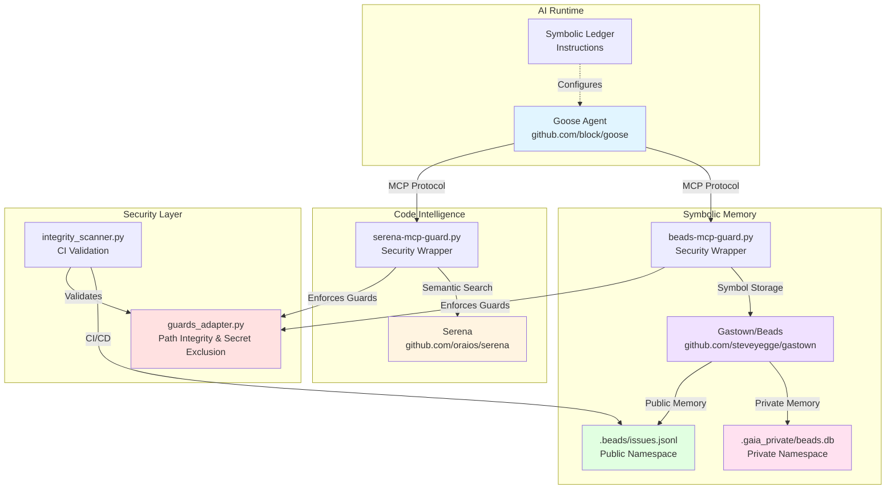

# GAIA Architecture Guide

**GAIA (Generative AI Architecture)** is a hardened AI coding assistant that maintains persistent symbolic memory of your codebase while enforcing strict security boundaries.

## The Problem GAIA Solves

### Pain Point #1: Context Window Amnesia
**The Problem:** Every time you start a new AI chat, it has forgotten everything about your codebase. You waste time re-explaining architecture, re-finding files, and re-teaching patterns.

**Example:**
```
You: "Add a new player action to the game"
AI: "Sure! Where's your game logic?"
You: "It's in src/context/GameContext.tsx... like I told you yesterday"
AI: "Let me search for that..."
```

**GAIA's Solution:** Symbolic memory persists across sessions. GAIA remembers where your game logic lives, what patterns you use, and what you've already explained.

### Pain Point #2: Security Leakage
**The Problem:** AI assistants can accidentally read `.env` files, API keys, or private credentials and leak them into chat history or suggestions.

**Example:**
```
AI: "I see you're using this API key: sk-live-abc123..."
You: 😱 "That's a production secret!"
```

**GAIA's Solution:** Path integrity guards physically block access to secrets. The AI literally cannot read `.env`, `*.key`, or other sensitive files.

### Pain Point #3: Implementation Noise in Architecture
**The Problem:** Your git history gets polluted with AI debugging notes, temporary context, and implementation details that don't belong in the permanent record.

**Example:**
```git
commit abc123: "Added user authentication"
  - docs/architecture.md: "TODO: debug why JWT fails on Safari"
  - docs/architecture.md: "Note: tried 3 different approaches, settled on..."
```

**GAIA's Solution:** Namespace split keeps high-level architecture in git while local debugging stays in `.gaia_private/` (git-ignored).

---

## Architecture Overview



---

## Component Deep Dive

### 1. Goose (AI Runtime)
**Repository:** [github.com/block/goose](https://github.com/block/goose)

**What it does:** Runs the AI agent with custom instructions and MCP tool access.

**Your customization:**
- [`goose-ledger`](file:///Users/brandonbennett/.local/bin/goose-ledger) script launches Goose with symbolic ledger protocol
- [`symbolic_ledger_instructions.md`](file:///Users/brandonbennett/.config/goose/symbolic_ledger_instructions.md) defines GAIA's behavior

**Real-world example:**
```bash
# Start GAIA session
goose-ledger "Add a new game mode"

# GAIA automatically:
# 1. Checks beads for existing game mode symbols
# 2. Uses Serena to find GameContext.tsx
# 3. Caches the pattern in a bead
# 4. Implements the feature
# 5. Stores the new symbol for future reference
```

### 2. Serena (Code Intelligence)
**Repository:** [github.com/oraios/serena](https://github.com/oraios/serena)

**What it does:** Provides semantic code search and symbol navigation.

**Your customization:**
- [`serena-mcp-guard.py`](file:///Users/brandonbennett/.local/bin/serena-mcp-guard.py) wraps Serena with security guards

**Real-world example:**
```python
# Without GAIA:
AI: "Let me search your entire codebase for 'GameContext'..."
# (Wastes time, might hit secrets)

# With GAIA:
AI: "I have a bead pointing to GameContext.tsx at line 42"
# (Instant, secure, cached from last session)
```

### 3. Gastown/Beads (Symbolic Memory)
**Repository:** [github.com/steveyegge/gastown](https://github.com/steveyegge/gastown)

**What it does:** Stores symbolic memory as "beads" (issue-like records).

**Your customization:**
- [`beads-mcp-guard.py`](file:///Users/brandonbennett/.local/bin/beads-mcp-guard.py) wraps Beads with security guards
- Multi-repo config routes to public (`.beads/`) or private (`.gaia_private/`) namespaces

**Real-world example:**
```bash
# Public bead (committed to git):
bd create --title "Game Architecture" \
  --body "GameContext.tsx manages all game state using React Context"

# Private bead (local only):
bd create --private --title "Debug: Safari JWT Issue" \
  --body "Tried 3 approaches, localStorage works best"
```

### 4. Security Guards
**Files:** [`guards_adapter.py`](file:///Users/brandonbennett/pursuit/sound-royale-ny/backend/gaia/guards_adapter.py), [`integrity_scanner.py`](file:///Users/brandonbennett/pursuit/sound-royale-ny/backend/gaia/integrity_scanner.py)

**What they do:**
- **Path Integrity:** Block access outside repo root
- **Secret Exclusion:** Block `.env`, `*.key`, `*.pem`, `.gaia_private/`
- **Architectural Leakage:** Respect `.beadsignore` patterns

**Real-world example:**
```python
# AI tries to read secrets
evaluate_path_request(repo_root, ".env")
# Returns: Decision(allowed=False, reason="DENY_SECRET_PATTERN")

# AI tries to read docs
evaluate_path_request(repo_root, "docs/README.md")
# Returns: Decision(allowed=True, reason="ALLOW")
```

---

## Namespace Split in Action

### Public Namespace (`.beads/issues.jsonl`)
**What goes here:** Architecture, patterns, phase goals, reusable knowledge

**Example bead:**
```json
{
  "title": "Authentication Pattern",
  "body": "We use JWT tokens stored in httpOnly cookies. See AuthContext.tsx for implementation.",
  "labels": ["architecture", "security"]
}
```

**Why it's public:** Future developers (or future you) need this context.

### Private Namespace (`.gaia_private/`)
**What goes here:** Debugging notes, local experiments, implementation details

**Example bead:**
```json
{
  "title": "Debug: WebSocket reconnection",
  "body": "Tried exponential backoff, settled on fixed 3s delay. Safari quirk with WS close codes.",
  "labels": ["debug", "local"]
}
```

**Why it's private:** This is noise for git history, but valuable for your current session.

---

## Security Hardening Phases

### ✅ Phase 1: Security Guards
- Path integrity enforcement
- Secret exclusion patterns
- Unit test coverage

### ✅ Phase 2: CI Integration
- Automated integrity scanning
- GitHub Actions validation
- Fail-fast on violations

### ✅ Phase 3: Namespace Split
- Public/private memory partitioning
- Git-ignored local storage
- Protected namespace guards

### 🔮 Phase 4: Offline Ledger (Future)
- MFA-gated local storage
- Encrypted private namespace
- Air-gapped symbolic memory

---

## Next Steps

### Immediate (Ready to Use)
1. **Start using GAIA:** Run `goose-ledger "your task"` to begin a session
2. **Create public beads:** Document architecture decisions with `bd create`
3. **Create private beads:** Store debugging notes with `bd create --private`

### Short-term (Recommended)
1. **Integrate with CI:** Ensure `integrity_scanner.py` runs on every PR
2. **Expand secret patterns:** Add project-specific sensitive files to `SECRET_GLOBS`
3. **Document patterns:** Create beads for common architectural patterns

### Long-term (Optional)
1. **Phase 4 Implementation:** Add MFA-gated encryption for private namespace
2. **Bead templates:** Create standardized bead formats for different symbol types
3. **Cross-project memory:** Share architectural beads across multiple repos

---

## Common Workflows

### Starting a New Feature
```bash
# 1. Start GAIA session
goose-ledger "Add user profile page"

# 2. GAIA checks existing beads for patterns
# 3. GAIA uses Serena to find similar components
# 4. GAIA implements following established patterns
# 5. GAIA creates a bead documenting the new feature
```

### Debugging an Issue
```bash
# 1. Start GAIA session
goose-ledger "Fix WebSocket reconnection bug"

# 2. GAIA creates a private bead for debugging notes
# 3. GAIA experiments with solutions (stored in private namespace)
# 4. Once fixed, GAIA creates a public bead with the solution
# 5. Private debugging notes stay local, clean solution goes to git
```

### Onboarding a New Developer
```bash
# 1. New dev clones repo
# 2. Runs `bd sync` to pull public beads
# 3. Reads beads to understand architecture
# 4. Starts `goose-ledger` with full context already loaded
```

---

## Troubleshooting

### "DENY_SECRET_PATTERN" errors
**Cause:** GAIA is protecting you from accessing secrets.

**Solution:** This is working as intended. If you need to reference a secret pattern, document it in a bead without including the actual value.

### Beads not syncing
**Cause:** Git conflicts in `.beads/issues.jsonl`

**Solution:** Run `bd sync` to resolve conflicts, or manually merge the JSONL file.

### Private beads appearing in git
**Cause:** `.gaia_private/` not in `.gitignore`

**Solution:** Verify `.gitignore` includes `.gaia_private/` and run `git rm -r --cached .gaia_private/`

---

## Resources

- **Gastown/Beads:** [github.com/steveyegge/gastown](https://github.com/steveyegge/gastown)
- **Goose:** [github.com/block/goose](https://github.com/block/goose)
- **Serena:** [github.com/oraios/serena](https://github.com/oraios/serena)
- **Security Policy:** [docs/sec/GAIA_SECURITY_POLICY.md](file:///Users/brandonbennett/pursuit/sound-royale-ny/docs/sec/GAIA_SECURITY_POLICY.md)
- **Sandbox Guide:** [SANDBOX_GUIDE.md](file:///Users/brandonbennett/.config/goose/SANDBOX_GUIDE.md)
